* 本篇博客是对计算机视觉中一个经典模型SSD的介绍

# 计算机视觉经典模型--SSD
## 简单描述  ：
 SSD的全称为Single Shot MultiBox Detector，是一个one-stage的视觉模型。本文选取SSD300进行简单介绍

## 网络结构：
>这三张图一张张细化，后两张图都有一点小问题，第一张图严格来说priorbox的分支并不属于网络部分，是一种先验处理，后面我会讲，并且fc6和fc7起其实是卷积层而不是全连接层。第二张图来自http://www.mclover.cn/blog/index.php/archives/329.html，将网络更加细化，但是并没有将卷积层后面的激活函数以及Conv4_3之后的norm层给标出来，算是小问题。

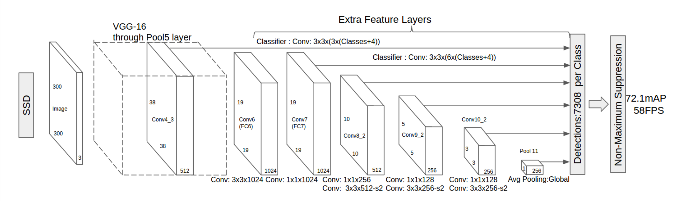

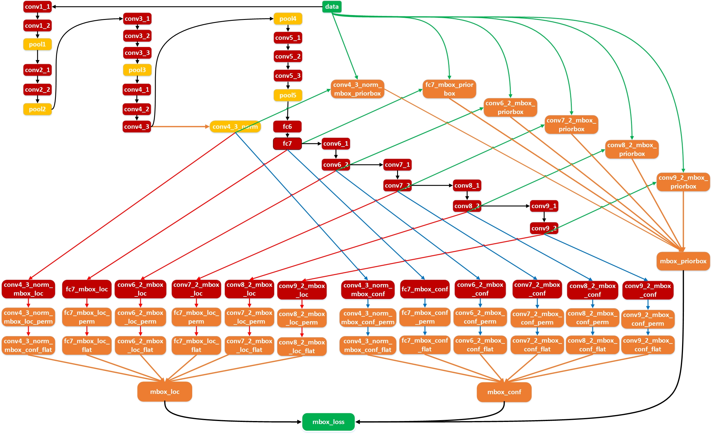

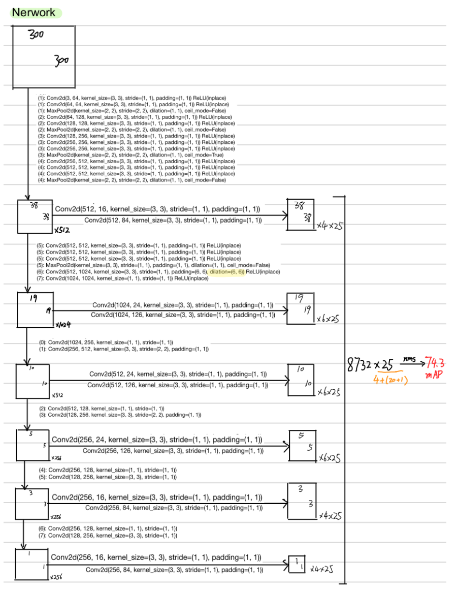

## 模型分析
### 优点：
1. 作为一个单阶段的检测器，比YOLO的速度更快，而检测的效果可以匹配Faster-RCNN

2.   使用了预测特征金字塔式的融合方式，从不同尺度的特征图下面来预测目标分类与位置，实现了不错的效果

3. 即使是分辨率比较小的图片也能产生不错的效果（相比Faster-Rcnn）

### 缺点：
1.  对小尺寸的目标识别仍比较差，还达不到Faster R-CNN的水准。这主要是因为小尺寸的目标多用较低层级的anchor来训练，较低层级的特征非线性程度不够，无法训练到足够的精确度。

2. 模型中有很多参数需要人工设置(在Prior box中)，这就导致调试的过程非常依赖经验。 

### 实验结果：

## 模型实现：
我的SSD网络模型参考的是https://github.com/amdegroot/ssd.pytorch/blob/master/ssd.py#L43，具体的网络结构在第一部分第三张图已经描绘的差不多了，这部分会介绍一下模型实现的一些其他细节。
### Prior Box

   这个即为网络结构中第二张图的右上角部分（也叫Defalut box），是一个先验的检测框处理。即对于每个点有多少个先验框，而网络的定位输出只是对这些这些先验框的一些小修正。
	
首先明确先验框的中心是feature map上每个点加上0.5,即比如为网络结构中第三张图，第一级检测的特征图最终是38x38的，那么就有38x38个中心点。
	
再说边长，对于每个中心点首先会产生一大一小两个正方形，小的正方形边长为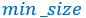,大的正方形边长为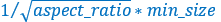
。然后会有很多个长方形，长方形的面积和小正方形面积一样，每个长宽比会产生两个长方形。长宽为：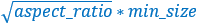 和 
	
最后解释一下min_size和max_size，我们知道第一级的feature map大小是最大的，然后逐渐变小。而每一级的min_size和max_size都会发生变化。公式如下：

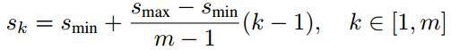

公式中m是使用feature map的数量（SSD 300中m=6）。第一层feature map对应的min_size=S1，max_size=S2；第二层min_size=S2，max_size=S3；其他类推。在原文中，Smin=0.2，Smax=0.9，但是在SSD 300中prior box设置并不能和paper中上述公式对应：

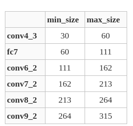

不过依然可以看出，SSD使用低层feature map检测小目标，使用高层feature map检测大目标，这也应该是SSD的突出贡献了。

### 损失函数 
在介绍损失函数之前先介绍一下**Smooth L1损失函数**，即更加光滑的L1损失函数。

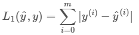

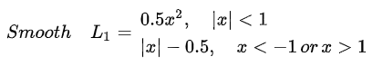

SSD的损失函数有两个部分组成，分别为**定位损失函数**和**分类损失函数**。
	
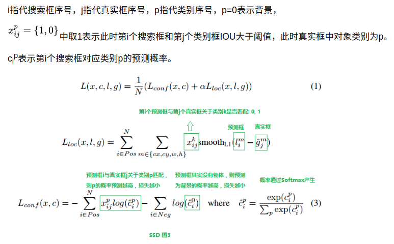

### 数据增强

### 模型测试
   当你要测试模型时，会对模型的输出格式进行转换并做阈值限定，删除一部分可信度较低的模型，并使用nms减少结果框，而在训练的时候我们不需要进行这些操作。

