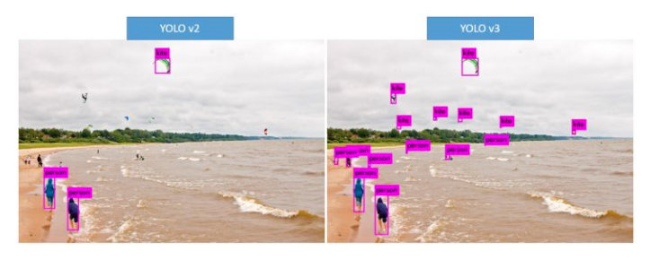

* 本篇博客是对计算机视觉中一个经典模型YOLO-V3的介绍

# 计算机视觉经典模型--YOLO-V3
## 简单描述  ：
最初的版本于2015年6月的论文You Only Look Once: Unified, Real-Time Object Detection中提出，直到2018年的4月的论文YOLOv3: An Incremental Improvement ，YOLO-V3来了。

## 网络结构：

更加详细的网络结构https://img-blog.csdn.net/20180516122041227

## 改进历程
### yolo-v1
最早的yolo-v1使用的backbone是GoogleNet。YOLO将输入图像分成SxS个格子，每个格子负责检测‘落入’该格子的物体。何为之落入？若某个物体的中心位置的坐标落入到某个格子，那么这个格子就负责检测出这个物体。

每个格子输出B个bounding box（包含物体的矩形区域）信息(就是每个格子有可能属于B个bounding box)，以及C个物体属于某种类别的概率信息。每个格子最多只预测出一个物体。当物体占画面比例较小，如图像中包含畜群或鸟群时，每个格子包含多个物体，但却只能检测出其中一个。这是YOLO方法的一个缺陷。

此时的虽然快且背景误检测率低(将背景检测为目标)，但是对于目标的召回率也低，而且识别物理位置的精确性也差。YOLO-V2就针对这两个缺点进行了优化。YOLOv2并不是通过加深或加宽网络达到效果提升，反而是简化了网络。

### yolo-v2(更新较多)

####  加入Batch Normalization（官方论文中的提升为2%）

#### High Resolution Classifier
>
YOLOv2首先对分类网络（darknet）进行fine tune，进行预训练，使训练后的网络适应高分辨率输入。然后，对检测网络也进行fine tune。
通过提升分辨率，提升了mAP。原来的YOLO网络在预训练的时候采用的是224*224的输入（这是因为一般预训练的分类模型都是在ImageNet数据集上进行的），然后在detection的时候采用448*448的输入，这会导致从分类模型切换到检测模型的时候，模型还要适应图像分辨率的改变。而YOLOv2则将预训练分成两步：先用224*224的输入从头开始训练网络，大概160个epoch（表示将所有训练数据循环跑160次），然后再将输入调整到448*448，再训练10个epoch。注意这两步都是在ImageNet数据集上操作。最后再在检测的数据集上fine-tuning，也就是detection的时候用448*448的图像作为输入就可以顺利过渡了。作者的实验表明这样可以提高几乎4%的MAP。

#### Dimension Clusters

>
在以往的算法中（例如SSD），anchor boxes的宽高比往往是提前确定的。如果事先确定的宽高维度不具有代表性，那么在训练中，网络将对其进行调整，最终得到准确的bounding boxes。这也就意味着，更好的先验boxes维度将使得网络预测的位置更加准确，学习速度也会更快。所以，论文中使用了利用IoU（交并比）的K-means聚类方法训练bounding boxes，自动找到更具有代表性的宽高维度。

>
在分析了聚类的结果并平衡了模型复杂度与recall值，作者选择了K=5而且发现聚类的结果和手动设置的anchor box大小差别显著。聚类的结果中多是高瘦的box，而矮胖的box数量较少。利用Cluster IoU生成9个anchor boxes的平均IoU（67.2）要明显高于先验anchor boxes的效果（60.9）。

>
过程： 
>
1. 初始化：选择5个box的作为初始点，选的过程就是第一个随机选，选过的不可能再选，然后最小距离最大的机会会大一点，就是说比较离群的机会大一点。
>
2. K-mean 注意中心点是不变,默认都是0,0，变的是w h
>
参考链接：https://blog.csdn.net/xiaomifanhxx/article/details/81215051

#### Convolutional With Anchor Boxes

这项技术主要是在卷积过程中的feature map中使用anchor boxes，像这样：

>
  论文通过缩减网络，让图片分辨率为416x416，这是为了让后面产生的卷积feature map宽高都为奇数，以产生一个center box，位于图像中间。
以比例 32进行池化，得到13x13的的卷积特征图（上文中提到的宽高均为奇数的feature map）。feature map中的每个cell预测一定数量的anchor boxes（官方论文中为9），我们知道原来的YOLO算法将输入图像分成7x7的网格，每个网格预测两个bounding box，因此一共只有98个box，但是在YOLOv2通过引入anchor boxes，预测的box数量超过了1千（以输出feature map大小为13x13为例，每个grid cell有9个anchor box的话，一共就是13x13x9=1521个（但实际上使用Dimension Clusters只需要5个就能达到9个的效果）

#### Direct Location Prediction
这个其实就是网络输出和真实框的转换关系，下方为真实值转换为网络输出，用于计算损失函数，右边是网络输出转换为真实值。

>
其中b为真实值，也就是G。t为网络输出值。Cx,Cy是特征图中每个点对应基础位置，即多少格子，也就是图中的红点（1,1）。Pw,Ph就是Dimension Clusters中获得的anchor。Px,Py相当于相当于红点的位置。

>
b和G准确的说不是真实值，而是缩放后的真实值，比如中心点在416x416图像的中心，那么对于对于13*13的特征图，它的bx,by = 7,7。同时Px，Py也为7.但是bx，by一般不会这么准确，有时候会是7.2和8.3，这时候Px，Py就为7和8。所以b要成为真实值还需要放大，对于13x13的特征图需要放大416/13=32倍。

>>    中用到了sigmoid函数，就是防止预测出中心点偏移到其它格子，将它限制在0-1

>
若是按照我的这种理解方式那么需要注意
>
1. 下面的4个公式中计算tx，ty时不需要除以Pw，Ph
2. 下面的4个公式中的后两个公式中的Pw，Ph是缩小之后的anchor的变长，缩放的原理同上。

#### Fine-Grained Features
>
上述网络上的修改使YOLO最终在13 * 13的特征图上进行预测，虽然这足以胜任大尺度物体的检测，但是用上细粒度特征的话，这可能对小尺度的物体检测有帮助。
>
这个转移层也就是把高低两种分辨率的特征图做了一次连结，连接方式是叠加特征到不同的通道而不是空间位置。这个方法把26 x 26 x 512的特征图分解成4个13x13x512，再拼接成13 x13 x 2048的特征图，这个特征图与原来的13x13x1024特征相连接得到13x13x3072。YOLO的检测器使用的就是经过扩张的特征图，它可以拥有更好的细粒度特征，使得模型的性能获得了1%的提升。

#### Multi-Scale Training

>
网络输入的图片为416*416，而论文作者需要YOLOv2对不同尺寸的图片具有鲁棒性，因此进行Multi-Scale Training（多尺度训练）。在之前的介绍中有提到，YOLO网络使用的降采样 factor = 32。所以利用32的倍数进行池化（官方论文中利用320,352，……，608进行池化,以32递增）。就是改变输入的图片的尺寸大小在10个epoch过后，对网络进行fine tune，随机选择新的图片尺寸，然后按照输入尺寸进行训练。实验表明，Multi-Scale Training使得同一个网络对不同分辨率的图片都可以进行检测，提高了网络性能。

#### New Network: Darknet-19
YOLOv2采用了一个新的基础模型（特征提取器），称为Darknet-19。使用Darknet-19之后，YOLOv2的mAP值没有显著提升，但是计算量却可以减少约33%。

### yolo-v3
#### New Network: Darknet-53
>
使用残差模型,构建更深的特征提取网络

#### 多尺度预测
使用FPN架构（Feature Pyramid Networks for Object Detection）来实现多尺度检测(具体参考第一部分网络结构)

####改进效果

强大的泛化能力

模型泛化能力很强的副作用，就是分类结果跑偏，比如下面这张coser的识别图，最左侧的人识别成了马

## 模型分析
### 优点：
1. 使用了低层特征用于检测，大大提升了对小物体的检测能力

2.  YOLO V3在mAP与SSD相同的情况下速度快很多

3. 使用了浅层特征使得一些距离十分近的目标得以检测出来，虽然不能完全解决，但是大大改善了

### 缺点：
可能是在大物体定位精度上稍微差一些

### 实验结果：
以下实验都是在coco数据集上实现

## 模型实现：
我的YOLO-V3网络模型参考的是https://github.com/BobLiu20/YOLOv3_PyTorch，这部分会介绍一下模型实现的一些其他细节
###  网络输入
416x416 的图片
### 匹配策略
  不论是SSD还有YOLO，我们都需要把真实值处理成网络输出同样的格式，这样才能求出损失，确定每一个位置的正确输出是什么，对于SSD的匹配策略来说一个真实值可以对应多个Prior box（可以看我之前关于SSD的博文）。
  
  对于YOLO-v3来说，对于一个特征图的一个格子（用这个格子的左上角表示这个格子，7.2,8.3这个点在数组中就是在（7,8）中），只要这个格子里有目标，那么这个格子就会选最优的anchor（只会选一个）。所以一个真实值只会对应一个anchor。（为什么不用SSD的匹配策略）

### 损失函数 
+ 损失函数主要有3部分，定位的损失、置信度的损失、分类的损失。
其中除了W和H的损失函数用的是均方误差，其他用的都是二值交叉熵损失

#### 置信度和定位损失  ：
对于每个真实值，所在的中心点取IoU最大的anchor用作计算损失，一个真实值对应一个框。

#### 分类损失：
 对于一个真实值，所在的中心点，该中心点的几个anchor和真实值的IoU低于阈值则认为是背景，其他的则认为有这个目标。一个真实值会对应多个anchor，注意这个和上面的区别。
 
 - yolov3有3路输出，3种不同大小的特征图，独立计算损失值。
 

### 模型测试
  结合前面的Direct Location Prediction你不难猜出网络的输出是什么了，首先网络输出的格式是xywh(假如是(0.5,0.5,2,2))，对于xy是0-1的数，需要加上该点所在的格子的左上角的坐标 比如是（5,5）。那么xywh就是（5.5,5.5,2,2）。这是缩放后的坐标，假设这个坐标是在13x13的特征图，那么xywh的真实坐标就是(5.5x32,5.5x32,2x32,2x32).

