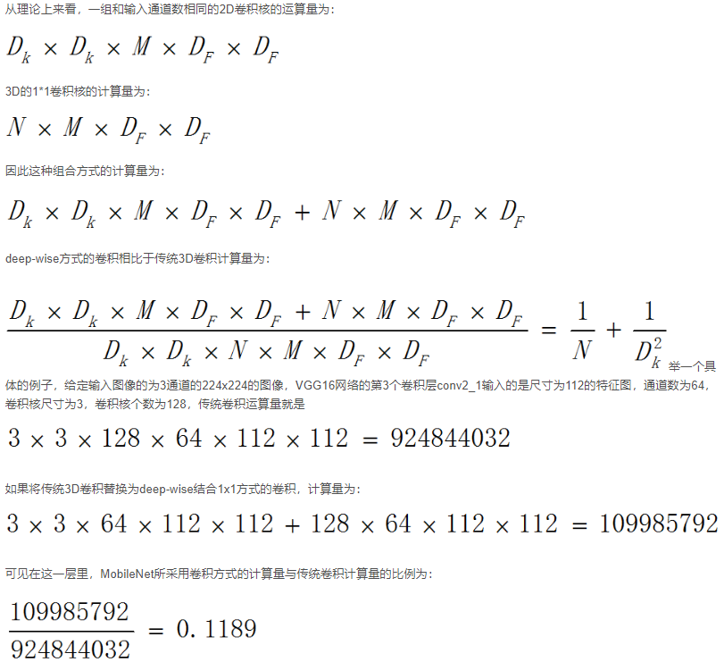

# 经典轻量型网络-SqueezeNet、MobileNet和ShuffleNet

* 十分经典的轻量型模型，很久之前看的，做一个总结。

# SqueezeNet
>
先讲SqueezeNet是因为它比较早，相对效果没有MobileNet那么好，但是可以说开了个头。

SqueezeNet在ImageNet上实现了和AlexNet相同的正确率，但是只使用了1/50的参数。更进一步，使用模型压缩技术，可以将SqueezeNet压缩到0.5MB，这是AlexNet的1/510。（SqueezeNet得到的模型是5MB左右，0.5MB的模型还要得益于Deep Compression。虽然Deep Compression也是这个团队的文章，但是将0.5这个数列在文章的题目中显然不是很合适。
）

### 模型决策

使用以下三个策略来减少SqueezeNet设计参数

（1）将3x3的卷积替换为1x1的卷积(仍然会有3x3的卷积)：参数减少为原来的1/9

（2）减少3x3卷积的输入通道数量

（3）将降采样操作延后，作者认为较大的Feature Map含有更多的信息，因此将降采样往分类层移动。注意这样的操作虽然会提升网络的精度，但是它有一个非常严重的缺点：即会增加网络的计算量。

其中，（1）和（2）可以显著减少参数数量，（3）可以在参数数量受限的情况下提高准确率

### 基础结构---Fire Module

简单来说就是将input先经过1x1的卷积处理，然后兵分两路，一路仍由1x1的卷积处理，另一路由3x3的卷积处理，最后再将这两路concat。通过先降低通道数再卷积增加通道数可以大大减少参数数量。

### 网络结构

后续还有在网络中加short-cut的优化。

# MobileNet

参数量差不多，但是比SqueezeNet快10倍

### 基础结构--深度可分离卷积

>
简单解释一下这个图，比如你原来使用3x3的卷积核，输入的通道是5，输出的通道是6,那么你应该有6个3x3x5的卷积核，而深度可分离卷积是先给你5个3x3x1的卷积，对每个通道处理（每个通道都经过这5个卷积处理）,将特征图大小变成我们想要的大小，但是一般不会变,同时通道数仍为5。然后又给你6个1x1x5的卷积扩充通道数。看起来多了一步但是参数量大大减少了。（N为输出通道）

### 基础结构--宽度因子
这是另外一种减少计算量的方式，简单来说就是上面所说的5个3x3x1的卷积变成了5α个，α介于0和1之间。同时6个1x1x5的卷积也变为6α个。

计算量变化：

**看看效果**

### v2版本

#### 优化1：Linear Bottlenecks

也就是去掉了小维度输出层后面的非线性激活层，目的是为了保证模型的表达能力。

因此执行降维的卷积层后面不会接类似于ReLU这样的非线性激活层
至于ReLU是如何损失特征的，我的理解是：ReLU的特性使得对于负值输入，其输出为0，而且降维本身就是特征压缩的过程，这样就使得特征损失更为严重。

#### 优化2：Inverted Residual block。（扩展-卷积-压缩）

DWConv 层提取得到的特征受限于输入的通道数，若是采用以往的residual block，先“压缩”，再卷积提特征，那么DWConv layer可提取得特征就太少了，因此一开始不“压缩”，MobileNetV2反其道而行，一开始先“扩张”，本文实验“扩张”倍数为6。 通常residual block里面是 “压缩”→“卷积提特征”→“扩张”，MobileNetV2就变成了 “扩张”→“卷积提特征”→ “压缩”，因此称为Inverted residuals
那瓶颈层内部为何需要升维呢？原因是为了增加模型的表达能力（不确定这样理解是否正确）：当使用ReLU对某通道的信息进行处理后，该通道会不可避免的丢失信息；然而如果有足够多的通道的话，某通道丢失的信息，可能仍旧保留在其他通道中，因而才会在瓶颈层内部对特征进行升维。文中附录证明了，瓶颈层内部升维足够大时，能够抵消ReLU造成的信息丢失（如文中将特征维度扩大了6倍）。

（还有V3版本 但是那是autoML的范围了，暂时不更新这部分）

### 网络结构（V2）

bottleneck：

t表示“扩张”倍数，c表示输出通道数，n表示重复次数，s表示步长stride。 

网络中并没有使用全链接层，而是采用了全卷积的方案。

先说两点有误之处吧： 

1. 第五行，也就是第7~10个bottleneck，stride=2，分辨率应该从28降低到14；如果不是分辨率出错，那就应该是stride=1； 

2. 文中提到共计采用19个bottleneck，但是这里只有17个。

#ShuffleNet

### 基础结构--Channel Shuffle

全连接的shuffle：

### 基础结构--Shuffle unit

**图(a)**是一个残差模块。对于主分支部分，我们可将其中标准卷积3×3拆分成深度分离卷积(可参考我的MobileNet笔记)。我们将第一个1×1卷积替换为逐点组卷积，再作通道混洗(即(b))。

**图(b)**即ShuffleNet unit，主分支最后的1×1Conv改为1×1GConv，为了适配和恒等映射做通道融合。配合BN层和ReLU激活函数构成基本单元.

**图(c)**即是做降采样的ShuffleNet unit，这主要做了两点修改：
1. 在辅分支加入步长为2的3×3平均池化
2. 原本做元素相加的操作转为了通道级联(concat)，这扩大了通道维度，增加的计算成本却很少

### 模型评价

相比于不同深度的模型对比，可以看到ShuffleNet要比MobileNet的效果要好，这表明ShuffleNet的有效性主要来源于高效的结构设计，而不是深度。ShuffleNet的效果要比同等条件下的MobileNet效果要好，我们认为收益源于ShuffleNet的设计。

### v2版本

**认为FLOPs并不能完全衡量模型速度！**

**观点1：** 首先直观的一点是内存访问消耗时间（memory access cost 缩写为 MAC）是需要计算的，这对模型速度影响比较大，但是却难以在FLOPs指标中体现出来。

假设一个1x1卷积层的输入特征通道数是c1，输出特征尺寸是h和w，输出特征通道数是c2，那么这样一个1x1卷积层的FLOPs就是下面式子所示，更具体的写法是B=1x1xc1xc2xhxw，这里省略了1x1。(B为卷积计算量)

接下来看看存储空间，因为是1x1卷积，所以输入特征和输出特征的尺寸是相同的，这里用h和w表示，其中hwc1表示输入特征所需存储空间，hwc2表示输出特征所需存储空间，c1c2表示卷积核(1*1)所需存储空间。

把根据均值不等式得到如下式子，得

带入MAC和B 得到（c1-c2）^2>=0。因此等式成立的条件是c1=c2，也就是输入特征通道数和输出特征通道数相等时，在给定FLOPs前提下，MAC达到取值的下界。

**观点2：**卷积的group操作对MAC的影响。结论是过多的group操作会增大MAC，从而使模型速度变慢。分组数应该根据实际课题以及应用的平台谨慎选择。单纯的通过增加分组卷积来增加通道数从而增加精确度是一个不明智的选择。
Group 操作可以大大减少FLOPs但是FLOPs实际上并不代表速度

带group操作的1*1卷积的FLOPs如下所示

这样就能得到MAC和B之间的关系了，如公式2所示，可以看出在B不变时，g越大，MAC也越大

**观点3：**关于模型设计的分支数量对模型速度的影响。结论是模型中的分支数量越少，模型速度越快。

**观点4：**element-wise操作所带来的时间消耗远比在FLOPs上的体现的数值要多，因此要尽可能减少element-wise操作。

#### 基于以上的对比实验，可以得到一个有效的网络应该包含：
（1） 卷积层使用相同的输入输出通道数

（2） 意识到使用大的分组数所带来的坏处

（3） 降低网络结构的离散程度（减少分支以及所包含的基本单元）

（4） 减少 element-wise 操作

### 基础结构（V2）

(a)和(b)是ShuffleNet v1的两种不同block结构，(c)和(d)是ShuffleNet v2的两种不同block结构。

1. (c)中的Channel Split这个操作将输入特征的通道分成c-c’和c’，c’在文章中采用c/2，这主要是和前面观点1对应。(其中c-c’部分不经过任何处理，c’部分走右边，最后concat，有点像short_cut)

2. 取消了1*1卷积层中的group操作，这和前面的观点2对应，同时前面的channel split其实已经算是变相的group操作了。

3. channel shuffle的操作移到了concat后面，和前面观点3对应

4. 同时也是因为第一个1x1卷积层没有group操作(放弃了1*1的GConv)，所以在其后面跟channel shuffle也没有太大必要。最后是将element-wise add操作替换成concat，这个和前面的观点4对应。

### 网络结构(V2)

### 模型评价(V2)
ShuffleNetV2的特征重用方式比DenseNet更高效，对比试验中显示，同等规模的ShuffleNetV2比DenseNet性能更好。

