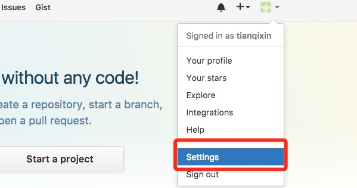
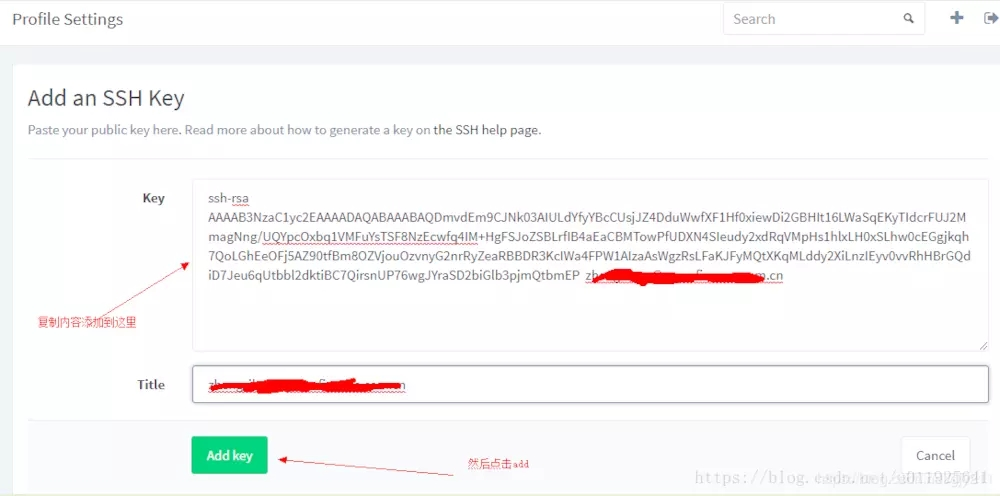
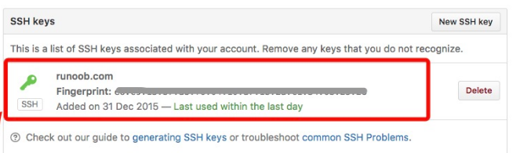
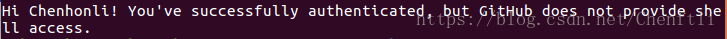

* 敲代码的小伙伴基本都知道github，可是很多人只会从github拉代码，而不会将自己的代码存在上面，可能认为嫌麻烦，但其实这个过程十分简单，一旦完成了就可以多个人共同开发一个项目，也可以在不同的电脑上处理自己的项目。

## 使用平台：
ubuntu16.04

## 所需工具：
安装git和ssh（这两个工具都比较好安装，网上一搜就有）

-----

## 第一步：
 注册一个github的帐号，网站：https://github.com

## 第二步：
之前已经安装好了git，现在需要配置git
>
git  config  --global  user.name  "XXX"    //用户信息
>
git  config  --global  user.mail  "XXX@qq.com"   //用户邮箱

XXX就是你在github的名字，
XXX@qq.com就是你的登录邮箱。

## 第三步：
建立电脑和github的ssh （最麻烦的一步，但是也比较傻瓜）

我的参考链接：
https://www.cnblogs.com/polly-ling/p/9529860.html
  ，我选择了其中一种方法，若是不行也可以直接去他的博客上看。

  
#### 执行下面两个命令，把下面的邮箱换成你的邮箱就行
>
ssh-keygen  -t rsa -N '' -f  ~/.ssh/id_rsa -C "12345678@qq.com"    
cat  ~/.ssh/id_rsa.pub //复制里面的密钥

#### 复制完密钥之后打开github 

 

#### 在左侧

#### 右上角的New SSH key

#### 将你刚刚复制的东西粘贴进去，Title可以写你的名字

#### 添加成功

#### 验证
>
执行ssh -T git@github.com

#### 显示如下就为成功

## 第四步：
建立完链接之后，你可以选择自己创建一个项目，或者直接fork，然后克隆到本地。

>
git clone git@github.com:rshare/docker-installer.git   ##以SSH方式克隆到本地，可以读写  
git clone https://github.com/rshare/docker-installer.git ##以https方式克隆到本地，可以读写 

之后就可用git命令来处理本地和github上的项目，我这里只讲如何将本地的项目修改同步到github上。
## 第五步：
比如你在github上创建了一个名为aaa，克隆到了home目录。在你改完代码、删除文件、添加文件完毕时，在/home/aaa/ 目录下执行下面三行代码，即可同步更新github上的项目。（前提是你前几步都是对的）

>
git add -A
>
git commit -m 'x' //这个'x'是备注信息 也可以写其他的
>
git push

#### 注意：
1.github不允许有空的文件夹，所以当你本地创建一个空文件夹，然后执行上面三行命令并不会在github上更新出这个空文件夹。

