# 《Towards Optimal Structured CNN Pruning via Generative Adversarial Learning》

项目地址（pytorch）：https://github.com/ShaohuiLin/GAL/tree/master/model

Paper地址：https://arxiv.org/abs/1903.09291

https://github.com/LLLibra/LLLibra.github.io/raw/master/_posts/

* 2019CVPR的一篇文章，虽然也是剪枝方法，同样设置了mask，但是因为尝试了使用生成对抗的方法，故做个记录。

## Motivation
1. 传统的基于重要程度的剪枝需要不停地迭代和fine-tune，十分耗时
2. 传统的基于重要程度的剪枝都是设定一个阈值，当低于这个阈值的时候就置为0,过于绝对
3. 只能用于有监督的训练

## 网络结构

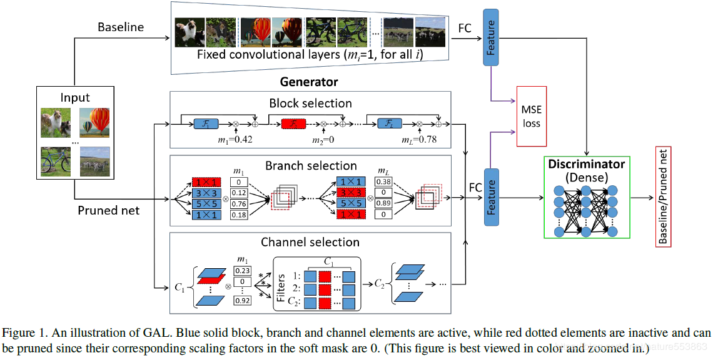

## 损失函数

fb(x)与fg(x)分别表示Baseline与Generator输出的特征矢量（非Softmax层）

m即为所谓的soft mask 就是一个可以反向传播的数，如果是筛选block的话就给每个block设置一个soft mask，若为branch剪枝就就给每一个branch设置一个soft mask。

E为二支交叉熵损失函数

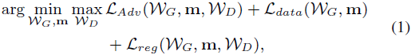

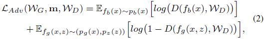

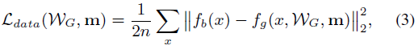

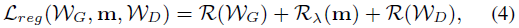

R(WG)表示一般的weight decay，且通常是L2正则化

R(m)表示对Soft Mask的L1正则化

R(WD)表示对判别器的正则化约束，用以防止判别器主导训练学习，并且主要采用对抗正则化，促进判别器与生成器之间的对抗竞争

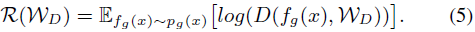

## FISTA（A fast iterative shrinkage-thresholding algorithm）

#### 传统梯度下降的缺点
 需要选择步长（即下降时导数前的系数），选小了下降很慢，选大了不好收敛到最优值
#### 优点：
1. 更快收敛
2. 更容易收敛到最优值

#### ISTA（Iterative shrinkage-thresholding algorithm）
即迭代阈值收缩算法。

**ISTA前提** ：  损失函数满足Lipschitz连续条件，即f(x)的导数有下界，其最小下界称为Lipschitz常数L。

**损失函数近似**： 

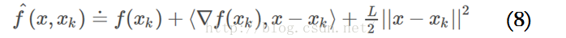 

（左边理论上应该是大于右边）

**迭代**：

 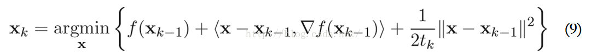

**步长**： 1/L

**缺点**：Lipschitz常数L不一定可知或者可计算

#### 改为FISTA
>
FISTA使用前两次迭代过程的结果xk-1,xk-1，对其进行简单的线性组合生成下一次迭代的近似函数起始点yk，步长不再固定。方法很简单，但效果却非常好，当然，这也是有理论支持的。

**ISTA:**

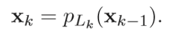

**FISTA:**

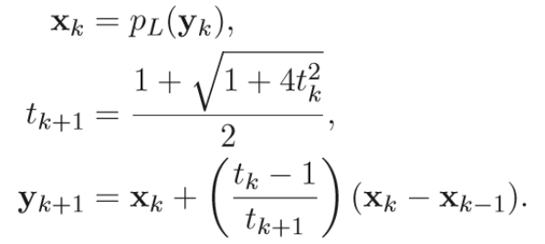

#### 使用FISTA

如果直接采用SGD求解式(1)的优化问题，Soft Mask较难稀疏化（零值较难获得）。此时通常需要设置一个阈值，并将低于阈值的Mask Value或Scaling Factor置零，达到剪枝的目的，然而剪枝网络的推理精度会明显低于Baseline。同时收敛也会比较慢。为解决该问题，文章引入FISTA方法用以求解式（1）的优化问题

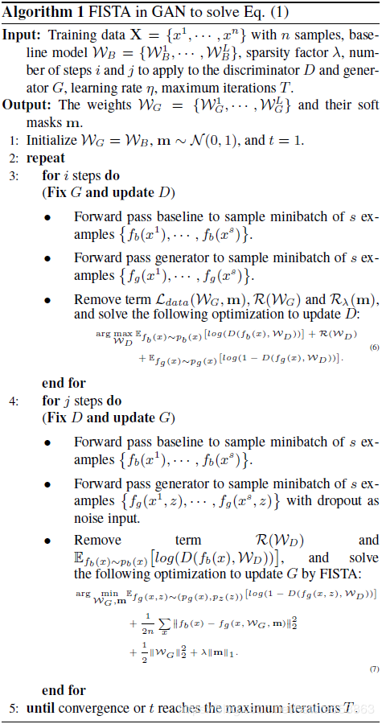

第一个阶段固定生成器G与soft mask m，通过对抗训练更新判别器D，损失函数包含对抗损失与对抗正则项

第二阶段开始使用FISTA，固定D，更新生成器G与Soft Mask，损失函数包含对抗损失中的fg相关项、fb与fg的MSE损失以及G、m的正则项。

最终，完成Soft Mask的稀疏化之后，便可以按照门控方式，完成channel、branch或block的规整剪枝。（注意M只有为0时才会舍弃，并没有设置阈值）

## 总结
#### 优点：
本文的两点只有两个

1. 使用了生成对抗的思想
2. 使用了FISTA优化训练

#### 缺点：
只是将模型的一些权重在mask的作用下置为0,但是模型运行保存的时候还是一样的大，甚至更大。
