---
layout: post
title:  "EffectiveSTL"
data:  星期三, 20. 五月 2020 09:44上午 
categories: C++
tags: 读书笔记
---
# 深度探索C++对象模型

## 关于对象
1.C++在布局以及存取时间上主要的额外负担是由virtual引起的，包括虚函数和虚基类

2.C++中虚表的的一项就是该类的type_info,
>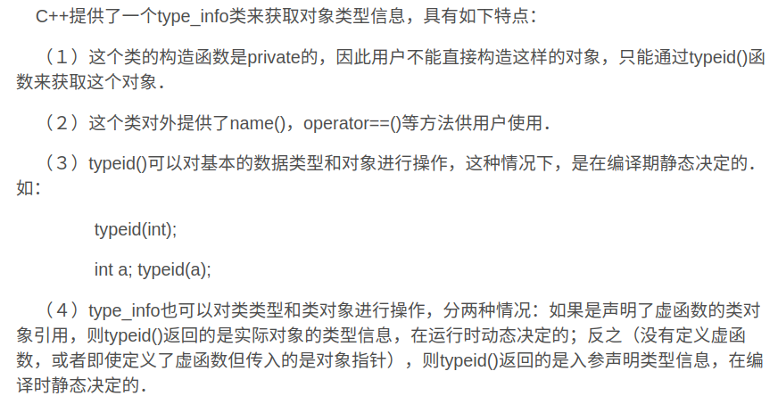
 
> 还可以调用typeid(f).id

> https://blog.csdn.net/weixin_33698043/article/details/91871159

3.如果C++还要支持C，就不能放弃struct语义，而class语义也不能放弃，因为它代表了封装和继承的哲学。

4.因为某些编译器在虚函数机制中对类的继承布局做了一些改变，所以组合而非继承，才是把C和C++结合在一起的唯一可行方案。如果要将一个复杂的类放入到某个C函数中，组合而非继承加上struct封装可以保证拥有与C兼容的空间，如果用继承可能会插入一些额外的参数。

## 构造函数语意学

#### 默认构造函数

**错误认识1**：对于任何类，若程序员没有自己定义无参数的构造函数，那么编译器会自动生成默认构造函数，来进行对成员函数的初始化。

**错误认识2**：编译器合成出来的默认构造函数会明确设定'“class内每一个data member的默认值”。

>这两种认识是不全面的

默认的构造函数分为有用的和无用的

无用的默认构造函数：一个空函数、什么操作也不做

有用的默认构造函数：可以初始化成员的函数。

当有成员类或者基类有默认构造函数，或者函数虚基类或者有虚函数，都会合成有用的默认构造函数

#### 默认拷贝构造函数

默认拷贝构造函数是bitwise的。

但是有4种情况，默认构造函数不会保持bitwise：**当前类的基类或者类成员含有默认拷贝构造函数，类中有虚函数，类中有虚基类**

这四种情况则会采用memberwise的拷贝构造函数

**bitwise：**相当于纯内存拷贝，按位拷贝一个对象的内容到另一个对象，而且不会有函数实体;

**memberwise：**对象初始化会逐一调用基类的构造函数、成员的构造函数，成员又会按这个过程逐一初始化；

**memberwise**的复杂度大概是**bitwise**的三倍

#### 程序语义转化
**函数返回调用拷贝构造函数**：

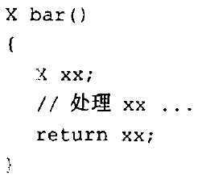 

**上述代码可能会被转化为**

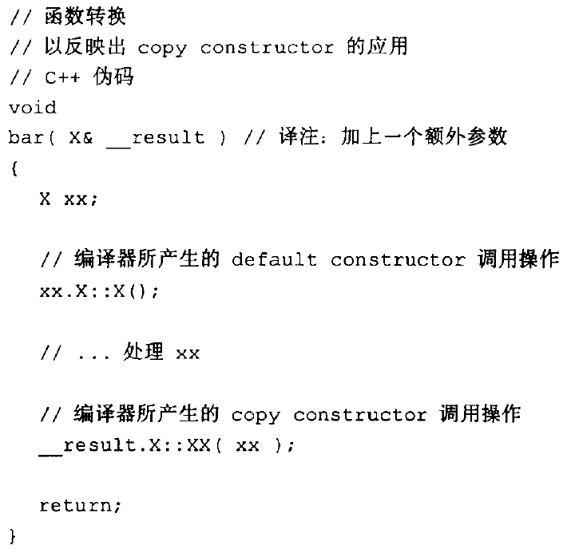

**这里又有NRV（Name Return Value）优化**
> 比如X c=bar(),原本会先创建__temp0传进去，然后赋值给c,现在是直接把c传进去，省下了把 __temp0拷贝给c的消耗

> 就是保存返回值的变量不再使用没名没姓的__temp0这样的东西了，而是直接把c作为返回变量

> NRV优化的最大好处就是不会再去调用那次多余拷贝构造函数了

#### 成员初始化
初始化列表中成员的初始化顺序是未知的，如果要用一个成员初始化另一个，建议放在函数体中，初始化列表先于函数体

## Data语意学

1.从虚基类中取成员会慢一些

2.从指针取成员和直接从对象中取成员的区别
> 从指针取可能要等到执行期（当取的成员是虚基类的成员），而从对象取有可能编译器就取好了

3.注意类不要分层，具体如下
> 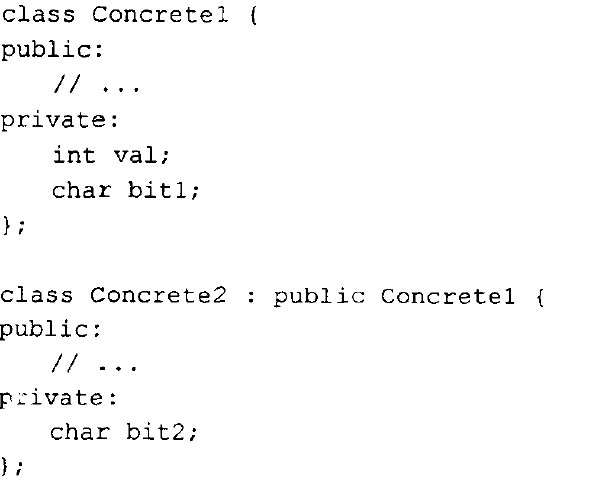

> 分开两者是12byte ，合在一起是8byte

4.当一个基类指针a赋值给另一个基类指针b（两个基类指针都指向派生类），b的派生类部分会被a的派生类部分替换

5.如何找到虚基类的位置，现在的一种做法就是在虚表中放入虚基类的offset，如果虚表的索引是正值，那么即使虚函数，如果是负值，那么就是虚基类的offset
> 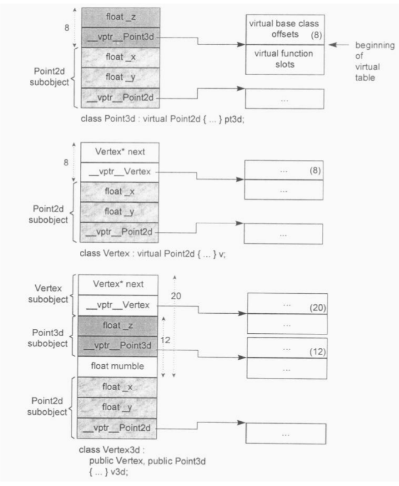

6.直接对类（不是对象）的成员取地址，是改成员在类中的偏移量

## Function 语意学
1.类内的静态函数会被转化为自由函数进行调用，所以对一个类静态函数取址，获得的不是一个类成员函数的地址，而是一个自由函数的地址。

2.不建议在虚基类中添加非静态函数，不然会过去复杂

3.所有的非静态成员函数的地址都与对象的地址（this指针）有关

4.使用一个成员函数，在不涉及虚函数，多重继承，虚基类的情况下，并不会比一个非成员函数的指针的成本更高。

5.对于虚函数，对其取址，获得的是它在虚表中的偏移量，而不是在内存中的地址。
> 如何判断一个函数指针中存的是虚函数的地址还是非虚函数的地址, 需要保证虚函数不会超过128个
> 
> 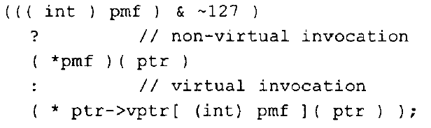

6.inline函数的参数替换
> 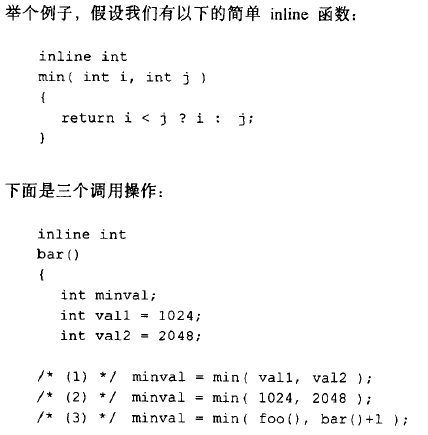

> 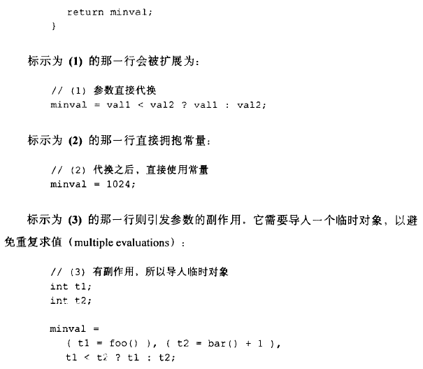

7.inline函数的局部变量
> 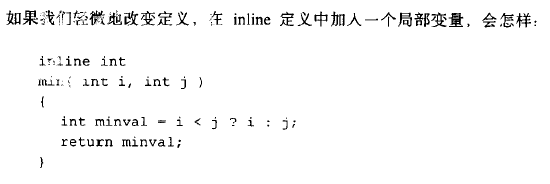

> 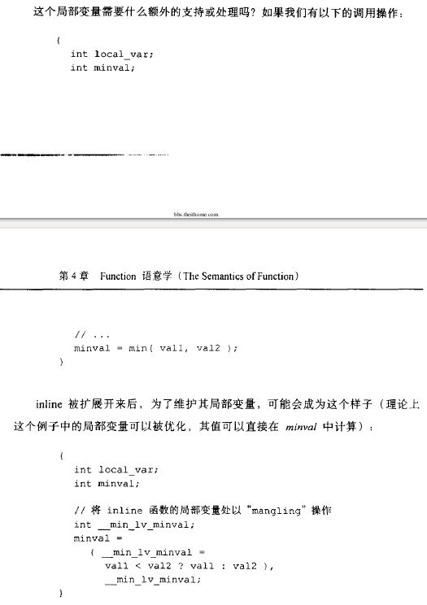

## 构造、解构、拷贝语意学
1.即使是接口类也需要一个构造函数来初始化成员变量，设为protected

2.纯虚函数也可以定义且调用，但是是静态调用

3.接口类的析构函数不应该设为纯虚函数，而是虚函数，
> 设置成纯虚函数，很遗憾，编译通不过，因为子类会调用父类的析构函数，父类析构函数指针不应该为空。

5.允许虚基类拷贝和虚基类中带有成员变量时间很麻烦的事，因为可能会被重复调用，所以可以考虑禁止虚基类拷贝，或者不要带有成员变量。

## 执行期语意学

1.placement new 并不支持多态

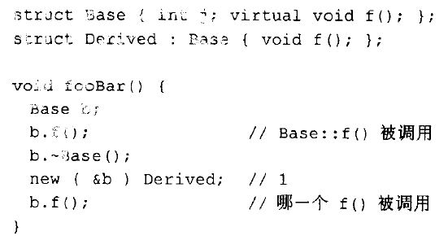

大部分编译器调用的确实Base::f()

2.两种初始化

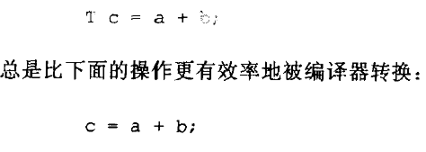

上面不会产生临时对象，直接调用拷贝构造函数，而下面可能会创建一个临时对象，那么就有构造、析构和赋值运算的问题了。'

## 站在对象模型的顶端

1.对于模板类来说，即使有些东西在所有模板中一样，但是也要具现化了再使用，并且即使是一个静态成员，不同的具现化代表不同的变量

2.目前编译器，面对一个template声明，即使是一些明显的错误也只能留到具现化的时候才能检测。

3.如果一个模板类中的成员函数在模板声明和具现化处都有定义

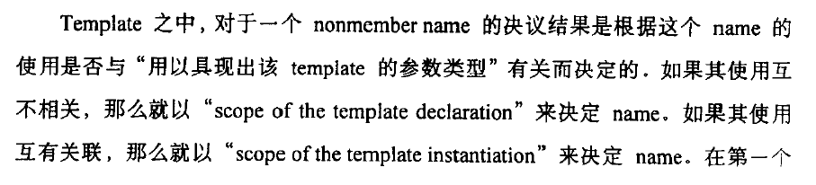

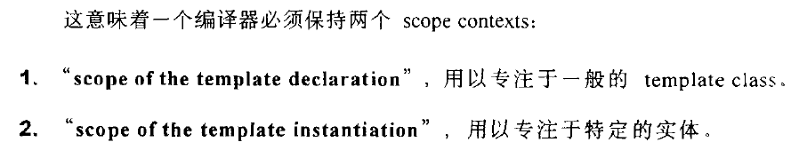

即你的函数是否和模板的具现化有关，还有一直不变

4.对于模板来说，如何只产生我们需要的部分和如何只有一份的具现化是一个问题，又比如可能会产生很多虚表，对编译是个很大的压力

5.typeid运算符作用于引用上可以起到dynamic cast作用于指针上的效果（防止转化失败，有空指针，但是没有空引用），如果dynamic cast作用于引用上，失败了则会抛异常。

6.避免使用虚函数作为动态库的接口
> 由于虚函数通过vtable的偏移量来寻址，因此当升级动态库的时候如果修改了之前的虚函数声明的顺序，或者新增了虚函数（vtable按照基类声明的顺序排列），都可能导致查找到的函数入口地址错误。因为造成 vtable 的排列发生了变化，现有的二进制可执行文件无法再用旧的 offset 调用到正确的函数。

> 这样一旦修改了虚函数的位置数量就要重新编译，完全失去了动态库的优点。

