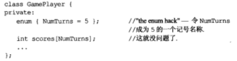
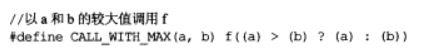
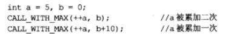
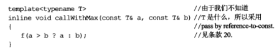
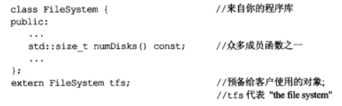
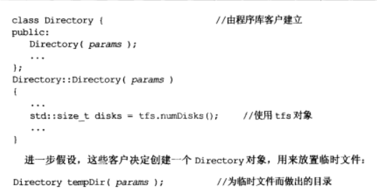
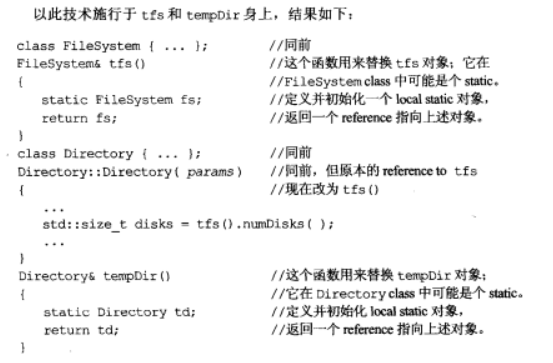

---
layout: post
title:  "Effective C++ (1)"
data: 星期四, 13. 二月 2020 10:41上午 
categories: C++
tags: 读书笔记
---
* 该模块会针对我读一本书进行整理，会分几篇博客完成，也许会有些不足或者错误的地方，未来可能会作修改。

* 有一些是看了其他博客觉得比较好摘来的，有一些是书上的，有一些是自己总结的。

# Effective C++总结1

## 条款2： 尽量以const、enum、inline替换 #define

### const代替#define
** 分析：**比如你定义 #define A 16
A可能未被编译器看到或者编译器开始处理源码之前它就被预处理器移走了。
这就会导致A并没有被记号表(Symbol table)记录 这时候报错会报16有错 (当然这里16是不会有错的，只是举个例子)
如果A被定义在非你写的头文件中 那你追踪A就要很久 
这时你用const就不会出现这种情况

### Enum代替#defines：

** 优点1：**有时候你定义一个变量想当作数组大小，但是报错不允许 static整数型class常量完成。课用enum代替。

** 优点2： ** 定义会比较清楚

* Enum更加接近#define 而不像const，比如取const地址是合法的，但是取enum和#define地址都是不合法的（#define也有特殊情况时合法的）。我们无法利用#define创建一个class专属常量，因为#define并不重视作用域

### inline代替#defines：

 #define 定义宏十分麻烦 需要注意很多小括号的配置
 
同时使用#define 定义宏常常会出现一些不合理的问题

而使用inline则不会

## 条款3： 尽可能使用const
** 优点1： **声明const可以帮助编译器侦测错误用法，避免改变不应改变的对象、参数、返回类型等。

** 优点2： **当non-const和const实现相同功能时，non-const对象可以调用const成员函数,  const对象不能调用non-const成员函数, 所以用const可以缩减代码量。

## 条款4：确定对象被使用前已先被初始化
主要就是注意类初始化构造函数要使用初始化列表，而不是赋值，因为前者使用的是拷贝构造函数，后者则是默认构造函数+赋值函数，效率应该是前者高。

A::A(int _a):a(_a){} //初始化列表

A::A(int _a){a=_a} //赋值构造

注意为内置类型手动做初始化，C++不保证初始化它们。

#### 本条款还介绍了一种情况
>
** 编译单元： ** 一般认为是一个源文件和其对应的头文件，但是编译器只会编译源文件，所以每一个cpp 文件就是一个编译单元，多个编译单元间的初始化顺序往往是不确定的。

>
  上面的tfs并不能保证在Directory之前初始化，所以改成下面的情况，注意：tfs（FileSystem）和Directory分属两个编译单元。 

这个例子一是提醒大家注意确定对象被使用前已先被初始化，二是提供一种对于这种情况的处理思路。

## 条款5：了解C++默默编写并调用哪些函数
当没有声明时，编译器会自动为类创建默认构造函数、析构函数、复制构造函数和赋值构造函数，但如果成员变量中包含引用、const这些不能被改变的值，则不会去生成赋值构造函数，因为无法修改引用对象和const的值，除非我们自己去定义赋值构造函数的行为。

## 条款6：若不想使用编译器自动生成的函数，就该明确拒绝
对于一个类的拷贝和赋值操作，即使你不声明它，系统也会给出一个默认的（是public的），而这个默认的很多时候都不是你想要的。只要将其声明 并改为private就可以阻止赋值和拷贝。

还有一种方法，可以提供一个父类，父类是无法拷贝的，那么子类也就无法拷贝。

## 条款7：为多态基类声明虚析构函数
如果一个基类可能有多态子类，那么就该声明一个虚析构函数。

如果一个类有任何虚函数，那么它就应该有虚析构函数。
>
当一个父类指针指向子类对象时（即多态的用法），在释放对象时，如果父类的析构函数不是virtual的，那么编译器会将这个指针视为父类类型的，只会释放掉这个对象的一部分空间。如果声明为virtual的，那么在释放的时候，编译器就知道这是一个子类类型，会将对象都释放掉，即防止内存泄漏问题。

如果一个类不被用来做基类，那么就不该声明虚析构函数(不绝对)。

* 有时候我们想要一个抽象类（无法被实例化），这十分便利，但是我们找不到可以pure 的  virtual函数，这时候我们就可以创建一个 pure virtual的析构函数。

## 条款8：别让异常逃离析构函数
当在析构函数中出现异常时，传统的处理方法有两个

1.结束程序开始调试

2.吞下这个异常，继续执行

但是这两种方法都不好，最好就是让用户自己处理。

## 条款9：绝不在构造和析构过程中调用虚函数
由于父类的构造函数发生在子类之前，而此时子类的成员变量等并未初始化，因此在父类的构造函数中调用virtual函数，绝对不会调用子类的方法，即使现在你在创建一个子类对象。换句话说，在构造函数中调用的virtual函数，都会下降到父类类型，即都不是virtual函数。

同样的道理，子类析构函数调用在父类之前，因此在父类析构函数调用virtual函数时，子类都不存在了，你让编译器怎么调用。因此一定不要再构造和析构中调用virtual函数。

有一个方法就是将该函数改为non-virtual 然后从子类中给父类必要的信息，让父类执行。

## 条款10：令 operator= 返回一个*this 引用

这只是个协议 不是强制性 不遵循也会通过编译 但是最好遵循

不仅适用于标准赋值的形式，也适用于所有和赋值相关的运算（比如+=）。

主要针对场景是连续赋值 如a=b=c，当在连续赋值的场景中，所以如果你不用引用做返回时，会调用拷贝构造函数，而且必须定义自定义的拷贝构造函数。

第一：返回引用比临时变量要少几次构造析构，效率高；
如果返回的是值时， return *this 后马上就调用拷贝构造函数。
但是如果没有定义拷贝构造函数  ，就会调用默认的拷贝构造函数。
我们知道调用默认的拷贝构造函数时当在类中有指针时可能会出错（浅拷贝）。

第二：赋值的时候要先释放自己的资源然后赋予新的资源（资源假设为一个指针，这样便于理解），如果你自己给自己赋值，按照这个先释放再赋值的逻辑，自己直接就没了。所以发现是自己赋值自己的时候（this = &object）直接返回*this即可。

