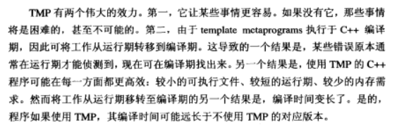

* 该模块会针对我读一本书进行整理，会分几篇博客完成，也许会有些不足或者错误的地方，未来可能会作修改。

* 有一些是看了其他博客觉得比较好摘来的，有一些是书上的，有一些是自己总结的。

# Effective C++总结3

## 条款31：将文件间的编译依存关系降至最低
对于C++类而言，如果它的头文件变了，那么所有这个类的对象所在的文件都要重编，但如果它的实现文件（cpp文件）变了，而头文件没有变（对外的接口不变），那么所有这个类的对象所在的文件都不会因之而重编。

因此，避免大量依赖性编译的解决方案就是：** 在头文件中用class声明外来类，用指针或引用代替变量的声明；在cpp文件中包含外来类的头文件。 **

具体做法 比如现在有A B C三个类，A要用到B C，现在有A.cpp,A.h等6个文件，
常规做法我们会将B和C的h文件放入A的h文件中，这就会产生一个问题，如果B变了，虽然C不需要重新编译，但是A需要重新编译，所有用到A的都需要重新编译，这毫无疑问是个大问题。

现在改了 ，将B C的h文件放入A的cpp文件中，然后将A.h文件中的#include”B.h”换成class B；（C也一样处理），这样处理的话B和C发生变化的时候A.cpp虽然还是要重新编译，但是A.h就不会重新编译了。最重要的是用到A的文件也不需要重新编译。

## 条款32：确定你的public继承是is-a关系
public继承意味着 is-a 关系，也就是要求，适用于基类身上的每一件事情，是每一件，也一定适用于衍生类身上。有时候，直觉上满足这一条件的继承关系，可能并不一定，比如，企鹅是鸟，但并不会飞。

## 条款33：避免遮掩继承而来的名称
如果在父类中没有设为虚函数的函数在子类中被声明，那么这个声明将覆盖父类的函数（包括重载的函数）。
但是你又不想将重载的函数给覆盖 你就可以这么做(使用using)

但是这里的using 直接就把一个函数名的所有函数都继承来了
如果我们只想要特定的函数而不是所有重载函数 就可以用forwarding functions 转交函数（此时由于在声明时定义，成为inline函数）

## 条款34：区分接口继承和实现继承

我们可以为纯虚函数提供实现代码，但是调用它的唯一途径是调用时明确指出其类的名称。

纯虚函数定义：virtual<函数类型><函数名>(参数表)=0;

## 条款35：考虑虚函数以外的其他选择
虚函数（本质是希望子类的实现不同）的替代方案：

** 方案1：** 

用public的非虚函数来调用private的虚函数具体实现，非虚函数必须为子类继承且不得更改，所以它决定了何时调用以及调用前后的处理；虚函数实现可以在子类中覆写，从而实现多态。

优点就是可以在你调用虚函数之前做一些准备工作，比如锁定互斥器、制造转运日志记录项等等。该方法下虚函数没有必要一定是private的，可以是protected，但有时候必须是public的，这样就不能用改方法了。

** 方案2：**  将虚函数替换为函数指针成员变量，这样可以对同一种子类对象赋予不同的函数实现，或者在运行时更改某对象对应的函数实现（添加一个set函数）。

** 方案3：** 用tr1::function成员变量替换虚函数，从而允许包括函数指针在内的任何可调用物搭配一个兼容于需求的签名式。

** 方案4：** 将虚函数也做成另一个继承体系类，然后在调用其的类中添加一个指针来指向其对象。

## 条款36：绝不重新定义继承而来的非虚函数

Virtual函数是动态绑定的，而non-virtual函数不是

non-virtual在实现上是静态绑定的，调用父类还是子类的函数完全取决于指针或者对象的类型。在子类重定义non-virtual时，父类的相同的函数是不会被覆盖的。

（non-virtual函数mf被重写）按照常理这两个调用的是不同的函数 但实际是同一函数

## 条款37：绝不重新定义继承而来的缺省参数值
默认参数都是静态绑定的，即你的指针是什么类型，默认参数就是什么类型。而virtual函数是动态绑定的，在运行期才决定调用哪个函数。

所以如果你在父类class Father有一个virtual函数并带有默认参数，例如void p(int default = 100)，在子类重写这个函数，然后换了新的默认参数为default = 10，在你以多态的方式调用p的时候：Father* f = new Son; f->p();这种情况p的默认参数为100而非10。因为f指针的静态类型为Father，而动态类型为Son。

所以如果你的函数必须包含默认参数，不要这样写，解决方法是将带有默认参数的函数改为non-virtual函数，内部再调用一个virtual函数。因为non-virtual函数是从来不应该被重写的

## 条款38：通过复合表示 has-a 或者“根据某物实现出”的关系
注意 has-a 和 is-a 的区分。如果是 is-a 的关系，可以用继承，但如果是 has-a 的关系，应该将一个类作为另一个类的成员变量来使用（复合），以利用该类的能力，而不是去以继承它的方式使用。

## 条款39：明智而审慎地使用private继承

Private继承意味着“根据某物实现出”，而不是 is-a 的关系。与上面的复合（has-a）很像，但比复合的级别低。当衍生类需要访问 protected 基类的成员，或需要重新定义继承而来的虚函数时，可以这么设计。此外，private继承可以让空基类的空间最优化。

** 但是我们尽可能使用复合，必要时才使用private继承。**

因为private继承则并不意味着is-a关系，private继承意味着implemented-in-terms-of（根据某物实现出）。private继承意味着只有实现部分被继承，接口部分被略去。** private继承在软件设计层面上没有意义，其意义只在于软件实现层面。 **

** 何时必要： **主要是当protected成员和/或virtual函数牵扯进来的时候。其实还有一种激进情况，那是当空间方面的厉害关系足以踢翻private继承的支柱时。

对于嵌入类如果是private那它就无法被继承，它里面的virtual函数也就无法被重写。

只有当class不带任何数据没有virtual函数是一个empty类

但是

## 条款40：明智而审慎地使用多重继承
多重继承确实有正当使用场景，比如public继承某个接口类的接口（其接口依然是public的），private继承某个类的实现来协助实现（继承来的实现为private，只供自己用）。虚继承会增加大小、速度、初始化（及赋值）复杂度等成本，如果虚基类不带任何数据，将是最具使用价值的情况。

1). 使用虚继承的类所产生的对象比不使用虚继承的大.

2). 访问虚基类成员变量时,也比访问非虚基类慢. 

3).

所以最好

1.非必要不适用虚父类，平时最好使用非虚继承

2.如果你必须使用虚基类，尽可能避免在其中放置数据，这样一来你就不需担心这些classes身上的初始化和赋值所带来的诡异事情了。

## 条款41：了解隐式接口和编译期多态

类和模板都支持接口和多态。

类的接口是显式定义的，就是说一定能直接找到这个接口的实现代码。多态是通过虚函数在运行期体现的。

模板的接口是隐式的（由模板函数的实现代码所决定其模板对象需要支持哪些接口），多态通过模板具现化和函数重载解析在编译期体现，也就是编译期就可以赋予不同的对象于模板函数。

## 条款42：了解typename的双重意义

** 嵌套从属类型 **（即依赖于模板参数类型的一个子类型，例如迭代器）

下面的例子中可以看出C本身并不是嵌套类型名称，只能算从属名称。但是C::iterator iter 是嵌套从属类型。

声明模板的参数时，前缀关键字 class 和 typename 可互换，功能相同。

对于嵌套从属类型名称必须用typename来修饰，但不能在模板类的基类列和初始化列表中修饰基类。

## 条款43：学习处理模板化基类内的名称

如果基类是模板类，那么衍生类直接调用基类的成员函数无法通过编译器，因为可能这个模板类针对某个类（参数）不声明该接口函数。

解决方法有：

1.在调用动作前加上“this->”

2.使用using声明式来在子类中声明基类的该接口

3.明确指出被调用的函数位于基类：Base< template >::xxx();

以上做法都是承诺被调用的函数一定会在各种特化基类中均声明。如果没有声明，还是会在运行期报错。

## 条款44：将与参数无关的代码抽离templates
Template里面的重复不易发现 但是要注意 不然会造成代码膨胀

任何模板代码都不该与某个造成膨胀的参数产生相依关系：

** 情况1： **
因非类型模板参数造成的代码膨胀（比如用尺寸做模板参数导致为不同尺寸的同一对象生成多份相同代码），往往可消除，做法是将该参数改为函数参数或者类成员变量，而不要放到模板的参数中。

** 情况2： **因类型参数造成的代码膨胀（比如int和long有相同的二进制表述，但作为模板参数会产生两份代码），往往可降低，做法是让带有完全相同二进制表述的具体类型共享实现码——使用唯一一份底层实现。

因此template持有指针者(例如list< int* >,list< const int* >,list< SquareMatrix < long,3 >* >等等)常常应该为每一份成员函数提供唯一一份被不同类型参数共享的底层实现.也就是说,如果某些成员函数操作强类型指针(T*)等,应该令它们调用另一个操作无类型指针void*的函数,由后者完成实际工作.某些C++标准程序库的实现版本的确为vector,list等templates做了这件事.

## 条款45：运用成员函数模板接受所有兼容类型
请使用member function templates（成员函数模板）生成“可接受全部兼容类型”的函数。

文中以shared_ptr为例讲解了使用成员函数模板实现智能指针不同类型间的转换（智能指针都是模板类），以及如何避免任意类型之间的相互转换，这种函数可称为泛化拷贝构造函数。另外泛化拷贝构造不同于默认拷贝构造函数。

同是一个模板出来的 可以通过这个泛化拷贝构造函数相互转化

虽然这种模板构造函数也能作为复制构造函数使用（用相同类型来构造即可），但编译器还是会当做你没有声明复制构造函数，从而为你创建一个，因此如果想要彻底控制行为，你还是需要自行声明你的复制构造函数和赋值构造函数。

## 条款46：需要类型转换时请为模板定义非成员函数
模板类中的模板函数不支持隐式类型转换，如果你在调用时传了一个其他类型的变量，编译器无法帮你做类型转换，从而报错。

解决方案是将该模板函数定义为模板类内的友元模板函数，从而支持了参数的隐式转换。

为了能让编译通过，我们能够进行例如以下改变

这样在定义一个Rational< int >对象的时候，operator 模板函数事实上已经被实例化了，这时候再调用oneHalf x 2这句话的时候，就是直接调用已经实例化的operator*函数了，所以，此时，它支持隐式转换。将2转换为Rational< int >对象。

之前的做法相当于让int变为一个rational，但是系统无法推导出来，后面则是直接告诉这个operator函数T为int。

如果函数的功能比较简单，可以直接inline，如果比较复杂，可以调用一个类外的定义好的模板函数（此时，友元函数已经给参数做了类型转换，因此可以调用模板函数了）。

在类中定义的友元函数都被视为非成员函数

## 条款47：请使用traits classes表现类型信息
traits是用来获取参数类型信息，因为有时候需要根据参数类型信息做不同的处理

如果我们采用if else参数类型给出相应操作 这是在运行期才能完成的事，但是这么一来效率低而且我们可能在编译器就需要这个类型。

那么怎么在编译期做到判断数据类型呢，方法就是重载函数，重载函数是在编译期就确定了调用哪个的，原理就是和所有名字相同的重载函数比较，直到找到参数类型一致的，这就是编译期实现了判断，可以利用这个特点在编译期就决定函数要运行什么功能。

** 总结：**对于模板函数，可能对于接收参数的不同类型，有不同的实现。此时，可以提供一个traits class，其中包含了某一系列类型的类型信息（通常以枚举区分具体类型），然后，在该类中实现接收多种traits参数的重载工具函数，用来根据标识的不同类进行不同的具体函数操作。这使得该行为能在编译期就被区分。

## 条款48：认识模板元编程（TMP）

采用模板编程的好处是：
　
1.可将工作由运行期移动到编译器完成，造成更高的执行效率（占用内存小，运行速度快）和更早的侦测错误
　
2.编码更加简洁；

坏处：
1.编译时间长   2.代码不易理解