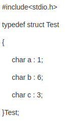

---
layout: post
title:  "struct、class和union"
data: 星期日, 16. 二月 2020 03:04下午 
categories: C++
tags: 专题
---
* 该模块会针对C++中的某一块知识做专题整理，也许会有些不足或者错误的地方，未来可能会作修改。

# C++专题3----struct、class和union

#### 本篇主要讲这三者的异同点，并针对讲一讲union（因为另外两个大家接触的比较多了）。

## Union

#### 定义： 

#### 注意

1.是一种特殊的节省空间的类，可以有多个数据成员，但是任意时刻只有一个数据成员可以有值，当我们给union的某个成员赋值之后，该union的其他成员就变成未定义的状态了。

2.可以为其成员指定public、protected和private等访问权限，默认情况下，其成员的访问权限为public。

3.所以分配给一个union对象的存储空间**至少**要能容纳它的最大的数据成员。

4.union不能含有静态、引用类型的成员，不能作为基类使用，不能作为派生类，不能有虚函数

5.为了追踪union中存的是什么类型的值，我们会定义一个独立的对象，这个叫做union的判别式，判别式是一个枚举类型。

#### 当union中有类成员（十分麻烦）
1.如果是union内的内置类型的成员可以直接赋值修改，但是如果是其他类型的成员就是要分别构造和析构该类型的成员。对于union来说想要构造或销毁一个类类型的成员十分复杂，所以我们会吧含有类类型成员的union内嵌到另一个类中，这个类可以管理并控制与union的类类型成员有关的状态转换。

2.当union成员中有成员有自己的析构函数就要注意定义union的析构函数了，因为析构函数并不知道当前要调用哪个析构函数。（不建议union含有自带析构函数的类成员）

3.当union含有类类型成员时，如果该类类型定义了默认构造函数或拷贝控制成员，则编译器为union合成对应的版本并将其声明为删除的，这意味着你的union甚至无法实例化，除非你自己定义构造函数。析构函数同理（上一条）。

4.C++的早期版本不允许union的成员是定义了构造函数或拷贝控制成员的类类型成员，C++11中取消了这个限制。但是也别高兴得太早，因为这类union在发生涉及到类类型成员的值转换时需要根据需求调用相关类成员的构造函数或析构函数。

#### 匿名union
在匿名union的作用域内该union的成员都是可以直接访问的。

匿名union不能包含受保护的成员或私有成员，也不能定义成员函数。

#### union的作用： 

union提供了一种有效的途径使得我们可以方便地表示一组数据类型不同的互斥值。

当多个基本数据类型或复合数据结构要占用同一片内存时，我们要使用union；当多种类型，多个对象，多个事物只取其一时（我们姑且通俗地称其为“n 选1”），我们也可以使用联合体来发挥其长处。

## struct与class的其他区别（两者区别很小）

1.使用struct 和 class定义类第一个区别是默认的访问权限，在不设置访问权限符的时候 class默认的成员都是private的，但是struct 都是public的
    
 2.默认情况下calss关键字定义的派生类是私有继承，而使用struct关键字定 义  的派生类是公有继承的
  
3.从关键字上，class有点特殊，在模板编程时用作类型名指定，等价于typename。

 
**注意：**

1.两者都可以有成员函数；包括各类构造函数，析构函数，重载的运算符，友元类，友元结构，友元函数，虚函数，纯虚函数，静态函数；

 2.都可以进行复杂的继承甚至多重继承，一个struct可以继承自一个class，反之亦可；一个struct可以同时继承5个class和5个struct，虽然这样做不太好。
 
 * union和struct的区别也挺明显的，这里就不总结了，区别还是挺大的，各自的使用场景区别也很大。
 
 * union和struct、class这三者可以相互嵌套

## 空的class会被赋予的函数

1）默认构造函数

2）默认析构函数

3）拷贝(复制)构造函数  （复制构造函数用于将一个对象复制到新创建的对象中。也就是说，它用于初始化过程中，而不是常规的赋值过程中。比如 Test t2 = t1;）

4）赋值函数(操作符) 比如t3 = t1;

5）地址操作符，  如果没有定义

## 结构体的位域

是C语言中的概念

有时候我们并不需要一个变量的全部字节   举个例子

本来一个char是8比特一字节，但是这里的a只占了1比特，b只有6比特 这就是位域的意义。这样a、b和起来就只占了一个字节。

在使用位域时需注意，位域不能跨字节存储，也不能跨类型存储，并且位域的长度不能大于指定类型的固有长度。

不能跨字节存储的意思就比入上述c的值是存在一个新的字节中，而不是将1比特放置在ab都存在的字节中。
