* 该模块会针对计算机网络中的某一块知识做专题整理，也许会有些不足或者错误的地方，未来可能会作修改。

#  计算机网络专题1----TCP知识整理

* 面试中经常会遇到的TCP相关问题

## 三次握手
TCP连接建立过程要解决三个问题：

1.要使使用TCP的双方能够知道对方的存在

2.要允许双方协商一些参数（如最大窗口值，是否使用窗口扩大选项和时间戳选项等）

3.能够对运输实体资源（如缓存大小、连接表中的项目进行分配）。

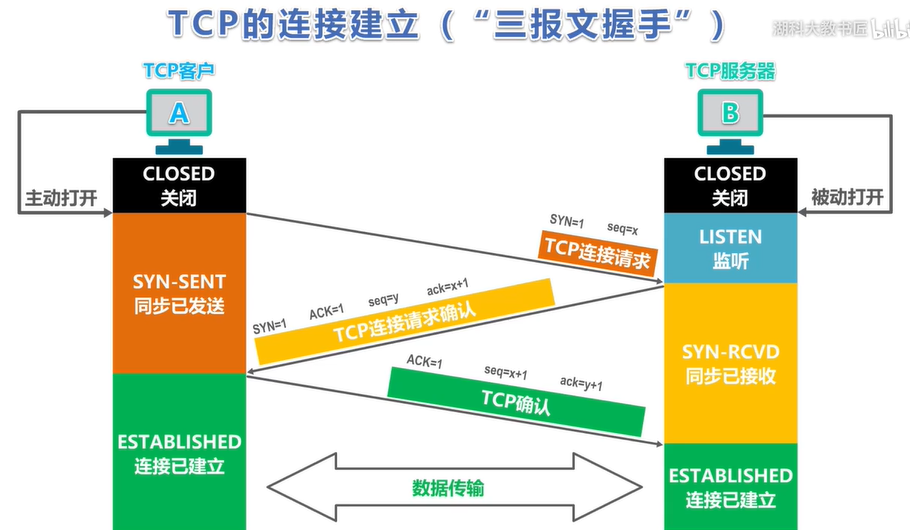

第一次握手：SYN=1 表示是TCP连接请求，这个报文不能携带数据，seq=x是TCP客户选择 的初始序号，同时即使没数据也要消耗一个序号（所以下面ack=x+1）

第二次握手：SYN=1 ACK=1 表示这个是TCP连接请求确认报文，不能携带数据，但也要消耗一个序号，seq=y是TCP服务器选择的初始序号。

第三次握手：ACK=1 表示这个是TCP确认报文，可以携带数据，但是如果不携带数据，下一个报文发送的数据仍然是seq=x+1

#### 只有两次握手会出现什么问题
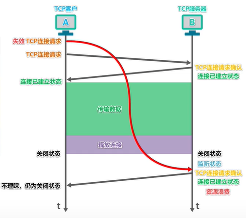

#### 服务器端如何TCP连接期间确定客户端是正常连接呢
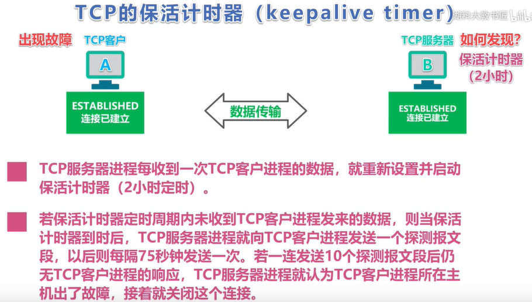

## 四次挥手
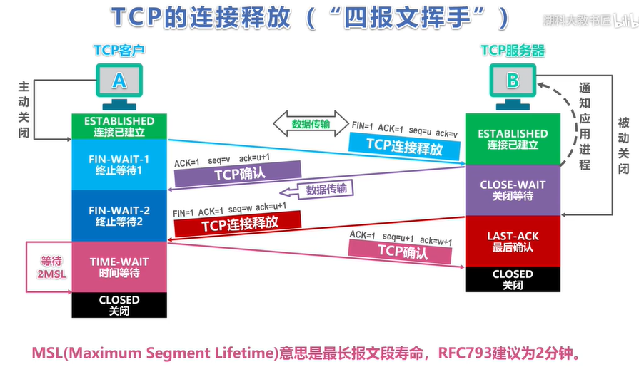

第一次挥手：即使不发送数据也要消耗一个需要，u等于客户端发送的最后一个序号+1，v等于服务器最后发送的序号+1.

第二次挥手：表示服务器已经接收了第一次挥手，知道客户端不再传过来数据，但是服务器接下来还可以传输数据，把剩下的传完。

第三次挥手：表示剩下的数据传完了，w等于服务器最后发送的序号+1.

第四次挥手：因为之前说第一次挥手即使不传数据也要消耗序号，所以seq=u+1。

#### TIME_WAIT
也就是上图的等待2MSL时间。那么如果不等会怎么样呢？

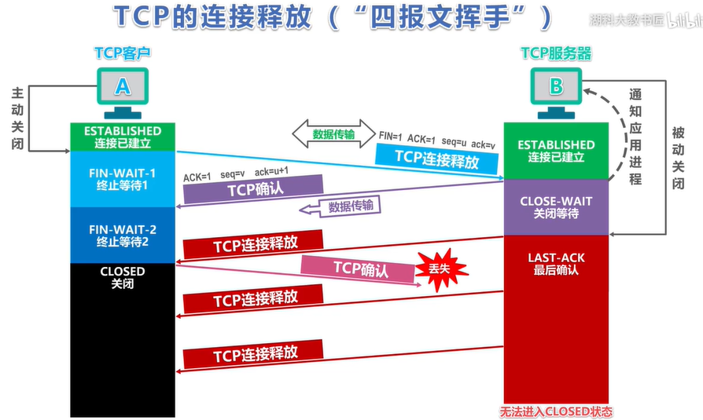

## 可靠传输

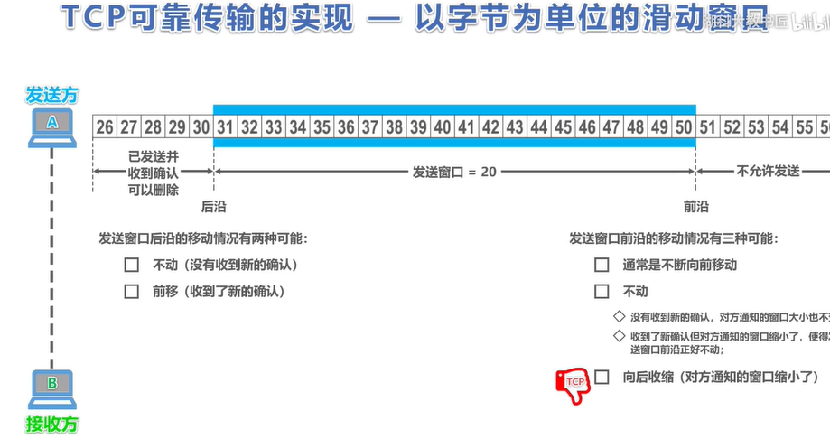

接收方只能对字节接收到的有序数据的最大序号做出确认报文，整个过程和数据链路层的选择重传很像 

--------------------------------------------------------------------------------------------

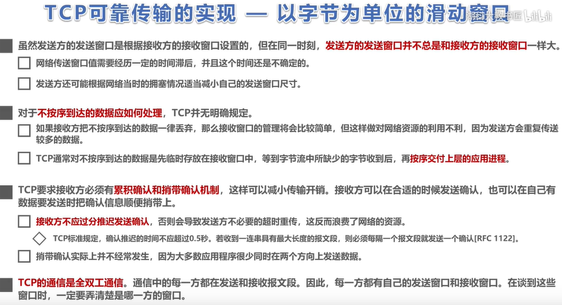

确认累计：即接收多个报文后再发送确认报文

稍带确认：发数据的时候顺便发送确认报文

#### 超时重传时间选择

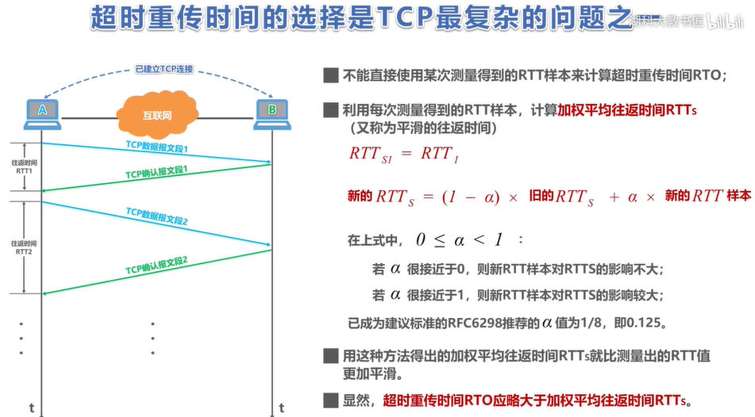

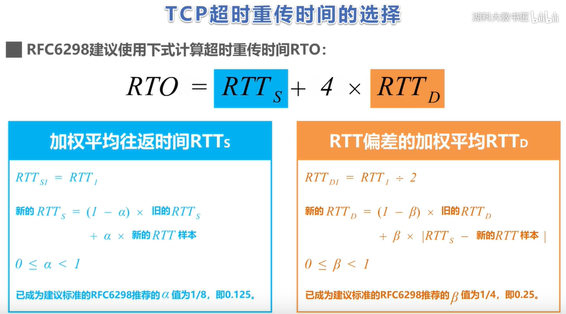

## 拥塞控制
#### 慢开始
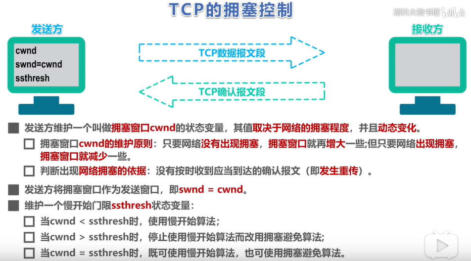

初始cwnd=1，cwnd的值是几就能发送几个数据报文段（注意这里我们单位不用字节）

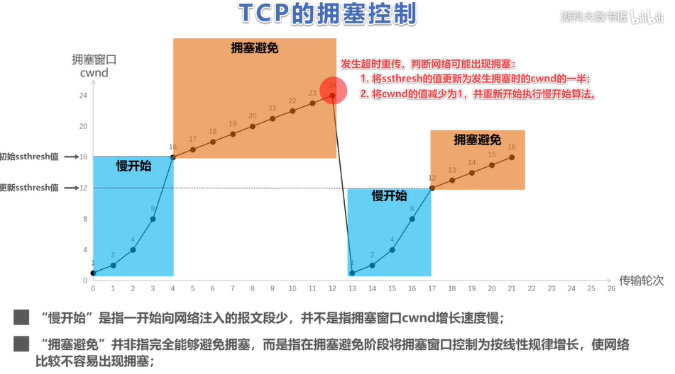

#### 快重传

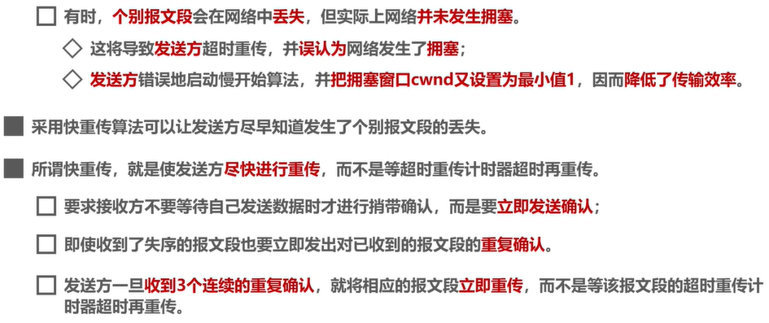

--------------------------------------------------------------------------------------------

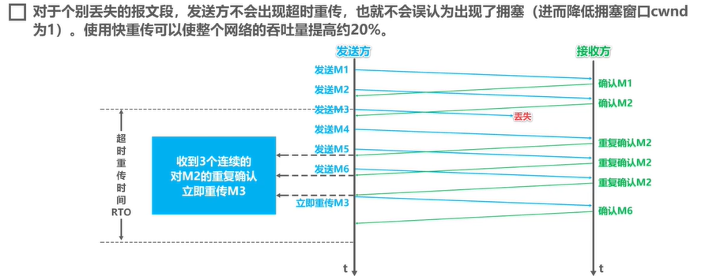

-------------------------------------------------------------------------------------------

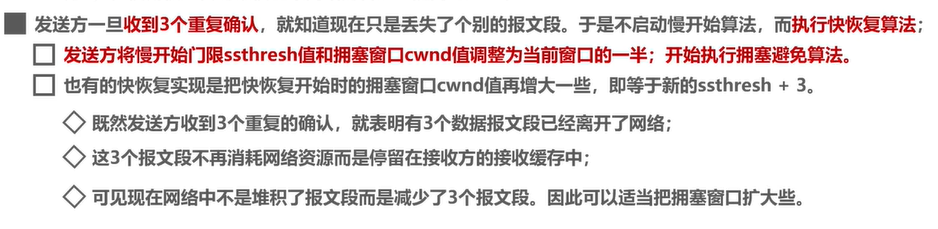

-------------------------------------------------------------------------------------------

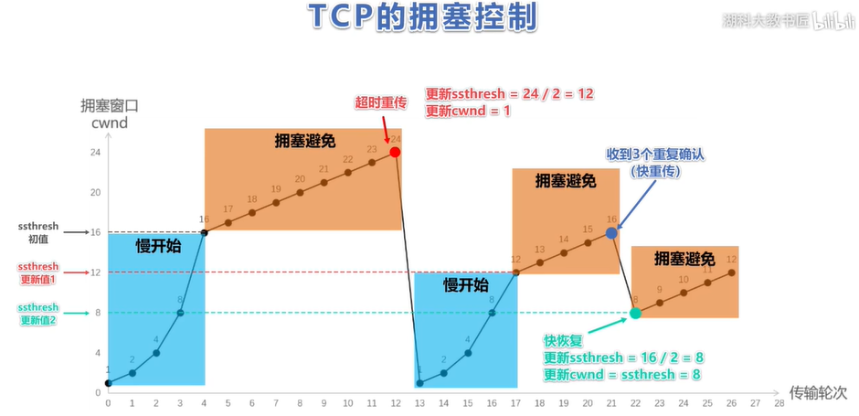

## 流量控制
利用滑动窗口实现对发送方的流量控制，下面给出一个例子，假设初始的发送窗口和接收窗口为400字节

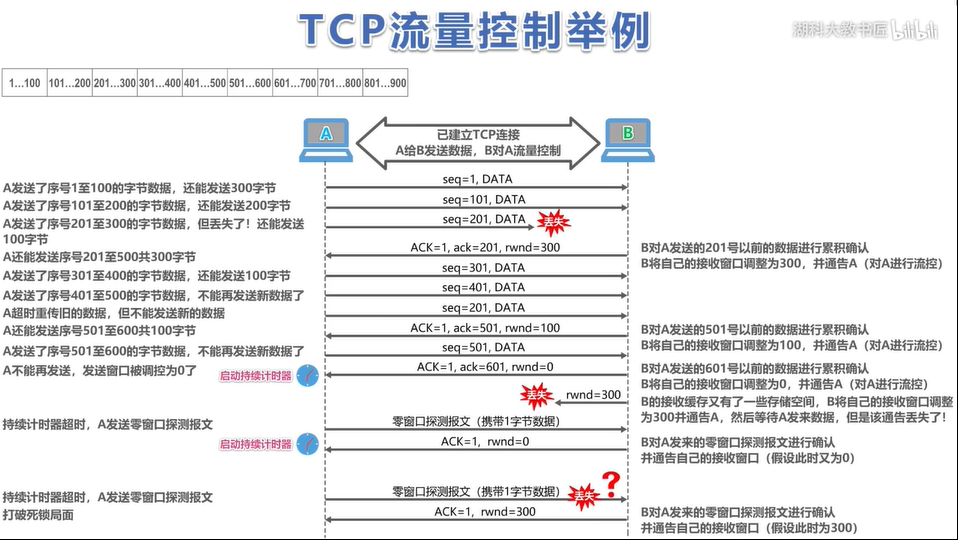

** 参数介绍 ：**

seq:发送报文段的起点

ACK:TCP确认报文标志

ack: 编号之前的报文全收到了

rwnd:发送窗口调整

** 注意：**

1.不一定要发送窗口全接收才发送窗口往前走。

2.** 一旦接收到发送窗口调整为0（即rwnd=0）的报文就设计时器，一段时间问一次接收方窗口是多少,主要是防止接受方发送的重新调整报文丢失造成的死锁，所以设了一个定时询问。

3.发送窗口其实是在拥塞窗口和接收窗口中取小者。

## TCP粘包
#### 什么是TCP粘包？

** 正常情况 **

** TCP粘包 **

发送的数据小于TCP发送缓冲区的大小，TCP将多次写入缓冲区的数据一次发送出去，将会发生粘包。这种情况由于接收端不知道这两个数据包的界限，所以对于接收端来说很难处理。

#### 为什么产生TCP粘包
接收方不知道该接收多大的数据才算接收完毕，造成粘包。

** 发送方原因：**

TCP默认使用Nagle算法（主要作用：减少网络中报文段的数量），而Nagle算法主要做两件事：

1.只有上一个分组得到确认，才会发送下一个分组

2.收集多个小分组，在一个确认到来时一起发送

Nagle算法造成了发送方可能会出现粘包问题

** 接收方原因： **

TCP接收到数据包时，并不会马上交到应用层进行处理，或者说应用层并不会立即处理。实际上，TCP将接收到的数据包保存在接收缓存里，然后应用程序主动从缓存读取收到的分组。这样一来，如果TCP接收数据包到缓存的速度大于应用程序从缓存中读取数据包的速度，多个包就会被缓存，应用程序就有可能读取到多个首尾相接粘到一起的包。

** 注意：**

1.UDP则是面向消息传输的，是有保护消息边界的，接收方一次只接受一条独立的信息，所以不存在粘包问题。

#### 怎么解决

** 发送方： ** 关闭Nagle算法

** 接收方： **

方法一：

需要应用层着手，读完一条数据后马上读下一条数据。这里有个关键点是如何获得每条数据长度，有两个方案。

1.格式化数据：每条数据有固定的格式（开始符，结束符），这种方法简单易行，但是选择开始符和结束符时一定要确保每条数据的内部不包含开始符和结束符。

2.发送长度：发送每条数据时，将数据的长度一并发送，例如规定数据的前4位是数据的长度，应用层在处理时可以根据长度来判断每个分组的开始和结束位置。

方法二：

可以在数据包之间设置边界，如添加特殊符号，这样，接收端通过这个边界就可以将不同的数据包拆分开。

## TCP与UDP的区别
1.TCP面向连接，UDP是无连接的

2.TCP提供可靠的服务。也就是说，通过TCP连接传送的数据，无差错，不丢失，不重复，且按序到达;UDP尽最大努力交付，即不保证可靠交付（UDP并没有流量控制和拥塞控制）

3.UDP具有较好的实时性，工作效率比TCP高，适用于对高速传输和实时性有较高的通信或广播通信。

4.每一条TCP连接只能是点到点的;UDP支持一对一，一对多，多对一和多对多的交互通信

5.TCP对系统资源要求较多，同时首部最小20字节最大60字节，UDP对系统资源要求较少，首部开销小，仅8字节。

6.TCP是面向字节流的，将应用层传下来的数据看作字节。UDP对应用层报文字节打包添加首部。

#### TCP的适用场景：文件传输（准确高要求高、但是速度可以相对慢）、接受邮件、远程登录。

#### UDP的适用场景：QQ聊天、在线视频、网络语音电话