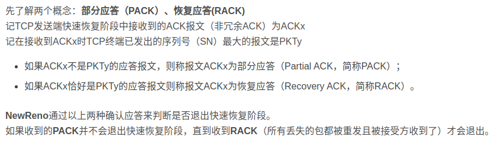

* 该模块会针对计算机网络中的某一块知识做专题整理，也许会有些不足或者错误的地方，未来可能会作修改。

#  计算机网络专题1----TCP知识整理

* 面试中经常会遇到的TCP相关问题

## 三次握手
TCP连接建立过程要解决三个问题：

1.要使使用TCP的双方能够知道对方的存在

2.要允许双方协商一些参数（如最大窗口值，是否使用窗口扩大选项和时间戳选项等），主要是序列号。

3.能够对运输实体资源（如缓存大小、连接表中的项目进行分配）。

第一次握手：SYN=1 表示是TCP连接请求，这个报文不能携带数据，seq=x是TCP客户选择 的初始序号,这个序号是随机初始化的，同时即使没数据也要消耗一个序号（本身也不能带数据，防止攻击者发送SYN报文攻击）（所以下面ack=x+1）
>
序号随机初始化主要是出于网络安全的因素着想。如果不是随机产生初始序列号，黑客将会以很容易的方式获取到你与其他主机之间通信的初始化序列号，并且伪造序列号进行攻击，这已经成为一种很常见的网络攻击手段。

第二次握手：SYN=1 ACK=1 表示这个是TCP连接请求确认报文，不能携带数据，但也要消耗一个序号，seq=y是TCP服务器选择的初始序号。

第三次握手：ACK=1 表示这个是TCP确认报文，可以携带数据，但是如果不携带数据，下一个报文发送的数据仍然是seq=x+1

#### 半连接队列
服务器第一次收到客户端的 SYN 之后，就会处于 SYN_RCVD 状态，此时双方还没有完全建立其连接，服务器会把此种状态下请求连接放在一个队列里，我们把这种队列称之为半连接队列。

#### 只有两次握手会出现什么问题

#### 第三次握手失败会怎么办
那么server端就会启动超时重传机制，超过规定时间后重新发送SYN+ACK，重传次数根据/proc/sys/net/ipv4/tcp_synack_retries来指定，默认是5次。如果重传指定次数到了后，仍然未收到ACK应答，那么一段时间后，server自动关闭这个连接。但是client认为这个连接已经建立，如果client端向server写数据，server端将以RST包响应
>
SYN洪泛攻击(DDos攻击的一种)
>
TCP SYN泛洪发生在OSI第四层，这种方式利用TCP协议的特性，就是三次握手。攻击者发送TCP SYN，SYN是TCP三次握手中的第一个数据包，而当服务器返回ACK后，该攻击者就不对其进行再确认，那这个TCP连接就处于挂起状态，也就是所谓的半连接状态，服务器收不到再确认的话，还会重复发送ACK给攻击者。这样更加会浪费服务器的资源。
>
解决方法：
>
1.第一种是缩短SYN Timeout时间,缩短从接收到SYN报文到确定这个报文无效并丢弃改连接的时间,原来一般几分钟。但过低的SYN Timeout设置可能会影响客户的正常访问。
>
2.设置SYN Cookie，就是给每一个请求连接的IP地址分配一个Cookie，如果短时间内连续受到某个IP的重复SYN报文，就认定是受到了攻击
>

#### 服务器端如何TCP连接期间确定客户端是正常连接呢

#### 如果客户端突然掉线或者重启，服务器端怎么样才能立刻知道？
若客户端掉线或者重新启动，服务器端会收到复位信号，每一种tcp/ip得实现不一样，控制机制也不一样。

#### SYN攻击
SYN攻击就是Client在短时间内伪造大量不存在的IP地址，并向Server不断地发送SYN包，Server则回复确认包，并等待Client确认，由于源地址不存在，因此Server需要不断重发直至超时，这些伪造的SYN包将长时间占用未连接队列，导致正常的SYN请求因为队列满而被丢弃，从而引起网络拥塞甚至系统瘫痪。

#### 三次握手中用到的函数（socket编程）

* 这个图有点问题 connect应该指向accept的上方而不是下方

其中connect函数和accept函数一起实现了三次握手

connect()为阻塞函数，其等待三次握手。

注：如果是 TCP 套接字，调用 connect 函数将激发 TCP 三次握手，而且仅在连接成功或出错时才返回。返回一个int类型的变量。

## 四次挥手

* 客户端和服务端都可发出释放请求

第一次挥手：即使不发送数据也要消耗一个需要，u等于客户端发送的最后一个序号+1，v等于服务器最后发送的序号+1.

第二次挥手：表示服务器已经接收了第一次挥手，知道客户端不再传过来数据，但是服务器接下来还可以传输数据，把剩下的传完。(此时的客户端就处于**半连接状态**或者**半关闭状态**)

第三次挥手：表示剩下的数据传完了，w等于服务器最后发送的序号+1.

第四次挥手：因为之前说第一次挥手即使不传数据也要消耗序号，所以seq=u+1。

#### TIME_WAIT
也就是上图的等待2MSL时间。那么如果不等会怎么样呢？
>
MSL(最大分段生存期)指明TCP报文在Internet上最长生存时间

#### 当http请求到来导致服务器端出现太多time_wait应该怎么办
主要关注高并发短连接的TCP服务器

1.高并发可以让服务器在短时间范围内同时占用大量端口，而端口有个0~65535的范围，并不是很多，刨除系统和其他服务要用的，剩下的就更少了。

2.在这个场景中，短连接表示“业务处理+传输数据的时间 远远小于 TIMEWAIT超时的时间”的连接。

**解决方法：**

1.负载均衡

2.端口复用 
>

>
也可以创建的时候socket直接设置SO_REUSEADDR

#### 如果直接关闭或者避免TIME_WAIT
1.禁用socket延迟关闭；

2.禁用net.ipv4.tcp_tw_reuse；

3.禁用net.ipv4.tcp_tw_recycle；

>
从服务端入手，在服务端向客户端返回所有有效数据后，再在后面插入若干填充字节；而在客户端将有效数据读完之后，将填充字节留在对应socket的接收队列中，然后直接关闭连接。这个思路的好处是对客户端程序不需要做改动。

>
在网上，解除TIME_WAIT状态限制有多种方法，其中有种方法是在socket建立后调用setsockopt函数如下：
>
int option = 1;
>
setsockopt(socket SOL_SOCKET SO_REUSEADDR &option sizeof(option));

## 可靠传输

接收方只能对字节接收到的有序数据的最大序号做出确认报文，整个过程和数据链路层的选择重传很像 

--------------------------------------------------------------------------------------------

确认累计：即接收多个报文后再发送确认报文

稍带确认：发数据的时候顺便发送确认报文

#### 超时重传时间选择

#### Nagle算法
此算法在TCP的实现中广泛使用。

若发送应用进程把要发送的数据逐个字节地发送到TCP的发送缓存，则发送方就
把第一个数据字节先发出去，把后面到达的数据缓存起来。当发送接收到对第一
个数据字符的确认后，再把发送缓存中的所有数据组装成一个报文段发送出去，
同时继续对随后到达的数据进行缓存。只有收到对前一个报文段的确认后才继续
发送下一个报文段。

## 拥塞控制
拥塞窗口以一个数据包大小（512Byte）为基数，

#### 慢开始

初始cwnd=1，cwnd的值是几就能发送几个数据报文段（注意这里我们单位不用字节）

#### 快重传

--------------------------------------------------------------------------------------------

-------------------------------------------------------------------------------------------

-------------------------------------------------------------------------------------------

#### 拥塞控制的缺点
发送端从发送报文到收到ACK经历一个RTT，在高带宽延时（High Bandwidth-Delay Product，BDP）网络中，RTT很大，导致拥塞窗口增长很慢，传输速度需要经过很长时间才能达到最大带宽，导致带宽利用率将低。

所以后续有相对应的拥塞控制算法Cubic和BBR

#### Reno算法的缺点(NewReno算法)
Reno算法就是上面的慢启动+拥塞控制+快重传+快恢复

而这里改进的算法名字为NewReno

Reno缺陷是它只考虑了只丢失一个包的情形，只要丢失了一个包，就被认为是发生了一次拥塞。

在实际的网络中，一旦发生拥塞，会丢弃大量的包。如果采用Reno算法，它会认为网络中发生了多次拥塞，则会多次将cwnd和ssthresh减半，造成吞吐量极具下降，当发送窗口小于3时，将无法产生足够的ACK来触发快重传而导致超时重传，超时重传的影响是非常大的。

在只丢失一个数据包的情况下，NewReno和Reno的处理方法是一致的，而在同一个时间段丢失了多个包时，NewReno做出了改进。

Reno快速恢复算法中，发送方只要收到一个新的ACK就会退出快速恢复状态而进入拥塞避免阶段，Neweno算法中，只有当所有丢失的包都重传并收到确认后才退出。

在NewReno中，添加了恢复应答判断功能，使得TCP终端可以区分一次拥塞丢失多个包还是发生了多次拥塞。

## 流量控制
利用滑动窗口实现对发送方的流量控制，下面给出一个例子，假设初始的发送窗口和接收窗口为400字节

**参数介绍 ：**

seq:发送报文段的起点

ACK:TCP确认报文标志

ack: 编号之前的报文全收到了

rwnd:发送窗口调整

**注意：**

1.不一定要发送窗口全接收才发送窗口往前走。

2.**一旦接收到发送窗口调整为0（即rwnd=0）的报文就设计时器，一段时间问一次接收方窗口是多少,主要是防止接受方发送的重新调整报文丢失造成的死锁，所以设了一个定时询问。**

3.发送窗口其实是在拥塞窗口和接收窗口中取小者。

4.其中各自的接收窗口大小取决于应用、系统、硬件的限制（TCP传输速率不能大于应用的数据处理速率）

## TCP粘包
#### 什么是TCP粘包？

**正常情况**

**TCP粘包**

发送的数据小于TCP发送缓冲区的大小，TCP将多次写入缓冲区的数据一次发送出去，将会发生粘包。这种情况由于接收端不知道这两个数据包的界限，所以对于接收端来说很难处理。

#### 为什么产生TCP粘包
接收方不知道消息之间的界限，不知道一次性提取多少字节的数据所造成的。

**发送方原因：**

TCP默认使用Nagle算法（主要作用：减少网络中报文段的数量），而Nagle算法主要做两件事：

1.只有上一个分组得到确认，才会发送下一个分组

2.收集多个小分组，在一个确认到来时一起发送

Nagle算法造成了发送方可能会出现粘包问题

**接收方原因：**

TCP接收到数据包时，并不会马上交到应用层进行处理，或者说应用层并不会立即处理。实际上，TCP将接收到的数据包保存在接收缓存里，然后应用程序主动从缓存读取收到的分组。这样一来，如果TCP接收数据包到缓存的速度大于应用程序从缓存中读取数据包的速度，多个包就会被缓存，应用程序就有可能读取到多个首尾相接粘到一起的包。

**拆包：**
当发送端缓冲区的长度大于网卡的MTU时，tcp会将这次发送的数据拆成几个数据包发送出去。

**注意：**

1.UDP则是面向消息传输的，是有保护消息边界的，接收方一次只接受一条独立的信息，所以不存在粘包问题。

#### 怎么解决

**发送方：**关闭Nagle算法

**接收方：**

方法一：

需要应用层着手，读完一条数据后马上读下一条数据。这里有个关键点是如何获得每条数据长度，有两个方案。

1.格式化数据：每条数据有固定的格式（开始符，结束符），这种方法简单易行，但是选择开始符和结束符时一定要确保每条数据的内部不包含开始符和结束符。

2.发送长度：发送每条数据时，将数据的长度一并发送，例如规定数据的前4位是数据的长度，应用层在处理时可以根据长度来判断每个分组的开始和结束位置。

方法二：

可以在数据包之间设置边界，如添加特殊符号，这样，接收端通过这个边界就可以将不同的数据包拆分开。

## TCP和UDP的相互影响
在一个程序中tcp的flow control算法可能对udp丢包率造成的影响，而udp的发包率和包大小也会影响tcp的流量控制，并且也会影响网络的吞吐量。

## TCP协议中的计时器
#### 重传计时器：Retransmission Timer
为了控制丢失的报文段或者丢弃的报文段。这段时间为对报文段的等待确认时间。

#### 坚持计时器：Persistent Timer
主要解决零窗口大小通知可能导致的死锁问题

#### 保活计时器：Keeplive Timer
主要是为了防止两个TCP连接出现长时间的空闲。

#### 时间等待计时器：Timer_Wait Timer
时间等待计时器是在连接终止期间使用的。(TIME_WAIT)

## TCP与UDP的区别
1.TCP面向连接，UDP是无连接的

2.TCP提供可靠的服务。也就是说，通过TCP连接传送的数据，无差错，不丢失，不重复，且按序到达;UDP尽最大努力交付，即不保证可靠交付（UDP并没有流量控制和拥塞控制），也是无序的。

3.UDP具有较好的实时性，工作效率比TCP高，适用于对高速传输和实时性有较高的通信或广播通信。

4.每一条TCP连接只能是点到点的;UDP支持一对一，一对多，多对一和多对多的交互通信

5.TCP对系统资源要求较多，同时首部最小20字节最大60字节，UDP对系统资源要求较少，首部开销小，仅8字节。

6.TCP是面向字节流的，将应用层传下来的数据看作字节。UDP对应用层报文字节打包添加首部。

7.Tcp socket在内核中都有一个发送缓冲区和一个接受缓冲区。UDP只有一个socket接受缓冲区，没有socket发送缓冲区，即只要有数据就发，不管对方是否可以正确接受。而在对方的socket接受缓冲区满了之后，新来的数据报无法进入到.
>
任何UDP套接字都有发送缓冲区大小，但实际上不存在UDP发送缓冲区，其大小仅仅是可写到套接字的UDP数据报的大小上限。
>
如果一个应用进程写一个大于套接字发送缓冲区大小的数据报，内核将返回该进程一个EMSGSIZE错误。既然UDP是不可靠的，它不必保存应用进程数据的一个副本，因此无需一个真正的发送缓冲区。

#### TCP的适用场景：文件传输（准确高要求高、但是速度可以相对慢）、接受邮件、远程登录。

#### UDP的适用场景：QQ聊天、在线视频、网络语音电话

## TCP/IP为什么去掉了会话层和表示层
TCP/IP模型中的多数应用层协议都将OSI模型中应用层、会话层和表示层的相应功能合在一起。

## TCP头部

## UDP大小如何确定
在普通的**局域网**环境下，我建议将UDP的数据控制在1472字节以下为好. 

进行Internet编程时则不同,因为Internet上的路由器可能会将MTU设为不同的值.所以就不能设置为1500来发数据。鉴于Internet上的标准MTU值为576字节,所以我建议在进行Internet的UDP编程时。

## UDP的可靠传输
在应用层创建基于UDP的协议模仿TCP的可靠传输

主要有三种**RUDP、RTP、UDT**，我们主要就讲一讲UDT。

#### UDT（UDP-based Data Transfer Protocol）
UDT是面向连接的全双工的应用层协议。发送和接收程式共享同一个UDP端口来发送和接收。

UDT总是试着将应用层数据打包成固定的大小，除非数据不够这么大。和TCP相似的是，这个固定的包大小叫做MSS（最大包大小）。

**连接方式**

**关闭连接**

如果一个UDT连接中的某节点想要关闭，则其会发送shutdown信息给对方，对方收到信息后也进行关闭操作。shutdown信息使用UDP进行传递，无法保证达到，此时会采取超时机制进行关闭，在16次连续 EXP 超时事件发生后，对端节点也会同样进行关闭操作。在目前的实现中，总超时时间的上限为30秒，下限为3秒。

**UDT的拥塞控制**
速率控制（调整包的发送周期）+窗口（限制最大的位被应答的包）

接收者也负责触发和处理任何的控制事件，包括拥塞控制和可靠性控制和他们的相对机制，例如RTT估计、带宽估计、应答和重传。

## 基于TCP的应用层协议
 FTP、Telnet、HTTP、HTTPS、 POP3、 SMTP

## 基于UDP的应用层协议
 DNS、TFTP（简单文件传输协议）、SNMP（简单网络管理协议，是用来管理网络设备的。）

