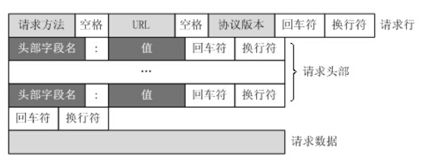
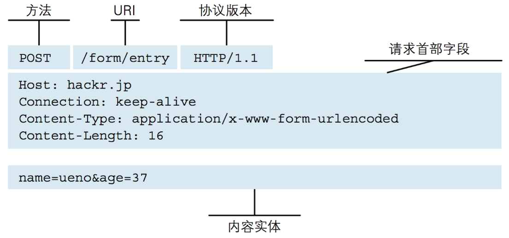
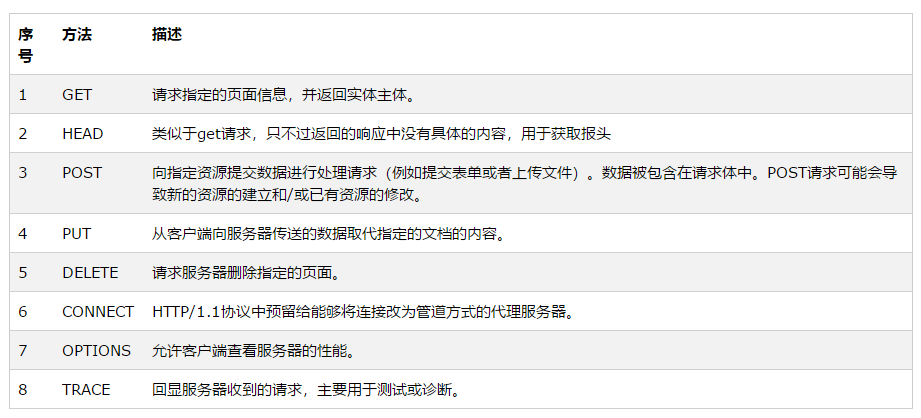
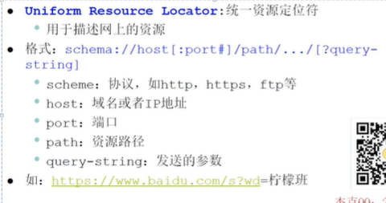
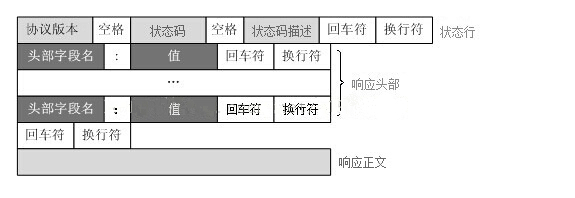
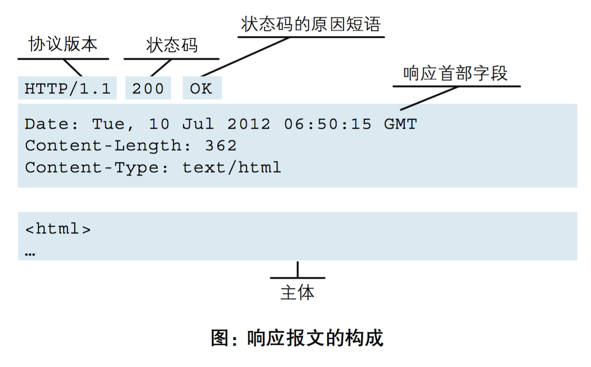
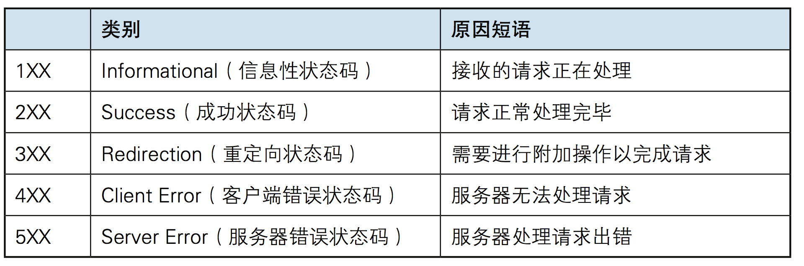
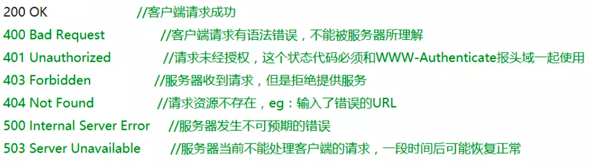

* 该模块会针对计算机网络中的某一块知识做专题整理，也许会有些不足或者错误的地方，未来可能会作修改。

#  计算机网络专题2----HTTP知识整理

## HTTP特点
1.用于从WWW服务器传输超文本到本地浏览器的传送协议

2.是应用层协议，基于TCP传输，端口号为80,基于请求-响应的模式

3.协议对于发送过的请求或响应都不做保存。

4.无连接：限制每次连接只处理一个请求。服务器处理完客户的请求，并收到客户的应答后，即断开连接。采用这种方式可以节省传输时间。(但其实HTTP1.0时代可以通过首部信息来支持tcp的keep-alive，在HTTP1.1时，默认就是keep-alive连接了，TCP直到传输一定数据/或超时/或FIN之前不会断开，所以这个特点可以忽略)

## 工作流程（四步）
1）首先客户机与服务器需要建立连接。只要单击某个超级链接，HTTP的工作开始。

2）建立连接后，客户机发送一个请求给服务器，即请求模板。

3）服务器接到请求后，给予相应的响应信息，即响应模块。

4）客户端接收服务器所返回的信息通过浏览器显示在用户的显示屏上，然后客户机与服务器断开连接。

如果在以上过程中的某一步出现错误，那么产生错误的信息将返回到客户端，有显示屏输出。

## 请求模块

#### 格式

主要可以分为三块：请求行、请求头、请求主体

注意请求头和请求主体之间有一个空行

#### 请求行
>
格式：请求方法+ 请求链接（URL）+HTTP版本
>
比如： POST http://10.1.128.25 HTTP/1.1

** 请求方法 **

HTTP服务器至少应该实现GET和HEAD方法，其他方法都是可选的。

HTTP1.0定义了三种请求方法： GET, POST 和 HEAD方法。

HTTP1.1新增了五种请求方法：OPTIONS, PUT, DELETE, TRACE 和 CONNECT 方法

** 请求链接（URL） **

** HTTP版本 **

HTTP的版本有1.0、1.1、2.0

#### 请求头

比如上面的Host、Connection、Content-Type都属于请求头的一种，请求头有很多，具体有哪些感兴趣的可以去搜一搜。

#### 请求主体
比如上方的name的那一行，并不是所有的请求方法都有请求主体，比如POST就有而GET就没有

## 响应模块
#### 格式

主要可以分为三块：响应行、响应头、响应主体

注意响应头和响应主体间有一个空行

#### 响应行
>
HTTP版本+状态码+状态码原因短语

** 状态码 **

** 状态码原因短语 **

#### 响应头
比如上面的Data这这种就是响应头，也十分的多，如果想了解更多可以百度

#### 响应主体
即上面的主体部分，就是客户端请求的数据，比如一个网页。

## GET和POST的区别
1.POST请求的参数会放在请求主体中，GET则会放在请求行的URL中。

2.一般浏览器规定GET请求的时候，URL长度不能大于2000个字符，POST请求的数据不能大于4M。当然不同的浏览器和服务器限制条件不同。

3.POST 表示可能修改变服务器上的资源的请求。例如我们在刷知乎的时候对某篇文章进行点赞，就是提交的 POST 请求，因为它改变了服务器中的数据（该篇文章的点赞数）。GET仅仅是获取资源信息，就像数据库查询一样，不会修改，增加数据，不会影响资源的状态。

4.数据包不同GET请求的时候，产生一个TCP数据包。请求的header和data一起发送出去，服务端返响应具体的状态码。
POST请求的时候，产生两个TCP数据包。先发送header信息，服务端响应100 continue，浏览器再发送data信息，服务端响应具体的状态码。
所以说，GET请求的性能要高于POST请求。但是这种差别几乎可以忽略不计。因为网络良好的情况下，两次包发送的时间几乎等于发送一次包的时间（tcp包）。而且，在某些浏览器下，POST请求也只发一次请求

5.GET 是会被浏览器主动缓存的，如果下一次传输的数据相同，那么就会返回缓存中的内容，以求更快地展示数据。POST则不会。

## HTTP1.0、1.1、2.0的区别
#### HTTP1.0和HTTP1.1的区别
** 长连接： ** 1.1默认长连接，1.0则是选择开启。

** 错误码： ** 1.1 新增了24个错误状态响应码，比如410（Gone）表示服务器上的某个资源被永久性的删除。

** Host头： **1.1的请求消息和响应消息都应支持Host头域，且请求消息中如果没有Host头域会报告一个错误（400 Bad Request）。 

** 带宽优化： **HTTP1.0中，存在一些浪费带宽的现象，例如客户端只是需要某个对象的一部分，而服务器却将整个对象送过来了，并且不支持断点续传功能，HTTP1.1则在请求头引入了range头域，它允许只请求资源的某个部分，即返回码是206（Partial Content），这样就方便了开发者自由的选择以便于充分利用带宽和连接。

** 缓存处理：**在HTTP1.0中主要使用header里的If-Modified-Since,Expires来做为缓存判断的标准，HTTP1.1则引入了更多的缓存控制策略例如Entity tag，If-Unmodified-Since, If-Match, If-None-Match等更多可供选择的缓存头来控制缓存策略。

####  HTTP 1.1和HTTP2.0区别
** 二进制格式：**HTTP1.x的解析是基于文本。基于文本协议的格式解析存在天然缺陷，文本的表现形式有多样性，要做到健壮性考虑的场景必然很多，二进制则不同，只认0和1的组合。基于这种考虑HTTP2.0的协议解析决定采用二进制格式，实现方便且健壮。

** 多路复用： **HTTP2.0使用了多路复用的技术，做到同一个连接并发处理多个请求，而且并发请求的数量比HTTP1.1大了好几个数量级，接收方可以根据request的 id将request再归属到各自不同的服务端请求里面。 当然HTTP1.1也可以多建立几个TCP连接，来支持处理更多并发的请求，但是创建TCP连接本身也是有开销的。

** 数据压缩：** HTTP1.1不支持header数据的压缩，HTTP2.0使用HPACK算法对header的数据进行压缩，这样数据体积小了，在网络上传输就会更快。

** 服务器推送：**当我们对支持HTTP2.0的web server请求数据的时候，服务器会顺便把一些客户端需要的资源一起推送到客户端，免得客户端再次创建连接发送请求到服务器端获取。这种方式非常合适加载静态资源。服务器端推送的这些资源其实存在客户端的某处地方，客户端直接从本地加载这些资源就可以了，不用走网络，速度自然是快很多的。

## 长连接和短连接
HTTP协议的长连接和短连接，实质上是TCP协议的长连接和短连接。

** 长连接 ** 是当一个网页打开完成后，客户端和服务器之间用于传输HTTP数据的TCP连接不会关闭，相反的就是** 短连接 **，现在都是长连接。

