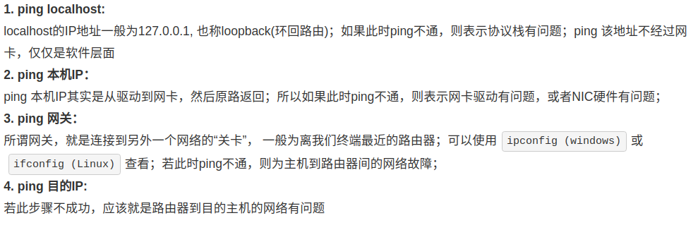

---
layout: post
title:  "两个经典过程"
data: 星期二, 10. 三月 2020 09:37上午 
categories: 计算机网络
tags: 专题
---
* 该模块会针对计算机网络中的某一块知识做专题整理，也许会有些不足或者错误的地方，未来可能会作修改。

#  计算机网络专题5----两个经典过程

## ping

#### ping的一般使用方法

#### ping的过程（处于一个局域网）
>
ping使用的是网络层的ICMP协议

1.ICMP创建一个请求数据包，IP协议判断目的IP处于LAN中

2.查找主机的ARP协议中是否有该目的IP的MAC地址，如果没有则发送ARP广播帧请求，获取目的MAC地址，如果还是找不到则产生主机不可达错误。

3.查找到了目的IP的MAC，则发送ICMP报文。

#### ping的过程（不处于一个局域网）
1.ICMP创建一个请求数据包，IP协议判断目的IP不处于LAN中

2.从主机的ARP缓存中获取默认网关的MAC地址，如果没有同样发送ARP广播获取。

3.默认网关接受该报文，查找其中的目的IP，和自己的路由表中的信息对比，如果没有对应的路由表项，也没有默认路由，则丢弃分组并向源主机发送目标网络不可达的报文。如果有则将报文转到对应接口。

4.中间重复这个过程终于到了目的网络，查找目的网络接口的ARP表，找到了对于目的主机的MAC地址，发送给目的主机。

5.目的主机经过CRC验证，发现合法，则同样的步骤发送应答报文，源主机收到应答报文则显示ping通。

#### 注意
第一次ping一个网络可能刚开始显示超时，因为不知道目的主机的MAC地址，需要ARP广播，所以会超时。（由于ARP缓存中找不到对应MAC地址，ICMP报文封装失败）

## 输入网址到显示网页的过程

1、输入网址

2、DNS解析

3、建立tcp连接

4、客户端发送HTPP请求

5、服务器处理请求　

6、服务器响应请求

7、浏览器展示HTML

8、浏览器发送请求获取其他在HTML中的资源。

