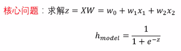
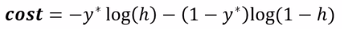
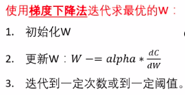
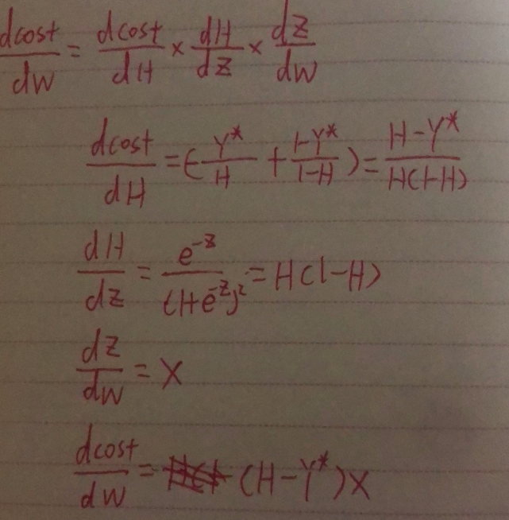
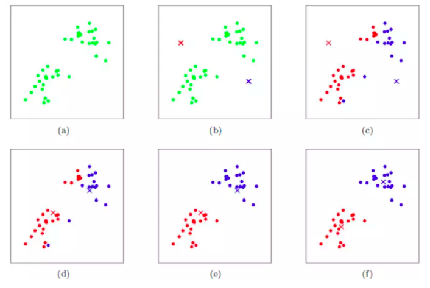
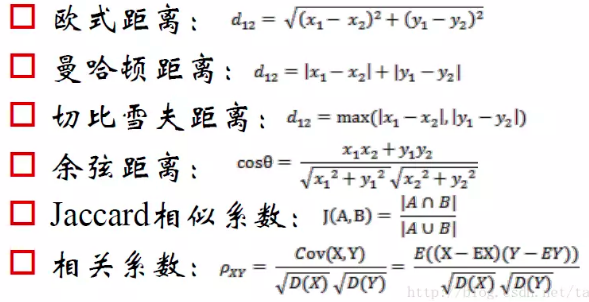
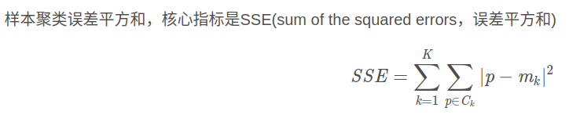
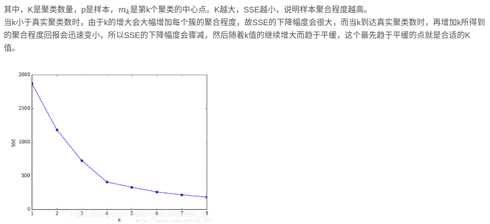

---
layout: post
title:  "逻辑回归"
data: 星期二, 10. 三月 2020 04:56下午 
categories: 机器学习
tags: 专题
---
* 该模块会针对机器学习中的某一块知识做专题整理，也许会有些不足或者错误的地方，未来可能会作修改。

#机器学习专题5----逻辑回归与kmeans算法

* 逻辑回归虽然简单 但是还是需要做个记录，同时作为一个专题内容太少，所以加上kmeans算法。

## 逻辑回归

1.逻辑回归处理的并不是回归问题而是分类，逻辑指的是logistic function，
因此是用回归的思想解决分类问题。

2.逻辑回归可以二分类也可以多分类

### 问题定义

这里应该是 z=wx
#### 损失函数

### 求导过程

其中alpha为学习率

### 逻辑回归的多分类

分k类就训练k个模型，然后将输出结果softmax得出结果

## kmeans算法
 

算法十分简单 直接上流程

####算法流程
1、首先确定一个k值，即我们希望将数据集经过聚类得到k个集合。

2、从数据集中随机选择k个数据点作为质心。

3、对数据集中每一个点，计算其与每一个质心的距离（如欧式距离），离哪个质心近，就划分到那个质心所属的集合。

4、把所有数据归好集合后，一共有k个集合。然后重新计算每个集合的质心。

5、如果新计算出来的质心和原来的质心之间的距离小于某一个设置的阈值（表示重新计算的质心的位置变化不大，趋于稳定，或者说收敛），我们可以认为聚类已经达到期望的结果，算法终止。

6、如果新质心和原质心距离变化很大，需要迭代3~5步骤。

#### 距离选择

### kmeans的优缺点

** 优点： **

1、原理比较简单，实现也是很容易，收敛速度快。

2、当结果簇是密集的，而簇与簇之间区别明显时, 它的效果较好。

3、主要需要调参的参数仅仅是簇数k。

** 缺点** 

1、K值需要预先给定，很多情况下K值的估计是非常困难的。

2、K-Means算法对初始选取的质心点是敏感的，不同的随机种子点得到的聚类结果完全不同 ，对结果影响很大。

3、对噪音和异常点比较的敏感。用来检测异常值。

4、采用迭代方法，可能只能得到局部的最优解，而无法得到全局的最优解。

### 注意点：

#### K值的确定

>

>

#### 初始质心的确定（kmeans++）
由于 K-means 算法的分类结果会受到初始点的选取而有所区别，因此有提出这种算法的改进: K-means++ 。

第一个点我们还是随机取。

对于每个点，我们都计算其和最近的一个质点的距离D(x)并保存在一个数组里，然后把这些距离加起来得到Sum(D(x))。然后，再取一个随机值，用权重的方式来取计算下一个质点。这个算法的实现是，先取一个能落在Sum(D(x))中的随机值Random，然后用Random -= D(x)，直到其<=0，此时的点就是下一个质点。

** 这样有效的原因是可以使质心的距离尽量远一些 **
