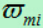

* 该模块会针对机器学习中的某一块知识做专题整理，也许会有些不足或者错误的地方，未来可能会作修改。

#机器学习专题6----随机森林与Adaboost

## 随机森林
* 作为集成学习bagging分支一员 ，随机森林的原理还是很简单的

随机森林是由很多决策树构成的，不同决策树之间没有关联。

当我们进行分类任务时，新的输入样本进入，就让森林中的每一棵决策树分别进行判断和分类，每个决策树会得到一个自己的分类结果，决策树的分类结果中哪一个分类最多，那么随机森林就会把这个结果当做最终的结果。

随机森林构建的4个步骤：随机取样，随机选特征分裂，分裂结束，形成大量决策树

#### 随机森林的应用场景
1.对离散值的分类

2.对连续值的回归（训练多棵回归树求平均）

3.无监督学习聚类（即先进行一个层次聚类，再分类）

4.异常点检测

>
层次聚类步骤：
>
假设有N个待聚类的样本，对于层次聚类来说，基本步骤就是：
>
1、（初始化）把每个样本归为一类，计算每两个类之间的距离，也就是样本与样本之间的相似度；
>
2、按一定规则选取符合距离要求的类别，完成类间合并；
>
3、重新计算新生成的这个类与各个旧类之间的相似度；
>
4、重复2和3直到所有样本点都归为一类，结束。

#### 构建过程
1.假如有N个样本，则有放回的随机选择N个样本(每次随机选择一个样本，然后返回继续选择)。这选择好了的N个样本用来训练一个决策树，作为决策树根节点处的样本。

2.当每个样本有M个属性时，在决策树的每个节点需要分裂时，随机从这M个属性中选取出m个属性，满足条件m << M。然后从这m个属性中采用某种策略（比如说信息增益）来选择1个属性作为该节点的分裂属性。

3.决策树形成过程中每个节点都要按照步骤2来分裂（很容易理解，如果下一次该节点选出来的那一个属性是刚刚其父节点分裂时用过的属性，则该节点已经达到了叶子节点，无须继续分裂了）。一直到不能够再分裂为止。注意整个决策树形成过程中没有进行剪枝。

4.按照步骤1~3建立大量的决策树，这样就构成了随机森林了。

#### 随机森林的优缺点

> #### 优点
>
1.能处理高维特征，不容易产生过拟合，模型训练速度比较快，特别是对于大数据而言。
>
2.对数据集的适应能力强：既能处理离散型数据，也能处理连续型数据，数据集无需规范化。
>
3.训练和预测速度快；
>
4.对训练数据的容错能力强
>
5.每次采样约有36.79%的数据不会被采走，一定程度减轻的样本不平衡。
>
6.可以判断特征的重要性
>
判断每个特征在随机森林中的每颗树上做了多大的贡献，然后取个平均值，最后比一比特征之间的贡献大小。其中关于贡献的计算方式可以是基尼指数或袋外数据错误率。

> #### 缺点
>
1.对少量数据集和低维数据集的分类不一定可以得到很好的效果。
>
2.当我们需要推断超出范围的独立变量或非独立变量，随机森林做得并不好。
>
3.据观测，如果一些分类/回归问题的训练数据中存在噪音，随机森林中的数据集会出现过拟合的现象。

## Adaboost

AdaBoost采用的是迭代的思想，每次迭代只会训练一个弱分类器，然后计算好的弱分类器将会参与下次迭代的使用。也就是说N次迭代就有N个弱分类器，其中N-1是训练好的，参数不会变，第N个迭代器是对前N-1个迭代器没分对的数据，进行分类。最终的效果要看着N个弱分类器的综合效果。

### Adaboost的两种权重

Adaboost的关键

** 数据权重： **用于确定分类器权重（弱分类器寻找其分类最小的决策点，找到之后用这个最小的误差计算出弱分类器的权重）

** 分类器权重：**说明了弱分类器在最终决策中拥有发言权的大小

### 训练过程
（1）初始化训练数据（每个样本）的权值分布：如果有N个样本，则每一个训练的样本点最开始时都被赋予相同的权重：1/N。

（2）训练弱分类器。具体训练过程中，如果某个样本已经被准确地分类，那么在构造下一个训练集中，它的权重就被降低；相反，如果某个样本点没有被准确地分类，那么它的权重就得到提高。同时，得到对应的弱分类器权重。然后，更新权值后的样本集被用于训练下一个分类器，整个训练过程如此迭代地进行下去。

（3）将各个训练得到的弱分类器组合成强分类器。各个弱分类器的训练过程结束后，分类误差率小的弱分类器的话语权较大，其在最终的分类函数中起着较大的决定作用，而分类误差率大的弱分类器的话语权较小，其在最终的分类函数中起着较小的决定作用。换言之，误差率低的弱分类器在最终分类器中占的比例较大，反之较小。

#### 特征选择

一共有N个训练样本，其中为决策树判断结果，只有二分类，输出-1或者1，为第i个样本在m轮迭代的数据权重。

#### 分类器权重计算

> #### 分类器权重公式推导
>
** 损失函数 **
>

>
** 推导 **
>

>
** 其中 **
>

>>
但是的推导过程是
>>

>>
可以推出
>>

>>
对比W公式
>>

>>
其中Z只是一个归一化的因素，也就是说如果将归一化了和是一样的。
>>
和是一个东西
>

>

#### 数据权重更新

#### 预测结果

### Adaboost的正则化

### Adaboost的回归问题
毫无疑问这里需要将基分类器改为CART回归树
> #### 特征选择
>

> 

> #### 分类器权重计算

> #### 数据权重更新
>

>

> #### 预测结果
>

>

### Adaboost的优缺点

### 相关问题
1.手推AdaBoost

2.与GBDT比较

3.AdaBoost几种基本机器学习算法哪个抗噪能力最强，哪个对重采样不敏感？

4.adaboost最后为什么取中位数

