* 该模块会针对算法中的某一块知识做专题整理，也许会有些不足或者错误的地方，未来可能会作修改。

#  算法专题1----排序算法

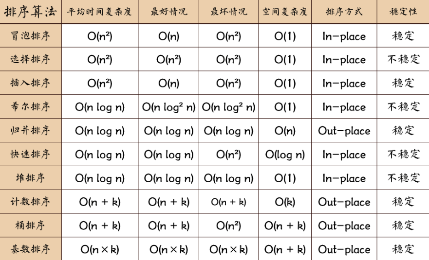

## 选择排序

首先，找到数组中最小的那个元素，其次，将它和数组的第一个元素交换位置(如果第一个元素就是最小元素那么它就和自己交换)。其次，在剩下的元素中找到最小的元素，将它与数组的第二个元素交换位置。如此往复，直到将整个数组排序。这种方法我们称之为选择排序。

## 插入排序
从数组第2个元素开始抽取元素。把它与左边第一个元素比较，如果左边第一个元素比它大，则继续与左边第二个元素比较下去，直到遇到不比它大的元素，然后插到这个元素的右边。

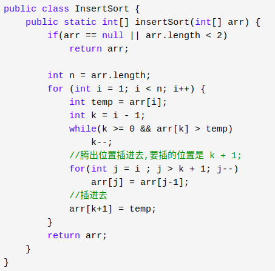

## 冒泡排序
把第一个元素与第二个元素比较，如果第一个比第二个大，则交换他们的位置。接着继续比较第二个与第三个元素，如果第二个比第三个大，则交换他们的位置….

我们对每一对相邻元素作同样的工作，从开始第一对到结尾的最后一对，这样一趟比较交换下来之后，排在最右的元素就会是最大的数。

除去最右的元素，我们对剩余的元素做同样的工作，如此重复下去，直到排序完成。

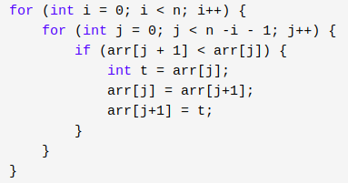

#### 优化

假如从开始的第一对到结尾的最后一对，相邻的元素之间都没有发生交换的操作，这意味着右边的元素总是大于等于左边的元素，此时的数组已经是有序的了，我们无需再对剩余的元素重复比较下去了。

## 希尔排序
希尔排序的思想是采用插入排序的方法，先让数组中任意间隔为 h 的元素有序，刚开始 h 的大小可以是 h = n / 2,接着让 h = n / 4，让 h 一直缩小，当 h = 1 时，也就是此时数组中任意间隔为1的元素有序，此时的数组就是有序的了。

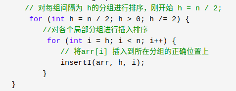
## 归并排序
把大的数组分成两个，然后对这两个数组分别进行排序，之后在把这两个数组合并成一个有序的数组。由于两个小的数组都是有序的，所以在合并的时候是很快的。通过递归的方式将大的数组一直分割，直到数组的大小为 1

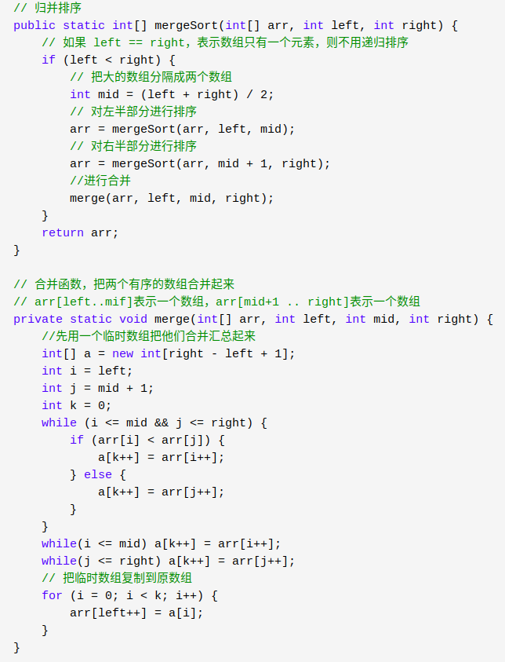
## 快速排序
我们从数组中选择一个元素，我们把这个元素称之为中轴元素吧，然后把数组中所有小于中轴元素的元素放在其左边，所有大于或等于中轴元素的元素放在其右边，显然，此时中轴元素所处的位置的是有序的。也就是说，我们无需再移动中轴元素的位置。

从中轴元素那里开始把大的数组切割成两个小的数组(两个数组都不包含中轴元素)，接着我们通过递归的方式，让中轴元素左边的数组和右边的数组也重复同样的操作，直到数组的大小为1，此时每个元素都处于有序的位置。

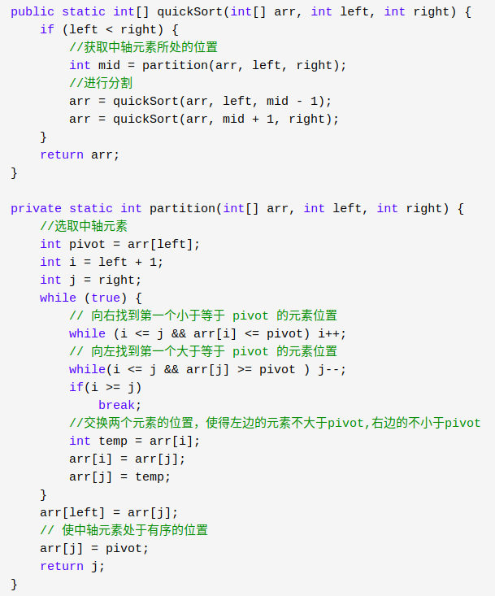

## 堆排序
大顶堆的堆顶是最大值，小顶堆则是最小值。

堆的插入删除都是O(logn)的

#### O(n)时间构建一个堆（自下往上）

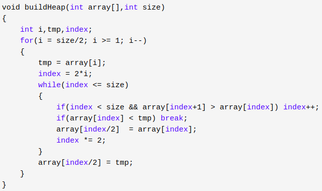

#### 取出堆中最大元素

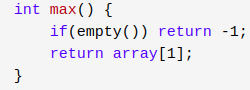

#### 往堆中插入元素（插入堆底，从下往上更新）

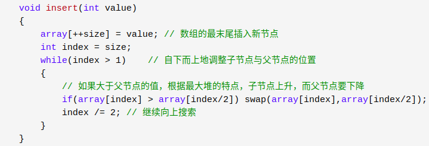

从堆中删除元素（取出堆顶并删除堆定，从上往下更新）

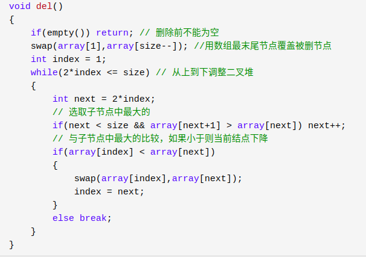

## 计数排序
计数排序是一种适合于**最大值和最小值的差值不是很大**的排序。

基本思想：就是把数组元素作为数组的下标，然后用一个临时数组统计该元素出现的次数，例如 temp[i] = m, 表示元素 i 一共出现了 m 次。最后再把临时数组统计的数据从小到大汇总起来，此时汇总起来是数据是有序的。

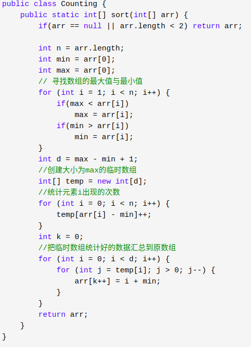

## 桶排序
桶排序就是把最大值和最小值之间的数进行瓜分，例如分成  10 个区间，10个区间对应10个桶，我们把各元素放到对应区间的桶中去，再对每个桶中的数进行排序，可以采用归并排序，也可以采用快速排序之类的。

之后每个桶里面的数据就是有序的了，我们最后将桶进行合并。

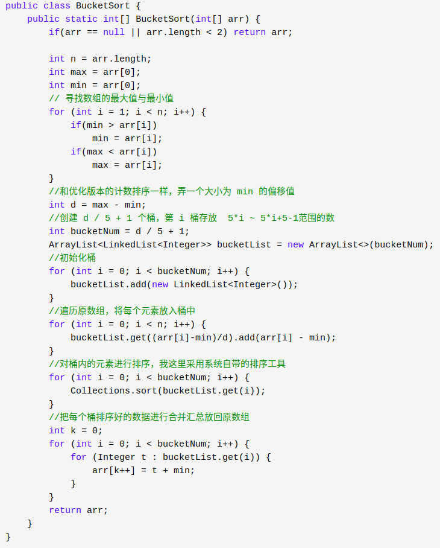

## 基数排序
基数排序的排序思路是这样的：先以个位数的大小来对数据进行排序，接着以十位数的大小来多数进行排序，接着以百位数的大小……

排到最后，就是一组有序的元素了。不过，**他在以某位数进行排序的时候，是用“桶”来排序的。**

由于某位数（个位/十位….，不是一整个数）的大小范围为0-9，所以我们需要10个桶，然后把具有相同数值的数放进同一个桶里，之后再把桶里的数按照0号桶到9号桶的顺序取出来，这样一趟下来，按照某位数的排序就完成了

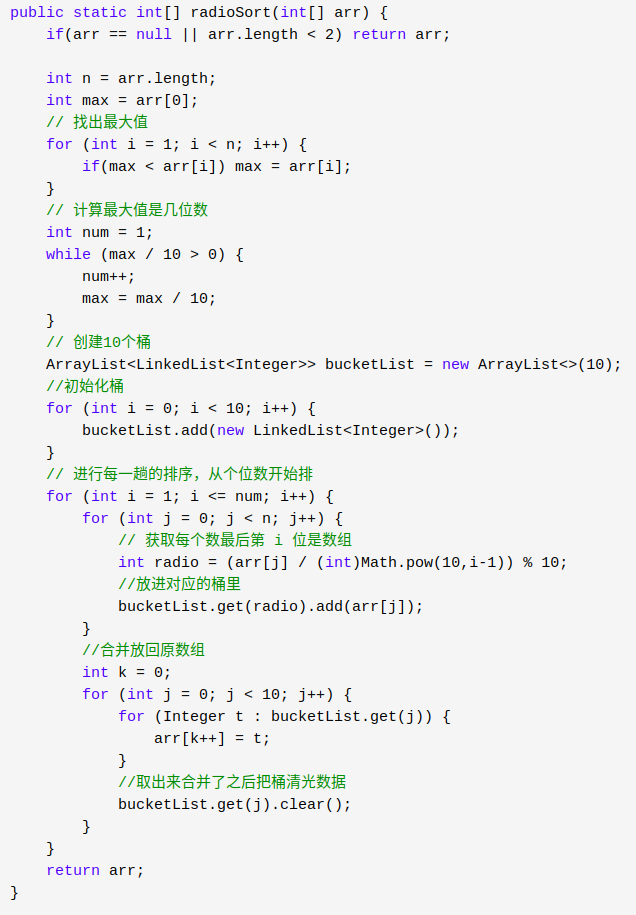

## 排序算法分析
堆排序、归并排序、快速排序都是比较适合处理大量数据的。其中归并排序是唯一适合处理大量数据还稳定，但是注意不能递归太深，可以使用非递归版本。

计数排序、桶排序、基数排序都是线性的，但限制条件都很多

插入、冒泡、选择排序则适合数据量少的时候处理数据

