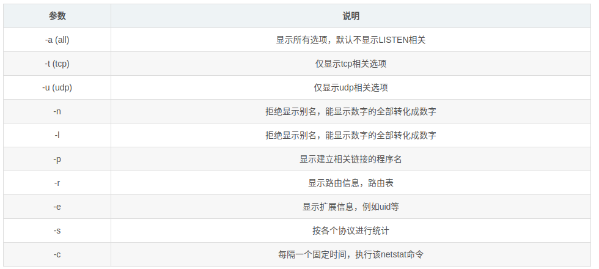

---
layout: post
title:  "linux常用指令"
data: 星期四, 19. 三月 2020 02:26下午 
categories: linux
tags: 专题
---
* 该模块会针对linux中的某一块知识做专题整理，也许会有些不足或者错误的地方，未来可能会作修改。

# linux专题1----linux常用指令

* 一些简单的诸如cd、ls就不说了

df -h 显示已经挂载的分区列表 

du -sh dir1 估算目录 'dir1' 已经使用的磁盘空间' 

cat file1 从第一个字节开始正向查看文件的内容 

grep Aug /var/log/messages 在文件 '/var/log/messages'中查找关键词"Aug" 

## grep
Linux系统中grep命令是一种强大的文本搜索工具，它能使用正则表达式搜索文本，并把匹配的行打印出来。搜索文件中的关键字。

## cat
表示读取文件内容及拼接文件。

## top命令
可以查看进程的信息，是动态的，还可以查看CPU状态

进程内容
>
total 进程总数
>
running 正在运行的进程数
>
sleeping 睡眠的进程数
>
stopped 停止的进程数
>
zombie 僵尸进程数

内存信息

进程信息
>
PID
>
进程所有者的用户名
>
 进程所有者的用户id
 >
 进程使用的物理内存百分比
 >
 进程使用的CPU时间总计，单位秒

## free
查看内存情况

free 命令显示系统内存的使用情况，包括物理内存、交换内存(swap)和内核缓冲区内存。

## ps
可以查看进程的信息 但是是静态的

-e 显示所有进程,环境变量

-f 全格式

-h 不显示标题

-l 长格式

-w 宽输出

a:  显示终端上地所有进程,包括其他用户地进程

r :   只显示正在运行地进程

u：显示进程的归属用户及内存的使用情况；

x:    显示没有控制终端地进程

如果是特定进程呢（ps -ef | grep）
##kill
杀死进程

## du
查看存储空间

主用要于看文件

 -h 输出文件系统分区使用的情况
 
 -s 显示文件或整个目录的大小，默认单位是KB

## df
df -h

首先如果需要查看整个磁盘还剩多少空间

## awk
awk是一个强大的文本分析工具，相对于grep的查找，sed的编辑，awk在其对数据分析并生成报告时，显得尤为强大。

linux如何查看满足特定查询条件的文件数量

##  netstate
netstate 命令用于显示各种网络相关信息，如网络连接，路由表，接口状态 (Interface Statistics)，masquerade 连接，多播成员 (Multicast Memberships) 等等。

