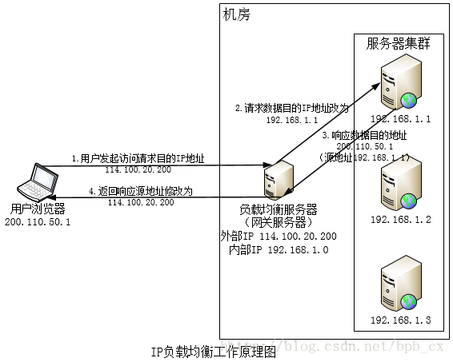
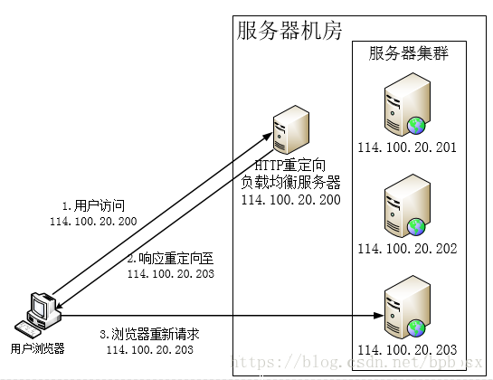

---
layout: post
title:  "负载均衡"
data: 星期五, 20. 三月 2020 06:40下午 
categories: 计算机网络
tags: 专题
---
* 该模块会针对计算机网络中的某一块知识做专题整理，也许会有些不足或者错误的地方，未来可能会作修改。

#计算机网络专题8----负载均衡

##DNS负载均衡
当我们通过域名访问网站时，需要通过DNS服务器得到服务器的IP地址，我们可以在DNS服务器上设置一定的算法，每次得到不同的IP地址来进行访问从而实现负载均衡。

即对一个网址返回不同的IP

##反向代理
正向代理VPN即我们请求发送到代理客户端，然后代理客户端发送到服务器。

反向代理是客户端发送到代理客户端，代理服务器发送到服务器，用户不知道真实服务器的存在。

反向代理服务器管理了一组服务器，当用户访问时，代理服务器根据负载均衡算法将请求转发到真实服务器，真实服务器也通过反向代理服务器返还数据。

##IP层负载均衡

如上图所示，当用户发起请求时（源地址为200.110.50.1），访问负载均衡服务器（目的地址为114.100.20.200），负载均衡服务器在内核进程获取网路数据包，根据一定的算法得到一个真实服务器的IP地址，其后将IP数据包的目的地址修改为该IP地址（192.168.1.1），之后就会将数据包发送到该真实服务器上去，之后再向负载均衡服务器返回数据，负载均衡服务器将源地址修改为114.100.20.200后返回给用户浏览器。

##HTTP重定向

HTTP重定向服务器就是一个普通的服务器，当用户访问时，其会根据一定的算法得到服务器集群的一个真实服务器的IP地址，将其放在HTTP响应头中，响应状态码为（302），当用户浏览器接收到这个响应时，会将得到的真实服务器的IP地址提出并重新访问。如上图所示，当用户访问域名时通过DNS解析得到114.100.20.200，然后访问114.100.20.200，也就是HTTP重定向服务器，响应重定向至114.100.20.203，用户浏览器再重新访问。

应该是让重定向服务器实现负载均衡算法