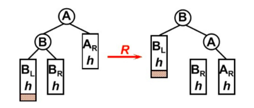
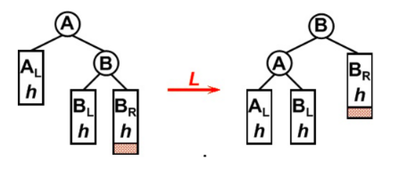
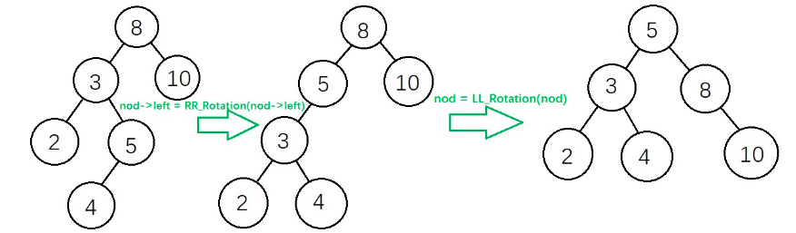
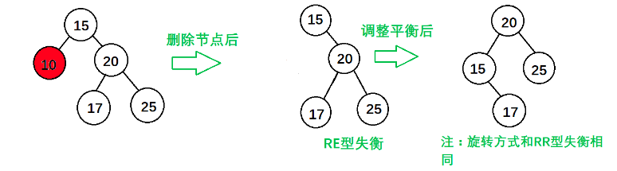
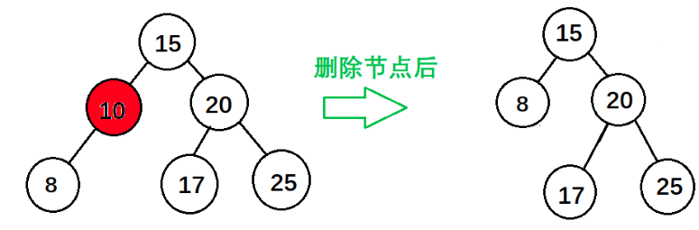
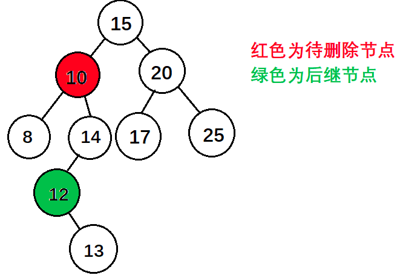

* 该模块会针对数据结构中的某一块知识做专题整理，也许会有些不足或者错误的地方，未来可能会作修改。

#  数据结构专题5----二叉平衡搜索树

* 这篇只是简单记录怎么插入和删除二叉平衡搜索树

## 定义
二叉平衡搜索树的定义就是每个节点左右深度差不超过1

## 插入

插入之后，从插入点开始从下往上找第一个不平衡的点A

分为4种情况，前两种比较简单

#### LL 插入节点在A的左子树的左子树里

做一个右旋就行

#### RR 插入节点在A的右子树的右子树里

做一个左旋就行
#### LR 插入节点在A的左子树的右子树里

先对A节点的左子树左旋

再对A节点右旋

#### RL 插入节点在A的右子树的左子树里
不放图了 ，对称操作

先对A节点的右子树右旋

再对A节点左旋

## 删除

#### 删除叶子节点

找到第一个不平衡点A

A的右节点B，假设删除的节点在A的左节点，且A的左子树目前深度为K，我们知道右子树B的深度为K+2。

（1）如果B的左子树深度为K，右子树深度为K+1那么就是上面的RR型

（2）如果B的左子树深度为K+1，右子树深度为K那么就是上面的RL型

（3）如果B的左右子树深度都为为K+1，这是在插入里面没有的情况，但是直接对A左旋就能解决了。

反过来一样分析

#### 删除节点只有一棵子树

按上述分析就行

#### 删除节点有两棵子树

找到删除结点的后继节点替换该节点，从改后继节点往上搜找第一个不平横节点

按删除叶子节点分析就行

>
**注意不会出现后继节点不是删除节点的子节点，且后继节点有右子树,即下面这种情况**
>

