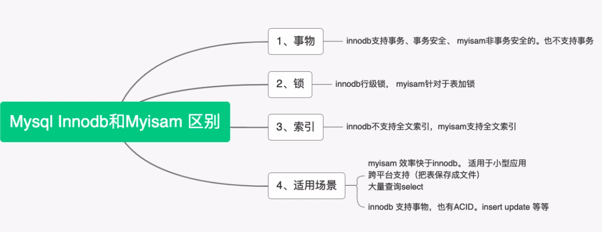

* 该模块会针对数据库中的某一块知识做专题整理，也许会有些不足或者错误的地方，未来可能会作修改。

# 数据库专题5----mysql优化与引擎

## 数据库优化
#### 通过建立索引对查询进行优化

#### 对查询进行优化，应尽量避免全表扫描

#### 慢查询优化

**慢查询：**所有执行时间超过long_query_time秒的所有查询或者不使用索引的查询

> #### 索引没起作用的情况
>
**使用多列索引的查询语句**
>
 MySQL可以为多个字段创建索引。一个索引最多可以包括16个字段。对于多列索引，只有查询条件使用了这些字段中的第一个字段时，索引才会被使用。
 >
 **使用LIKE关键字的查询语句**
>
 在使用LIKE关键字进行查询的查询语句中，如果匹配字符串的第一个字符为“%”，索引不会起作用。只有“%”不在第一个位置索引才会起作用。

> #### 优化数据库结构
>
**将字段很多的表分解成多个表 :**
>
 对于字段比较多的表，如果有些字段的使用频率很低，可以将这些字段分离出来形成新表。因为当一个表的数据量很大时，会由于使用频率低的字段的存在而变慢。
 >
 **增加中间表**
 >
 对于需要经常联合查询的表，可以建立中间表以提高查询效率。通过建立中间表，把需要经常联合查询的数据插入到中间表中，然后将原来的联合查询改为对中间表的查询，以此来提高查询效率。

> #### 分解关联查询：
>
将一个大的查询分解为多个小查询是很有必要的。
>
就是可以对每一个表进行一次单表查询，然后将查询结果在应用程序中进行关联，很多场景下这样会更高效

## mysql引擎------innoDB

* 尽管要比MyISAM引擎慢很多，但是InnoDB包括了对事务处理和外来键的支持，这两点都是前两个引擎所没有的。

InnoDB是一个事务型的存储引擎，有行级锁定和外键约束。

Innodb引擎提供了对数据库ACID事务的支持，并且实现了SQL标准的四种隔离级别，关于数据库事务与其隔离级别的内容请见数据库事务与其隔离级别这类型的文章。该引擎还提供了行级锁和外键约束，**它的设计目标是处理大容量数据库系统**，它本身其实就是基于MySQL后台的完整数据库系统，MySQL运行时Innodb会在内存中建立缓冲池，用于缓冲数据和索引。但是该引擎不支持FULLTEXT类型的索引，而且它没有保存表的行数，当SELECT COUNT(*) FROM TABLE时需要扫描全表。**当需要使用数据库事务时，该引擎当然是首选。由于锁的粒度更小，写操作不会锁定全表，所以在并发较高时，使用Innodb引擎会提升效率。**但是使用行级锁也不是绝对的，如果在执行一个SQL语句时MySQL不能确定要扫描的范围，InnoDB表同样会锁全表。

#### 适用场景：
1.支持事务，支持外键约束

2.支持崩溃修复能力和并发控制

3.需要对事务的完整性要求比较高（比如银行）

4.如果需要频繁的更新、删除操作的数据库

#### 索引结构：

InnoDB也是B+Treee索引结构。Innodb的索引文件本身就是数据文件，即B+Tree的数据域存储的就是实际的数据，这种索引就是聚集索引。这个索引的key就是数据表的主键，因此InnoDB表数据文件本身就是主索引。

InnoDB的辅助索引数据域存储的也是相应记录主键的值而不是地址，所以当以辅助索引查找时，会先根据辅助索引找到主键，再根据主键索引找到实际的数据。所以Innodb不建议使用过长的主键，否则会使辅助索引变得过大。建议使用自增的字段作为主键，这样B+Tree的每一个结点都会被顺序的填满，而不会频繁的分裂调整，会有效的提升插入数据的效率。

## mysql引擎------MyISAM
#### 优点：
1.插入和读出记录快

2.空间和内存使用比较低

#### 缺点
并发性要求不能高

## mysql引擎------MEMORY存储引擎

#### 优点：

1.如果需要很快的读写速度

#### 缺点：
1.安全性不高

2.不能建立太大的表

3.全部存在内存中，所以是一次性的

