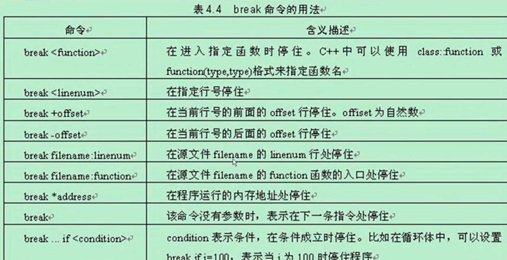
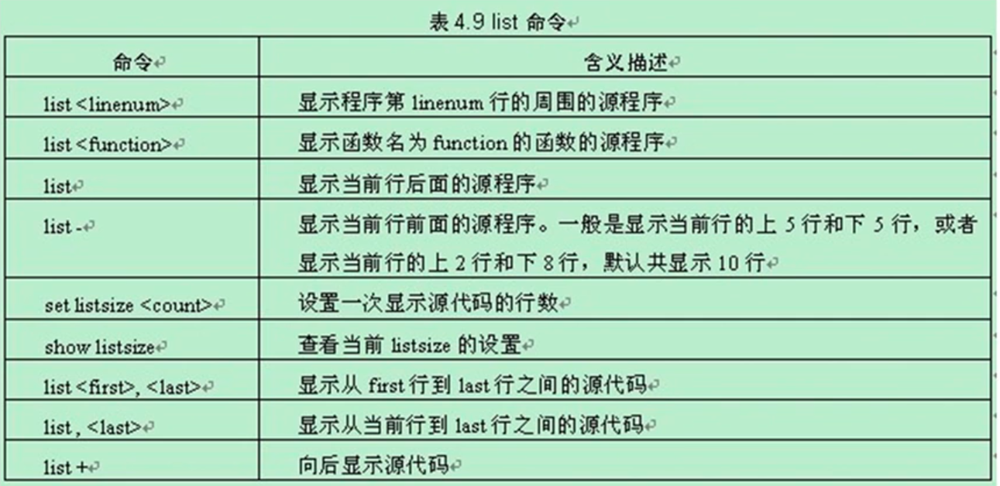

---
layout: post
title:  "GDB调试"
data: 星期四, 26. 三月 2020 09:51下午 
categories: linux
tags: 专题
---
* 该模块会针对linux中的某一块知识做专题整理，也许会有些不足或者错误的地方，未来可能会作修改。

#linux专题2----GDB调试

#### 查看类的内存分布

set p pretty on //可以使得打印信息按层次分布 更直观

## GDB的常用功能

#### 设置断点 单步执行

#### 查看程序中变量值的变化

#### 动态改变程序的执行环境 

#### 进程突然挂了 使用 gdb 调试core文件，找到程序挂掉的原因
寻找core文件，core文件是当程序挂掉时，把一些错误信息放到里面，找到最新时间的core文件。

core文件：在一个程序崩溃时，它一般会在指定目录下生成一个core文件。core文件仅仅是一个内存映象(同时加上调试信息)，主要是用来调试的。

在core文件所在目录下键入:
gdb -c core

## 使用方法
#### 首先需要在编译时就加入调试信息 
比如需要在gcc编译时加入-g或者-ggdb选项和g++ -g test.c -o test。调试信息包含程序中的每个变量的类型和可执行文件中的地址映射以及源代码的行号。gdb正是利用这些信息使源代码和机器码相关联。

#### 开始调试
gdb test

然后你就会看到出现好多信息在屏幕上，大致说的是gdb的一些版本信息说明之类的，但是它对你调试程序没用呀，所以，你可以加上-q选项，不输出它们。

**gdb -q test**

也可以先进gdb再加载文件 

**shell clear** 
清屏

#### 设置断点

**break 6**

在第6行设置断点

**info breakpoints**

查看断点信息

## GDB常用命令

next：单步调试（逐过程，函数直接执行）,简写n

step：单步调试（逐语句：跳入自定义函数内部执行）,简写s

list：查看原代码（list-n,从第n行开始查看代码。list+ 函数名：查看具体函数）,简写l

run：重新开始运行文件（run-text：加载文本文件，run-bin：加载二进制文件）,简写r

print：打印值及地址,简写p，可以使用p x=8,修改变量的值

退出gdb,简写q

display 实时显示变量 只会在变量的作用域内显示变量

disassenbler 显示汇编指令

signal 给程序发送信号量

return 强制返回函数，如果后面加上一个表达式，改表达式可以作为函数返回值

call 强制调用函数 并显示函数返回值 如果有的话