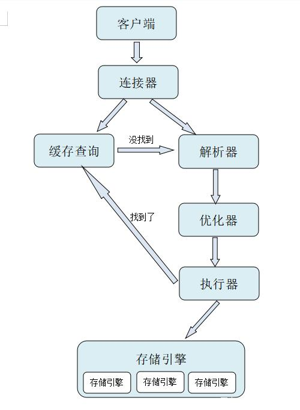

* 该模块会针对数据库中的某一块知识做专题整理，也许会有些不足或者错误的地方，未来可能会作修改。

# 数据库专题6----sql语句

SQL 对大小写不敏感！

#### SELECT - 从数据库表中获取数据

select * from table1

**针对某一字段：**select * from table1 where field1 like '%value1%' 

**最大值：**select max(field1) as max_val  from table1

**最小值：**select min(field1) from table1

**求平均：**select avg(field1)  from table1

**求和：**select sum(field1)  from table1

**求行数：**COUNT( ) 返回某列的行数

>
SELECT column_name, function(column_name)  //此处的function()函数是指
>
SQL中的一些聚合函数，例如：MAX(),MIN(),SUM(),AVG(),COUNT()等等
>
FROM table_name
>
WHERE column_name operator value    //where条件语句
>
GROUP BY column_name;    //以某一列分组
>

>
总结一下写的顺序
>
select ... from... where.... group by... having... order by..
>
这个having是挑选分组

> #### 连接
>
可以直接用来替换表
>
**左连接：**a_table a **left join** b_table b on a.a_id = b.b_id
>
**右连接：**a_table a **right  join** b_table b on a.a_id = b.b_id
>
**内连接：**a_table a **inner join** b_table b on a.a_id = b.b_id
>
**全连接：**full outer join
>
select a.a, a.b, a.c, b.c, b.d, b.f from a LEFT JOIN b ON a.a = b.c
> #### distinct
>
选出来的表没有完全重复的
> #### LIMIT a,b
取出a到b行（从0开始计数）
> #### 降序排列
order by '平均成绩' **desc**
> #### case   when

>

>
注意end不要忘
>
case when 有一种特殊的用法是sum(case when) group by
> 
只有sum有用 count和avg这些都没用
>
参考https://www.jianshu.com/p/3f27a6dced16 第25个问题
> #### 变量
>
(select @rank:=0) b; 设置初始变量
> #### union
>
合并两个表
>

>
默认地，UNION 操作符选取不同的值。如果允许重复的值，请使用 UNION ALL。
>

#### 多表SELECT
select a.name, b.name

from team a, team b 

where a.name < b.name

#### UPDATE - 更新数据库表中的数据
update table1 set field1=value1 where 范围

#### DELETE - 从数据库表中删除数据
delete from 表名  where条件表达式 

条件表达式里面可以有 select语句
#### INSERT INTO - 向数据库表中插入数据
**方法一：**

**方法二：**

#### CREATE DATABASE - 创建新数据库
create database school;

#### ALTER DATABASE - 修改数据库

#### CREATE TABLE - 创建新表
create table student(

s_id varchar(10),

s_name varchar(20),

s_age date,

s_sex varchar(10)

);

#### ALTER TABLE - 变更（改变）数据库表

#### DROP TABLE - 删除表

#### CREATE INDEX - 创建索引（搜索键）

#### DROP INDEX - 删除索引

#### sql语句执行过程

**连接器：**一条sql语句要经过连接器，客户端要和mysql建立连接。

**解析器：**解析器会对SQL语句进行语法分析、语义分析。

**优化器：**知道查什么之后，怎么做才更加高效呢，这就是优化器要做的事了。优化器会考虑这个表中有哪些索引呢，应该使用哪个索引呢。多表联查的时候，要决定各个表的顺序。

**执行器：**执行器先检查权限，看看你是否有权限执行，如果没有就返回错误信息。执行器会向搜索引擎要数据，返回的结果如果设置了缓存还要将数据放置到缓存中。

真个查询语句的流程是：sql语句->连接器->缓存查询->解析器->优化器->执行器->搜索引擎。

