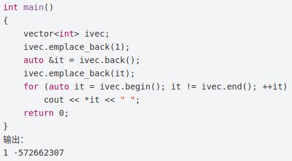
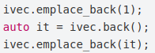

---
layout: post
title:  "左值和右值"
data: 星期四, 26. 三月 2020 10:24上午 
categories: C++
tags: 专题
---
* 该模块会针对C++中的某一块知识做专题整理，也许会有些不足或者错误的地方，未来可能会作修改。

# C++专题16----左值和右值

* 主要介绍C++11引入的**右值引用**和**移动语义**。

简单地说，可以放在等式左边即为左值，只能放在等式右边即为右值。

右值的概念又是为了引出右值引用

右值引用是用来支持转移语义的。转移语义可以将资源 ( 堆，系统对象等 ) 从一个对象转移到另一个对象，这样能够减少不必要的临时对象的创建、拷贝以及销毁，能够大幅度提高 C++ 应用程序的性能。消除了临时对象的维护 ( 创建和销毁 ) 对性能的影响。
## 什么是左值和右值
但左值并不一定能被赋值，因为左值可以引用某个常量。 所有的引用都是左值。

看能不能对表达式取地址，如果能，则为左值，否则为右值。

右值是表达式的值（不是引用），可以放在赋值右面。

通常来说有名字的变量就是左值，而由运算操作(加减乘除，函数调用返回值等)所产生的中间结果(没有名字)就是右值，如上的 3 + 4， a + b 等。

右值无法转换为左值。但是左值可以变为右值。

左值和右值主要的区别之一是左值可以被修改，而右值不能。

对于基础类型，右值是不可被修改的，也不可被 const, volatile 所修饰。对于自定义的类型，右值却允许通过它的成员函数进行修改。
>
（A=Get_A()).change()

## 左值引用和右值引用

主要讲的是右值引用，右值引用是C++ 11中新添加性质。

&& 语法是新的右值引用。
>

>
getTemp()返回的右值本来在表达式语句结束后，其生命也就该终结了（因为是临时变量），而通过右值引用，该右值又重获新生，其生命期将与右值引用类型变量a的生命期一样，只要a还活着，该右值临时变量将会一直存活下去。实际上就是给那个临时变量取了个名字。
>
这里a的类型是右值引用类型，但是如果从左值和右值的角度区分它，它实际上是个左值。因为可以对它取地址，而且它还有名字，是一个已经命名的右值。

**注意：**

1.左值引用只能绑定左值，右值引用只能绑定右值，如果绑定的不对，编译就会失败。

2.**常量左值引用**却是个奇葩，它可以绑定非常量左值、常量左值、右值，而且在绑定右值的时候，常量左值引用还可以像右值引用一样将右值的生命期延长，缺点是，只能读不能改。

3.已命名的右值引用，编译器会认为是个左值

## 移动语义

>

>
MyString("hello")只是临时对象，拷贝完就没什么用了，这就造成了没有意义的资源申请和释放操作，如果能够直接使用临时对象已经申请的资源，既能节省资源，又能节省资源申请和释放的时间。

**noexcept承诺函数不抛出异常，标准库对这个函数不做额外处理。**
>
由于不分配新资源，移动操作一般没有异常，当编写出一个不会抛出异常的移动操作时要通知标准库。一种通知标准库的方法是在构造函数中指明noexcept，必须在类头文件和声名和定义中都指定noexcept。

## 移动与拷贝的区别

拷贝构造的参数是const MyString& str，是常量左值引用，而移动构造的参数是MyString&& str，是右值引用，而MyString("hello")是个临时对象，是个右值，优先进入移动构造函数而不是拷贝构造函数。而移动构造函数与拷贝构造不同，它并不是重新分配一块新的空间，将要拷贝的对象复制过来，而是"偷"了过来，将自己的指针指向别人的资源，然后将别人的指针修改为nullptr，这一步很重要，如果不将别人的指针修改为空，那么临时对象析构的时候就会释放掉这个资源，"偷"也白偷了。下面这张图可以解释copy和move的区别。

## move函数
有些左值是局部变量，生命周期也很短，能不能也移动而不是拷贝呢？C++11为了解决这个问题，提供了std::move()方法来将左值转换为右值，从而方便应用移动语义。我觉得它其实就是告诉编译器，虽然我是一个左值，但是不要对我用拷贝构造函数，而是用移动构造函数吧

## 返回右值引用

无论如何，都不能在函数内部返回临时变量的指针或引用，无论该引用是左值引用还是右值引用。C++11也从来没有认为变量的控制权被转移后析构就不再发生了。所以要在函数内部产生一个对象并返回，正确的做法是：1）将对象建立在堆内存上并返回地址；2）返回局部对象，并通过copy复制运算符在函数外复制该局部对象的副本；3）返回局部对象（是一个右值），并通过移动赋值运算符将返回的局部对象转移到另一个对象中；

2、3分别对应上面两种情况

## 注意

1.str6 = std::move(str2)，虽然将str2的资源给了str6，但是str2并没有立刻析构，只有在str2离开了自己的作用域的时候才会析构，所以，如果继续使用str2的成员变量，可能会发生意想不到的错误。

2.如果我们没有提供移动构造函数，只提供了拷贝构造函数，std::move()会失效但是不会发生错误，因为编译器找不到移动构造函数就去寻找拷贝构造函数，也这是拷贝构造函数的参数是const T&常量左值引用的原因！

## 右值引用与模板
当右值引用和模板结合的时候，就复杂了。T&&并不一定表示右值引用，它可能是个左值引用又可能是个右值引用。

这里的&&是一个未定义的引用类型，称为**universal references**，它必须被初始化，它是左值引用还是右值引用却决于它的初始化，如果它被一个左值初始化，它就是一个左值引用；如果被一个右值初始化，它就是一个右值引用。

只有当发生自动类型推断时（如函数模板的类型自动推导，或auto关键字），&&才是一个universal references。

## 引用折叠

所有的右值引用叠加到右值引用上仍然使一个右值引用。

所有的其他引用类型之间的叠加都将变成左值引用。

## 完美转发
所谓转发，就是通过一个函数将参数继续转交给另一个函数进行处理，原参数可能是右值，可能是左值，如果还能继续保持参数的原有特征，那么它就是完美的。

解决办法就是借助universal references通用引用类型和std::forward()模板函数共同实现完美转发。

move表现为无条件的右值转换，就其本身而已，它不会移动任何东西。**forward仅当参数被右值绑定时，才会把参数转换为右值。**

## emplace_back减少内存拷贝和移动

通常使用push_back()向容器中加入一个右值元素(临时对象)时，首先会调用构造函数构造这个临时对象，然后需要调用拷贝构造函数将这个临时对象放入容器中。原来的临时变量释放。

elections.emplace_back("Nelson Mandela", "South Africa", 1994); 

现在直接传入参数构造

这是两个特殊的例子，主要是因为vector的性质

