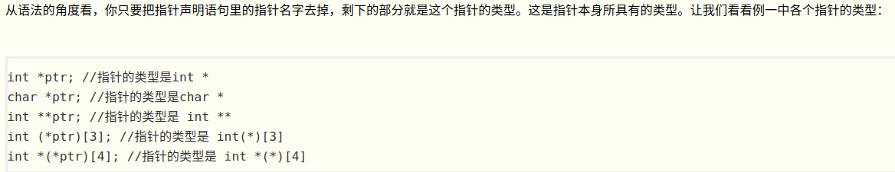
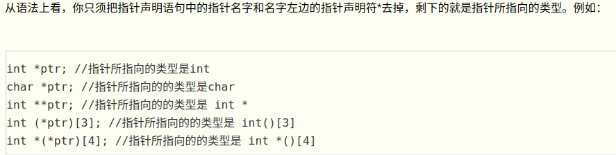
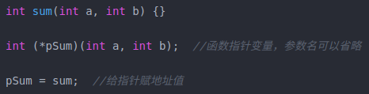
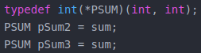
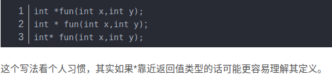
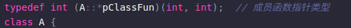
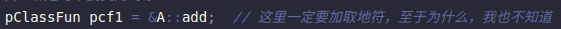
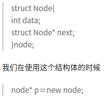

---
layout: post
title:  "指针"
data: 星期二, 03. 三月 2020 07:13下午 
categories: C++
tags: 专题
---
* 该模块会针对C++中的某一块知识做专题整理，也许会有些不足或者错误的地方，未来可能会作修改。

# C++专题10----指针

* 指针的内容比较多，可能一个专题写不完，也许会分多个专题

## xxxxx 
1.指针是程序数据在内存中的地址，而指针变量是用来保存这些地址的变量。

#### 指针的类型

#### 指针所指向的类型

#### 指针的大小
32位机器上指针4字节 

64位机器上指针8字节

#### 运算符&和*

&a的运算结果是一个指针，指针的类型是a的类型加个*，指针所指向的类型是a的类型，指针所指向的地址嘛，那就是a的地址。

*p 的结果是p 所指向的东西，这个东西有这些特点：它的类型是p 指向的类型，它所占用的地址是p所指向的地址。

这两者有点互逆的感觉

#### 指针的初始化
声明的指针未被初始化，指针默认值随机产生。

## 指针和数组

## 指针和字符串 

char *b = "I love you";

​ char *ａ；

​ a＝″I love Fishc.com！″;

这里的字符串的值存在静态常量区，无法改变，尝试改变就会报错，当然字符串数组还是能修改字符串的值的。

## 指针与函数

### 函数指针
函数指针的意义，从内存中找到需要执行的代码对应的首地址， 

函数名称本身就是一个函数指针。

### 函数指针定义

>
例如
>

>
或者说函数名本身也是函数指针
>

### 指针函数
指针函数，简单的来说，就是一个返回指针的函数

### 成员函数指针
成员函数指针不仅要指定目标函数的形参列表和返回类型，**还必须指出成员函数所属的类。**因此，我们必须在*之前添加classname::以表示当前定义的指针指向classname的成员函树， 如下：

定义在类外

当我们初始化一个成员函数指针时，其指向了类的某个成员函数，但并没有指定该成员所属的对象——直到使用成员函数指针时，才提供成员所属的对象。

## 指针操作

## conts与指针
在我另外一篇写const和static的博文中写过了，这里就不分析了

## 特殊指针
#### 野指针
即一个指针指向一段实际的内存，只是它指向哪里我们并不知情。下面几种情况会产生野指针。

1.一个指针的内存空间已经被释放就成了野指针。

2.如果指针声明在栈区且没有初始化，那么该指针会随意指向一个地址空间。（非静态局部变量）

3 .指针超过了变量的作用范围。即在函数外调用了函数中的局部变量指针，且这个指针是在栈上，虽然可能会调用成功但是仍是十分危险的。因为局部变量的作用范围虽然已经结束，内存已经被释放，然而地址值仍是可用的，不过随时都可能被内存管理分配给其他变量。

避免野指针只能靠我们自己养成良好的编程习惯，（1）声明指针的时候就对其进行初始化，如果暂时不知道该初始化成什么值，就先把指针置空。（2）内存被free或delete后，指向该内存的指针马上置空。（3）函数不要返回指向栈内存的指针。

#### 空指针

即指针指向的内容为空，没有指向任何有意义的内存空间。

#### 无类型指针
void *a , a就是无类型指针，就是说可以用任意类型的指针对void指针赋值。

#### 堆上的指针
之前突然想如何在堆上创建指针，后面才想到如果一个类在堆上，那么类中的所有东西应该都在堆上，包括指针。

这p指针的地址是在栈上，但是它指向的地址在堆上，而next指针的地址就在堆上。

#### 返回局部指针变量
我们一般不会这么做，因为你返回的指针如果指向的是局部变量的地址，这个局部变量的地址在出了这个函数就变无效了。我们返回局部指针变量的前提就是所返回的指针所指向的地址不能是离开该函数就会释放的空间（比如函数自己申请的栈空间，可以跑跑实验）。

