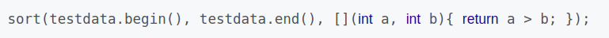

---
layout: post
title:  "lambda"
data: 星期四, 05. 三月 2020 02:43下午 
categories: C++
tags: 专题
---
* 该模块会针对C++中的某一块知识做专题整理，也许会有些不足或者错误的地方，未来可能会作修改。

# C++专题11----lambda

* lambda的内容不算多，但是也会用到，所以作个整理。这是C++11 新增的特性之一

## 功能简介及常用场景
 Lambda 表达式用于定义并创建匿名的函数对象，以简化编程工作。

** 场景一：**

在标准C++(C++11之前)中，是没有局部函数这种语法的。但是在有些场景下，使用局部函数可以极大的简化代码。而lambda就是起到这个作用。

在lambda函数引入之前，通常的变通方法是定义局部类，并使用静态函数来作为局部函数，但是限制是不能使用所在函数的局部变量。

** 场景二： **

## 用法介绍及分析

#### [捕捉列表] (参数列表) mutable 或 exception 声明 -> 返回值类型 {函数体}

#### 捕捉列表
不能省略，编译器可以根据该“标志”来作出判断出该函数是否为lambda函数。

捕捉列表的主要作用就是捕捉上下文中的变量以作为lambda函数使用。

捕捉列表有以下几种选择

1.[],函数体中没有任何额外的参数可以用。

2.[=]，函数体内可以使用 Lambda 所在范围内所有可见的局部变量（包括 Lambda 所在类的 this），并且是值传递方式

3.[&]，函数体内可以使用 Lambda 所在范围内所有可见的局部变量（包括 Lambda 所在类的 this），并且是引用传递方式

4.[this]，函数体内可以使用 Lambda 所在类中的成员变量。

5.[a]

6.[&a]，将 a 按引用进行传递。

7.[a,&b]，将 a 按值传递，b 按引用进行传递。

8.[=,&a,&b]，除 a 和 b 按引用进行传递外，其他参数都按值进行传递。

9.[&,a,b]，除 a 和 b 按值进行传递外，其他参数都按引用进行传递。

#### 参数列表
参数列表。和C/C++中的普通函数参数意义一样。该部分是可选的，意味着如果我们不需要进行参数传递时，可以连同括号“（）”一起省略掉。

参数可以通过按值（如: (a, b)）和按引用 (如: (&a, &b)) 两种方式进行传递。

#### mutable 或 exception 声明
这部分可以省略。

exception 声明用于指定函数抛出的异常，如抛出整数类型的异常，可以使用 throw(int)。

** 重点讲一下lambda **

在lambda函数中，按值传递的参数是不允许在函数中修改该参数的值的，但是加了mutable就没有这个限制了。具体原因看下文的底层原理。

若在lambda中使用了mutable修饰符，则“参数列表”是不可省略掉的（即使是参数为空）。

#### -> 返回值类型
标识函数返回值的类型，当返回值为 void，或者函数体中只有一处 return 的地方（此时编译器可以自动推断出返回值类型）时，这部分可以省略。

####  {函数体}
标识函数的实现，这部分不能省略，但函数体可以为空。

## 底层原理
是内联函数inline。？

1.创建 lambda 类，实现构造函数，使用 lambda 表达式的函数体重载 operator()（默认的operator函数是const的，所以无法修改变量，mutable就是将这个函数改为non-const），所以 lambda 表达式 也叫匿名函数对象。

2.创建 lambda 对象

3.通过对象调用 operator()

** 注意：lambda函数应该算是一格inline函数**

