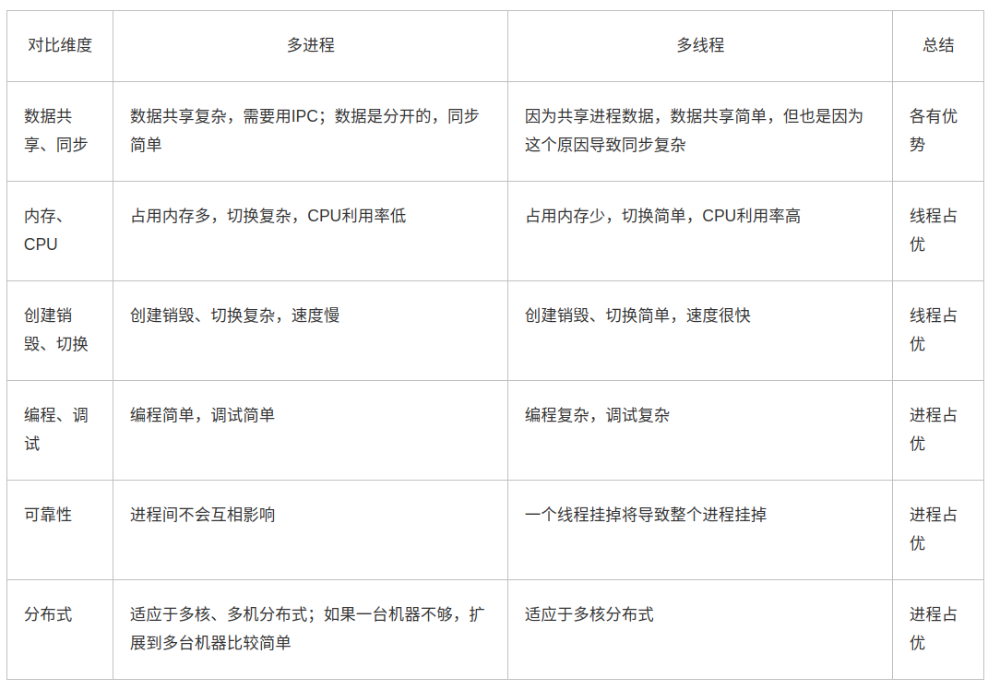

* 该模块会针对操作系统中的某一块知识做专题整理，也许会有些不足或者错误的地方，未来可能会作修改。

#  操作系统专题1----进程与线程

* 本文会简单介绍一下进程和线程的概念与区别

## 进程

#### 什么是进程
进程是资源（CPU、内存等）分配的基本单位，它是程序执行时的一个实例。程序运行时系统就会创建一个进程，并为它分配资源，然后把该进程放入进程就绪队列，进程调度器选中它的时候就会为它分配CPU时间，程序开始真正运行。

** 简单说进程是有独立功能的程序在一个数据集合上运行的过程，它是系统进行资源分配和调度的一个独立单位。 **

#### 进程与程序
1.程序是进程的基础，程序每次运行构成不同的进程，进程是程序功能的体现。

2.通过多次执行，一个程序可以多个进程;通过调用

#### 进程的特点
** 动态性： **可以动态地创建、结束进程

** 并发性： **进程可以独立调度并占用处理机运行;并发并行

** 独立性： **不同进程间工作互不影响

** 制约性： **因访问共享数据/资源或进程间同步而产生制约

## 线程

#### 为什么需要线程
多进程的开销太大，进程间的通信和共享数据都是问题，而且维护进程的开销也大。所以就需要提出一种新的实体，可以并发执行，可以共享相同的地址空间。

#### 什么是线程
而线程是进程的组成部分，它代表了一条顺序的执行流。

线程=进程 - 共享资源

#### 线程的特点
1.可以共享资源

2.可以独立运行，并发运行

3.轻型实体：线程中的实体单位基本上不拥有系统资源，只是有一点必不可少的、能保证独立运行的资源。

#### 注意事项
1.一个进程下的多个子线程均拥有自己独立的栈空间（存储函数参数、局部变量等）、寄存器、程序计数器和状态字，但是多个子线程和主线程共享堆、全局变量等** 非栈内存**。

2.如果子线程的崩溃是由于自己的一亩三分地引起的，那就不会对主线程和其他子线程产生影响，但是如果子线程的崩溃是因为对共享区域造成了破坏，那么也会导致进程的崩溃。（但是查了资料子进程大部分都会引起主进程崩溃）

3.一个线程只能属于一个进程，而一个进程可以有多个线程，但至少有一个线程（通常说的主线程）。

4.一个线程可以创建和撤销另一个线程。

## 进程与线程的区别
1.进程是资源分配的最小单位，线程是程序执行的最小单位

2.进程切换开销大，线程切换开销小。

2.线程之间的通信更方便，同一进程下的线程共享全局变量、静态变量等数据，而进程之间的通信需要以通信的方式（IPC)进行。

3.多进程程序更健壮，多线程程序只要有一个线程死掉，整个进程也死掉了，而一个进程死掉并不会对另外一个进程造成影响，因为进程有自己独立的地址空间。

4.进程有自己的独立地址空间，每启动一个进程，系统就会为它分配地址空间，建立数据表来维护代码段、堆栈段和数据段，这种操作非常昂贵。而线程是共享进程中的数据的，使用相同的地址空间，因此CPU切换一个线程的花费远比进程要小很多，同时创建一个线程的开销也比进程要小很多。

## 多线程与多进程

需要频繁创建销毁、进行大量计算的优先使用线程

强相关的处理用线程，弱相关的处理用进程（个人认为强相关的应该是需要经常切换的）

可能要扩展到多机分布的用进程，多核分布的用线程

