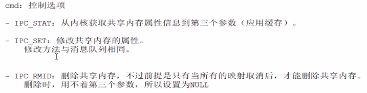

---
layout: post
title:  "进程间通信"
data: 星期五, 08. 三月 2020 01:29下午 
categories: 操作系统
tags: 专题
---
* 该模块会针对操作系统中的某一块知识做专题整理，也许会有些不足或者错误的地方，未来可能会作修改。

#  操作系统专题3----进程间通信IPC/进程间的同步

## 通信简介
1.通信根据是否通过中间缓存分为直接通信和间接通信，通过是否阻塞也可分，阻塞的分为通过，非阻塞被认为是异步的。

## 信号
信号是Unix系统中使用的最古老的进程间通信的方法之一。操作系统通过信号来通知进程系统中发生了某种预先规定好的事件（一组事件中的一个），它也是用户进程之间通信和同步的一种原始机制。一个键盘中断或者一个错误条件（比如进程试图访问它的虚拟内存中不存在的位置等）都有可能产生一个信号。

#### 信号事件主要有两个来源：

#### 优点

轻量级快速

#### 实现方式
1.应用程序在程序开始前先要注册一个handler（处理函数），当操作系统获得某个信号的时候就会用这个函数处理。

2.操作系统收到信号，当时正在内核态，操作系统将从内核态到用户态的返回入口改为处理函数的入口，同时也要把信号处理函数之后我们要去的地方修改好，即被打断的地方。（这一步都需要修改堆栈，我们一般不会这么做，病毒会这么做）

kill -l 能查到一共62种信号，某个信号代表某个事件

#### signal函数
设置某个信号处理方式

    #include < signal.h >

    typedef void (*sighandler_t)(int);

     sighandler_t signal(int signum, sighandler_t handler);

>
signum是信号编号
>
sighandler是函数指针，也就是提示处理函数要是void并且形参只有一个int
>
handler是信号处理方式
>

## 信号量(Semaphore)

允许多个进程访问公共资源。互斥量的数量加强版。

## 管道/匿名管道/无名管道（PIPE）
管道通信方式的中间介质是文件(无名文件)，通常称这种文件为管道文件。

管道是半双工，数据只能向一个方向流动；双方需要互相通信时，需要建立起两个管道。

管道的通信方式为：写端每次都将数据写入管道缓冲区的**末尾**
，而读端每次都从管道缓冲区的**头部**读出数据。

#### 实现原理
管道的实质是内核利用**环形队列**的数据结构在
**内核缓冲区**中的一个实现

当缓冲区读空或者写满时，有一定的规则控制相应的读进程或者写进程进入等待队列，当空的缓冲区有新数据写入或者满的缓冲区有数据读出来时，就唤醒等待队列中的进程继续读写。

>
管道具体实现进程间通信过程
>
父进程创建管道（pipe函数），得到两个⽂件描述符指向管道的两端
>
父进程fork出子进程，⼦进程继承父进程的文件描述符表，也有两个⽂件描述符指向同⼀管道。
>
父进程关闭fd[0],子进程关闭fd[1]，即⽗进程关闭管道读端,⼦进程关闭管道写端（因为管道只支持单向通信）。⽗进程可以往管道⾥写,⼦进程可以从管道⾥读,管道是⽤环形队列实现的,数据从写端流⼊从读端流出,这样就实现了进程间通信。

#### 代码
int pipe(int pipefd[2]); 

//创建一个用于父子进程（或着父孙，以此类推）之间通信的无名管道（缓存），并将管道和两个文件描述符关联起来。

//pipefd[0] 读管道的读文件描述符

//pipefd[1] 写管道的写文件描述符

//读管道，管道空就阻塞，写管道，管道满，也阻塞。

close(pipefd[0]) //对于父进程 关闭读文件描述符 // 子进程关闭写文件描述符

//当你尝试向读端全关闭的管道中写数据 会抛出异常
#### 缺点
1.只能在具有亲缘关系的进程间通信，

2.只能单向传输数据，另外管道的缓冲区是有限的

3.没有名称

## 命名管道（FIFO）
FIFO可以在无关的进程之间交换数据甚至跨越一个网络的不同计算机的不同进程之间,但是仍旧是半双工的，也是一种文件类型。

仍需要满足 先入先出的原则

命名管道不同于匿名管道之处在于它提供了一个路径名与之关联，以命名管道的文件形式存在于文件系统中，这样，即使与命名管道的创建进程不存在亲缘关系的进程，只要可以访问该路径，就能够彼此通过命名管道相互通信，因此，通过命名管道不相关的进程也能交换数据。

#### 实现方式（代码）
1.进程调用mkfifo创建有名管道
>
int mkfifo(const char *pathname , mode_t mode);
>
pathname 被创建管道文件的文件名
>
mode 指定被创建时的原始权限
>
成功返回0 失败返回-1 并设置errno

2.open打开有名管道

3.read/write读写管道进行通信

只需要一个进程创建，另一个直接用就行

#### 优点

1.有名管道克服了管道没有名字的限制，

2.它还允许无亲缘关系进程间的通信；

#### 缺点
仍是字节流不是结构化数据

## 消息队列
消息队列是存放在内核中的消息链表（双向链表），每个消息队列由消息队列标识符表示，不同于上面的文件描述符。

> **链表节点组成**
>
消息编号：识别消息用
>
消息正文：真正的消息内容

消息通信方式以消息缓冲区为中间介质，通信双方的发送和接收操作均以消息为单位。在存储器中，消息缓冲区被组织成队列，通常称之为消息队列。

消息队列存放在内核中，只有在内核重启(即，操作系统重启)或者显示地删除一个消息队列时，该消息队列才会被真正的删除。

消息队列是一种异步的服务间通信方式

消息队列允许一个或多个进程写入或者读取消息。全双工。

#### 实现（代码）
**发送消息：**
>
（a）进程先封装一个数消息包，也就是一个结构体，封包的时候消息编号和消息正文都写到结构体的成员中（这个结构体需要我们自己写）,每个进程都有属于自己的消息编号，A进程要是给B进程发送消息，需要知道B进程的消息编号
>

>
（b）调用相应的API发送消息，通过**消息队列的标识符**找到对应的消息，然后将消息包发送给消息队列。链表更新。

**接收消息：**
>
调用API接收消息，通过**消息队列标识符**和**消息的编号**

**msgget函数：** 创建新的消息队列、或者获取已存在的某个消息队列，并返回唯一标识消息队列的标识符（msqID），后续收发消息就靠这个标识符。
>
int msgget(key_t key,int msgflg)
>
如果key没有对应一个消息队列就创建。key也能唯一标识一个消息队列。
>>
key用于计算出消息队列ID，使用**ftok()函数**生成key
>>
key_t ftok(const char *pathname, int proj_id);
>>
通过指定路径名和一个整形数就可以返回唯一对应的一个key，只要路径名和整形数不变，key就不变，这个整数一般用ASCII码表里的值
>
msgflg 指定创建时的原始权限
>
返回值：成功则返回消息队列标识符（消息队列ID），此ID无法修改，失败则返回-1并设置errno。
>
其他进程获取消息队列ID的方法（1）将key保存在一个文件中，大家去读（2）重新用相同的路径和整形生成key

> #### 查看消息队列是否创建成功
>

>

**msgsnd函数：**利用消息队列标识符发送某编号的消息
>
int msgsnd(int msqid,const void *msgp,size_t msgsz,int msgflg)
>
msgp 即消息包结构体 msgsz即消息正文大小,里面有消息编号
>
msgflg 设置为0默认阻塞发送消息，阻塞到发送成功，设置为IPC_NOWAIT非阻塞发送，发送完就返回。
>
返回值：成功返回1,失败返回-1,并设置errno

**msgrcv函数：**利用消息队列标识符接收某编号的消息
>
ssize_t  msgrcv(int msqid , void *msgp, size_t msgsz , long msgtyp , int msgflg)
>
msgp 缓存地址，缓存中存放着消息结构体
> 
msgsz 消息正文的大小  msgtyp你要接收的消息编号，也就是你自己的消息编号
>
msgflg : 设置为0阻塞接收消息， 设置为IPC_NOWAIT：非阻塞接收消息，没有消息该函数不阻塞  
>
返回值：成功返回消息正文的字节数，失败返回-1并设置errno

**msgctl函数：**利用消息队列标识符删除消息队列
>
int msgctl(int msqid, int cmd,struct msqid_ds *buf);
>
利用cmd指定的指令控制消息队列
>
除了删除消息队列，还有修改和获取消息队列属性等等功能。
>

>
buf是一个msqid_ds结构体类型
>

#### 优点： 
1.解耦

如下场景，A系统要发送数据给BCD三个系统。如果新增E系统要调用A系统呢？如果过一段时间C系统不需要了呢？A系统负责人几乎要崩溃了，这是只要将A系统的数据传入消息队列就行

2.通过异步处理提高系统性能，也有削峰的作用
>
在不使用消息队列服务器的时候，用户的请求数据直接写入数据库，在高并发的情况下数据库压力剧增，使得响应速度变慢。但是在使用消息队列之后，用户的请求数据发送给消息队列之后立即 返回，再由消息队列的消费者进程从消息队列中获取数据，异步写入数据库。由于消息队列服务器处理速度快于数据库（消息队列也比数据库有更好的伸缩性），因此响应速度得到大幅改善。

3.消息通讯
>
消息队列一般都内置了高效的通信机制，因此也可以用在纯的消息通讯。比如实现点对点消息队列，或者聊天室等.

#### 缺点：
1.系统可用性降低

系统引入的外部依赖越多，越容易挂掉。本来你就是 A 系统调用 BCD 三个系统的接口就好了，人 ABCD 四个系统好好的，没啥问题，你偏加个 MQ 进来，万一 MQ 挂了咋整，MQ 一挂，整套系统崩溃的，你不就完了？

2.系统复杂度提高

硬生生加个 MQ 进来，你怎么保证消息没有重复消费？怎么处理消息丢失的情况？怎么保证消息传递的顺序性？头大头大，问题一大堆，痛苦不已。

3.一致性问题

A 系统处理完了直接返回成功了，人都以为你这个请求就成功了；但是问题是，要是 BCD 三个系统那里，BD 两个系统写库成功了，结果 C 系统写库失败了，咋整？你这数据就不一致了。

#### 消息列队为什么优于有名管道
1.消息队列提供有格式字节流

2.消息队列还有消息优先级，接收程序可以通过消息类型有选择地接收数据，而不是像命名管道中那样，只能默认地接收。

3.消息队列也可以独立于发送和接收进程而存在，从而消除了在同步命名管道的打开和关闭时可能产生的困难。

## 共享内存

采用共享内存通信的一个显而易见的好处是效率高，因为进程可以直接读写内存，而不需要任何数据的拷贝。**对于像管道和消息队列等通信方式，则需要在内核和用户空间进行四次的数据拷贝，而共享内存则只拷贝两次数据：一次从输入文件到共享内存区，另一次从共享内存区到输出文件。**实际上，进程之间在共享内存时，并不总是读写少量数据后就解除映射，有新的通信时，再重新建立共享内存区域。而是保持共享区域，直到通信完毕为止，这样，数据内容一直保存在共享内存中，并没有写回文件。共享内存中的内容往往是在解除映射时才写回文件的。因此，采用共享内存的通信方式效率是非常高的。

原理就是多个进程使用的虚拟地址指向同一个物理内存，对于一个共享内存的同步互斥，实现采用的是引用计数的原理。

共享内存直接使用地址来读写缓存，效率更高，但是如果是调用API来读写，中间必须通过重重OS函数调用，效率太低。

注意共享内存写的时候需要加锁

>

## 实现（代码）
（1） 调用API，在物理内存上开辟出一大段缓存空间

（2）让各自进程空间与开辟出的缓存空间建立映射关系

**shmget函数：**创建新的或者获得已有的共享内存
（shm=share memory）
>
int shmget(key_t key , size_t size,int shmflg);
>
key用于生成共享内存标识符,同样使用ftok函数产生
>
size指共享内存大小，一般为虚拟页大小的整数倍，如果不是整数倍会自动补全
>
shmflg指原始权限
>
返回值：成功返回共享内存标识符(shmid)，失败返回-1，并设置errno

**shmat函数：**将物理内存映射到自己的进程空间
>
int shamat(int shmid, const void *shmaddr , int shmflg);
>
shmaddr:指定映射的起始地址，可以自己指定，但一般不会，也可以设置NULL，操作系统帮你选。
>
shmflg指定映射条件，设置为0，可读可写，设置为SHM_RDONLY，只读，设置为1,只写
>
返回值，成功返回映射地址，失败返回（void *）-1，并设置errno

**memcpy函数**将我们要发送的内容复制到共享内存
>
每次读完清空共享内存

**shmdt函数：**取消映射
>
int shmdt(const void *shmaddr);
>
shmaddr共享内存起始地址
>
返回值：成功返回0,失败返回-1，设置errno

**shmctl函数：**释放共享内存,只有所有映射都取消了才会执行这个函数
>
int shmctl(int shmid,int cmd,struct shmid_ds *buf)
>
和消息队列一样
>

#### 优点：
共享内存针对消息缓冲的缺点改而利用内存缓冲区直接交换信息，无须复制，快捷、信息量大是其优点。(其他三种方式都会有大小限制)

#### 缺点：
1.需要额外的同步机制应对竞争

2.因为内存在一台计算机中，所以只能是一台计算机的多个进程。

#### 实现方式
实现方式：通过将同一块物理内存映射到不同的地址空间，这样不同的虚地址就可以访问到一个地址

> #### SYSTEM V IPC的缺点
>
即值信号量、消息队列和共享内存，不再有对应文件创建
>
进程结束的时候不会自动删除，删除方法有三种
>
1.重启电脑
>
2.调用相应API删除
>
3.使用iprcm命令删除 

## socket套接字
套接字是网络编程的api，通过套接字可以不同的机器间的进程进行通信，常用于客户端进程和服务器进程的通信。

## 残留问题

 