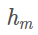

* 该模块会针对机器学习中的某一块知识做专题整理，也许会有些不足或者错误的地方，未来可能会作修改。

#机器学习专题3----GBDT

* 本篇主要是基于上一个专题决策树的基础上讲的

## 集成学习
集成学习有两个流派boosting和bagging

Boosting是串行的，通过对错判训练样本重新赋权来重复训练，以提高基学习器准确性，降低偏差；代表算法就是GDBT

Bagging是并行的，通过在训练集中随机采样训练，训练出多样性的基学习器，降低方差，最终输出由多个学习器少数服从多数的原则得到。代表算法随机森林。

## GBDT (GradientBoostingDecisionTree) 梯度提升迭代决策树

1.GBDT以回归树也就是CART作为基学习器，GBDT只能回归，分类也是先回归再分类

2.核心在于累加所有分类器的结果作为最终结果，这也印证了分类器必须是回归树。

3.关键点在于利用损失函数的负梯度去模拟残差，这样对于一般的损失函数，只要其一阶可导就行。

#### 简单例子

### GBDT训练过程

模型一共训练M轮，每轮产生一个弱分类器 T(x;θm)，每个分类器在上一轮分类器的残差基础上进行训练（即训练数据的标签会变成残差）。

模型最终可以描述为

>
** 如何已知m-1轮模型的训练结果，求第m个模型的结果 **
>

>
初始化 c为常数
>

>
从上下我们可以看出用基学习器h拟合前一轮模型损失函数的负梯度,就是通过梯度下降法最小化
>

>
** 每次迭代完训练数据的标签都会变化，每个训量样本的标签都会变成对应残差也就是损失函数的负梯度，也就是上面的，然后构造出一个新的h **
>>
** 这里为什么不是直接做差作为残差而是使用负梯度呢？**
>>
如果只是经验风险最小化的话非常容易过拟合，所以一个合理的办法就是在每个基模型中加入正则项，所以在有正则项的情况下就不再是直接相减时损失函数最小了，所以我们需要计算损失函数的梯度，而不能直接使用分模型来拟合残差。
>
为第m个模型的结果。
>
中的是为了防止模型变化太剧烈,相当于学习率。
>
为前m个模型的输出结果和
>
** 过程也可以直接看下图 **
>

>
相当于第m论模型的权重模型的权重，通过线性搜索得到。
>
上图中的4  是学习得到CART树

### GBDT损失函数
>
** 回归损失函数 **
>

>

>
** 分类损失函数 **
>
指数损失函数
>

>
对数损失函数（二分类）
>

>
对数损失函数（多分类）
>

### GBDT特征选择
  GBDT选择特征的细节其实是想问你CART树生成的过程。
  
  假设我们目前总共有 M 个特征。第一步我们需要从中选择出一个特征 j，做为二叉树的第一个节点。然后对特征 j 的值选择一个切分点s. 一个 样本的特征j的值 如果小于等于s，则分为一类，如果大于s,则分为另外一类。如此便构建了CART 树的一个节点。其他节点的生成过程和这个是一样的。 （不知道的可以看我的决策树专题）
  

### GBDT如何分类
>
对于GBDT的二分类问题其实就是换个损失函数而已，所以这里主要讨论多分类问题

假设我们需要分3类，我们每一轮需要训练3棵树，每棵树给出该样本属于该类的概率，相当于二分类的子问题。最终输出就是将多棵树的结果做一个softmax。

假设一个样本x属于第二类，那么对于第一棵树，我们给出训练数据(x,0),第二棵树给出训练数据(x,1)，地三棵树给出训练数据(x,0)。

其他的就和上面的训练过程差不多

### GBDT优缺点

** 优点：**

1.可以灵活处理各种类型的数据，包括连续值和离散值。

2.在相对少的调参时间情况下，预测的准确率也可以比较高。这个是相对SVM来说的。

3.使用一些健壮的损失函数，对异常值的鲁棒性非常强。比如 Huber损失函数和Quantile损失函数。

** 缺点： **

由于弱学习器之间存在关联关系，难以并行训练模型。

GBDT在高维稀疏的数据集上，表现不如支持向量机或者神经网络。

