---
layout: post
title:  "决策树"
data: 星期一, 09. 三月 2020 04:26下午 
categories: 机器学习
tags: 专题
---
* 该模块会针对机器学习中的某一块知识做专题整理，也许会有些不足或者错误的地方，未来可能会作修改。

#机器学习专题2----决策树

## 决策树简介
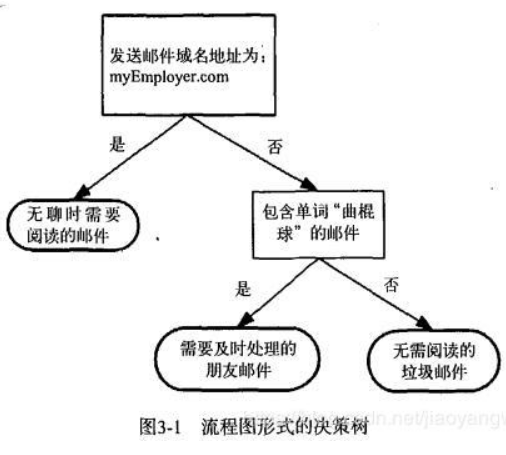

决策树原理和问答猜测结果游戏相似，根据一系列数据，然后给出游戏的答案。

** 决策树可以实现非线性分类 **

** 决策树算法通常有三个步骤： **特征选择、决策树生成、决策树剪枝

## 特征选择

我们知道我们需要分类的物体常常是多标签的，决策树一个非叶节点即为一个分类条件，那么每个节点的分类条件应该选什么，有一个衡量标准就是信息增益。
#### 信息增益
在划分数据集之前之后信息发生的变化成为信息增益，知道如何计算信息增益，我们就可以计算每个特征值划分数据集获得的信息增益，获得信息增益最高的特征就是最好的选择。

** 首先给出结论,信息增益越大的特征越好，信息增益=经验熵-条件熵**

我们以这张表为例子

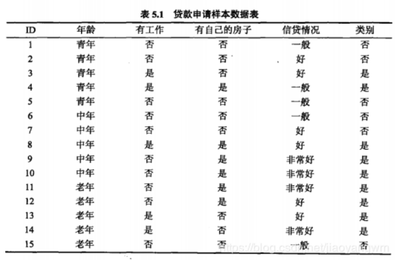

** 第一步：计算经验熵 **

既然是信息增益 我们就需要基础的信息价值，也就是经验熵，引入公式

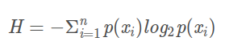

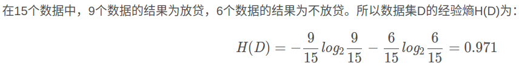

注意这里是否放贷是我们的标签而不是特征

** 第二步：计算条件熵 **

即我们以一个特征为分类条件,会产生变化，这里以年龄为例子，由于有log我就不算全了，还是用到了我们上面的经验熵公式。

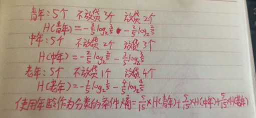

我们以同样的方式计算其他就特征就可以得出各个特征的信息增益了

由于经验熵是固定的，所以条件熵越小越好。

## 决策树生成

我们已经学习了从数据集构造决策树算法所需要的子功能模块，包括经验熵的计算和最优特征的选择，其工作原理如下：得到原始数据集，然后基于最好的属性值划分数据集，由于特征值可能多于两个，因此可能存在大于两个分支的数据集划分。第一次划分之后，数据集被向下传递到树的分支的下一个结点。在这个结点上，我们可以再次划分数据。因此我们可以采用递归的原则处理数据集。

** 但是根据特征选择的标准不同 我们又有三种算法 **

### ID3算法

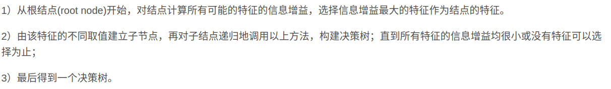

** 停止条件：**

（1）当节点的数据量小于一个指定的数量时，不继续分裂。两个原因：一是数据量较少时，再做分裂容易强化噪声数据的作用；二是降低树生长的复杂性。提前结束分裂一定程度上有利于降低过拟合的影响。
　　
（2）经验熵或所有特征的值小于一个阈值

（3）决策树的深度达到指定的条件

（4）所有特征已经使用完毕，不能继续进行分裂。

### C4.5

C4.5注意到一种特殊的情况，实际上光计算信息增益的话使用ID这个特征是最好的，条件熵为0,但是这明显不合理，所以C4.5使用了信息增益比作为参考。
>
** 信息增益比**
>
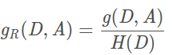
>
其中H(D)经验熵，g(D,A)为信息增益

C4.5算法同ID3算法过程相似，仅在选择特征时，使用信息增益比最大的特征。

** 停止条件：** 

和ID3差不多。 但是信息增益比应该不能作为停止条件。

### CART
CART分类树算法使用** 基尼系数 **来代替信息增益比，基尼系数代表了模型的不纯度，基尼系数越小，不纯度越低，也就是越纯，特征越好。这和信息增益（比）相反。并且CART为二叉树。

>
** 基尼系数 **
>
和上面条件熵的计算很相似，只不过对应每一类别不再用经验熵的公式
>
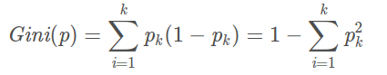
>
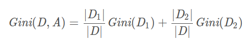

>
** 由于CART 是二叉树，所以构建的过程有一些不一样 **
>
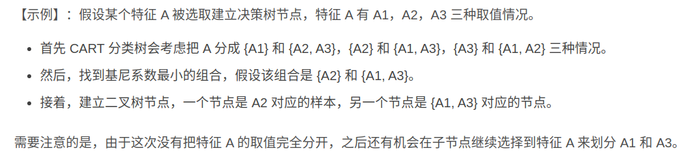

** 优点：**

1.无论是信息增益还是信息增益比，其中都涉及大量的对数运算，计算开销自然要比普通的乘除操作要大。使用基尼系数可以减少计算量，起到简化模型的作用，并且也不会完全丢失熵模型的优点。

2.CART 算法生成的决策树模型是二叉树，而 ID3 以及 C4.5 算法生成的决策树是多叉树，从运行效率角度考虑，二叉树模型会比多叉树运算效率高。

## 决策树剪枝

#### 剪枝目的
决策树的剪枝是为了简化决策树模型，避免过拟合。

#### 预剪枝
>
** 构造决策树的同时进行剪枝 **。
>
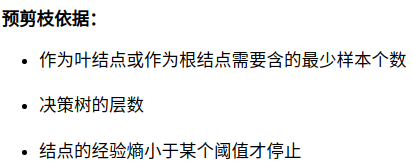

#### 后剪枝

** Reduced-Error Pruning (REP,错误率降低剪枝）**
>
将一个非叶节点变为叶子节点，标签为这个子树下标签的多数，然后看测试结果，直至没有任何子树可以替换使得测试数据集的表现得以改进时，算法就可以终止。

** Pessimistic Error Pruning (PEP，悲观剪枝）**
>
同样需要选择一个非叶节点将其变为叶子节点，但是评判的标准变了。
>
参考链接https://blog.csdn.net/weixin_41647586/article/details/89052754
>
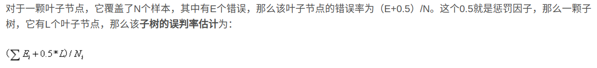
>
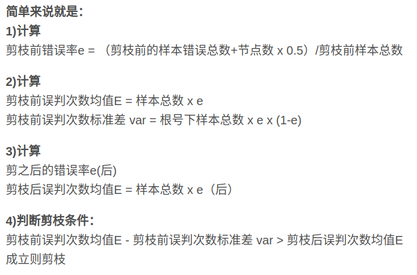

** Cost-Complexity Pruning(CCP、代价复杂度) **
>
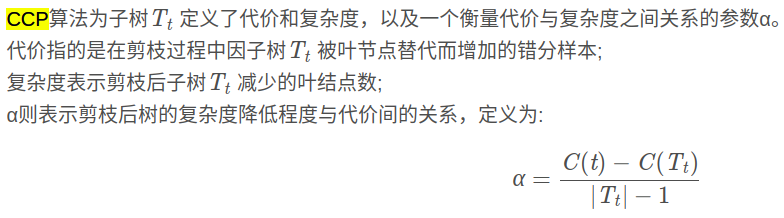
>
** C(t)为该子树变为叶节点的样本错误率，C(Tt)是原本该子数各个叶节点包含的错误样本率。 **
>
1.对于完全决策树T的每个非叶结点计算α值，循环剪掉具有最小α值的子树，直到剩下根节点。在该步可得到一系列的剪枝树｛T0，T1，T2......Tm｝,其中T0为原有的完全决策树，Tm为根结点，Ti+1为对Ti进行剪枝的结果；
>
2.从子树序列中，根据真实的误差估计选择最佳决策树。

#### 预剪枝和后剪枝的比较
后剪枝通常比预剪枝保留更多的分支，其欠拟合风险很小，因此后剪枝的泛化性能往往强于预剪枝决策树。但后剪枝过程是从底往上裁剪，因此其训练时间开销比前剪枝要大。

## 决策树的回归（CART回归树）
>
** 为什么只能是CART **
>
1.回想下id3，分裂后需要计算每个类别占总样本的比例，回归哪来的类别，c4.5也一样
>
2.回归问题肯定是连续属性，所以只能二划分，而cart树是强制的二叉树

遍历所有输入变量，找到最优的切分变量j和最优的切分点s，即选择第j个特征xj和它的取值s将输入空间划分为两部分，然后重复这个操作。

节点的输出值是该单元内的均值

#### 最小二乘法求切分点
* 其实个人觉得这个和最小二乘关系不大 是一种暴力算法

>
对于每一个特征j，以及特征里一个样本的取值s，可以划分两个区域R1和R2
>
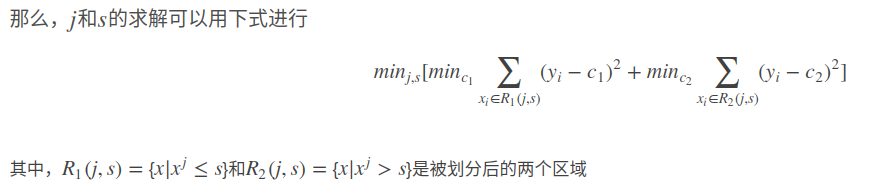
>
这个C是被划分区域里每个样本的均值
>
暴力循环找出最合适的j和s

## 决策树的优缺点

#### 优点：
1.对异常点的容错能力好，健壮性强。

2.决策树很容易理解和解释，而且决策树也容易可视化

3.决策树在预测时的时间代价小

#### 缺点：
1.决策树容易过拟合，导致模型的泛化能力很差。可以通过剪枝缓解这个问题。

2.决策树不稳定，一些很小的变化可能会导致完全不同的决策树生成。这个问题可以通过集成方法来缓解（如：随机森林）；

3.一些复杂的关系决策树很难去学，因为决策树并不能清楚的表达它们，比如，异或问题，多路复用问题等。一般这种关系可以换神经网络分类方法来解决；

4.如果某些类别的样本比例过大，生成决策树容易偏向于这些类别。因此建议在创建决策树之前要平衡数据集。
