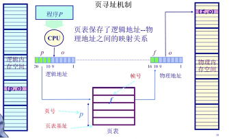

* 该模块会针对操作系统中的某一块知识做专题整理，也许会有些不足或者错误的地方，未来可能会作修改。

#  操作系统专题4----内存管理1

* 由于操作系统内存管理的内容比较多，所以我决定分为几个专题

## 连续内存分配

### 固定分区分配
固定内存分配可分为分区大小相等分区大小成规律性（如指数型）增长。

### 可变分区分配（动态分配）

管理动态分配需要用到** 空闲分区表** 和** 空闲分区链 **

** 空闲区间回收的时候要注意分4种情况 **

>## 4种动态分配算法

> #### 最佳适配算法（适合小文件）
>空闲分区按容量递增次序链接。每次分配内存时顺序查找空闲分区链(或空闲分区表)，找到大小能满足要求的第-一个空闲分区。
>
优点：大部分分配是小尺寸时很有效；简单
>
缺点：外部碎片；重分配慢；易产生很多没用的微小碎片。

> #### 最差适配（适合中等尺寸）
>空闲分区按容量递减次序链接。每次分配内存时顺序查找空闲分区链(或空闲分区表)，找到大小能满足要求的第-一个空闲分区。
>
优点：假如分配时是中等尺寸效果最好
>
缺点：重分配慢；外部碎片；易于破碎大的空闲块以至大分区不能被分配。

> #### 首次适配
>每次都从低地址开始查找，找到第–个能满足大小的空闲分区。
>
优点：
1． 简单
2． 不会分割后面大的空闲块，向着空间的结尾。
>
缺点：
1.容易产生外碎片
2.不确定性

> #### 邻近适应
>空闲分区以地址递增的顺序排列(可排成-一个循环链表)。每次分配内存时从上次查找结束的位置开始查找空闲分区链(或空闲分区表)，找到大小能满足要求的第一个空闲分区。
>
优点：不用每次都从低地址的小分区开始检索。算法开销小(原因同首次适应算法)	
>
缺点：会使高地址的大分区也被用完

## 非连续内存分配
#### 连续分配的缺点
1.分配给一个程序的物理内存只能是连续的

2.内存利用率低

3.有外碎片/内碎片问题

#### 非连续分配的优缺点
** 优点： **

1.分配给一个程序的物理内存是非连续的

2.更好的内存利用和管理

3.允许共享代码和数据(共享库等)

4.支持动态加载和动态链接

** 缺点 ： **

1.软件开销大

2.需要硬件支持

### 分段
逻辑地址空间是连续的，物理地址是离散的。使得代码段可以共享，使得有些数据可以更好地分离。

>
使用段管理将逻辑地址转为物理地址有两种选择

>#### 硬件方式（使用MMU）
>

>
段表：有段的起始信息和总长度，由操作系统建立。(上图可能有点错)
>
段号决定了在段表中的索引。
>
段的起始地址加偏移就能取出内存中的数据

>#### 软件方式
>
一个段指一个“内存块”，是一个逻辑地址空间。
>
程序根据段访问机制访问内存地址需要一个二维的二元组(s段号，addr端内偏移)
>

### 分页
逻辑地址空间的页的大小和物理空间的大小一样，每页大小固定。

逻辑地址转换为物理地址：

1.页表Page Table （操作系统建立）

2.MMU/TLB(快表)

这里我们把物理页称为** 页帧**

>#### 页寻址方式
>
页表实际上就是一个大的数组hash表。它的index是 页号，对应的value是 页帧号，首先根据逻辑地址计算得到一个 页号，也就是index，再在页表中找到对应的 页帧号，最后根据 页帧号 计算得到物理地址；由于他们的页/帧内偏移相等，所以页表不需要保存这个数据。通过这种方式能够根据逻辑地址找到对应的物理地址。
>

>
** 注意 **
>
1.逻辑地址的页内偏移和物理地址的帧内偏移是一样的，所以页表不需要保存偏移
>
2.页表中存着frame_num，所以最后的物理地址表示为（frame_num,偏移量）
>
3.不是所有的页都能映射到帧的

#### 页表机制的缺点：
1.时间代价：访问一个内存单元需要2次内存访问：一次获取页表项；一次是访问数据。

2.页表可能会非常大(页表的长度等于2^页号位数)，同时n个程序要n个页表。 

** 解决方法**

1.缓存caching 

2.间接访问indirecion（多级页表）

>#### 转换后备缓冲区/快表TLB（缓存）
>
1.TLB实际上是CPU的MMU内存管理单元保存的一段缓存，这段缓存保存的内容是 页表 的一部分，** 是经常访问到的那部分页表，其余不常用的页表内容保存在内存中。**
>
2.TLB未命中，也叫TLB miss，这种情况比较少见，因为一页很大，32位系统一页是4K，如果采用局部性原理（编程时访问的区域集中一些），这意味着它仅包含CPU经常访问的那些页面，那么访问4k次才会遇到一次TLB miss。

>#### 多级页表
>
为了缓解一级页表的空间问题，以时间换空间，但是时间又可以通过TLB缓解
>
一级页表中存着二级页表的起始地址
>
二级页表则存着frame num
>
当P1的这个页表项不存在时，原来是一条条即使不存在也要占空间告诉你不存在，现在多条合并在一起告诉你二级页表不存在。就可以省出很多空间
>

>(这里是三级的不是二级的)

### 分页与分段的对比
1.这里分页物理内存是固定大小而分段是不固定，这是两者主要区别

2.分段比分页更容易实现信息的共享和保护。不能被修改的代码称为纯代码或可重入代码(不属于临界资源)，这样的代码是可以共享的。可修改的代码是不能共享的

3.访问内存次数
>
分页(单级页表) :第一次访存–查内存中的页表，第二次访存一-访问目标内存单元。总共两次访存
>
分段:第一次访存–查内存中的段表，第二次访存–访问目标内存单元。总共两次访存
>
与分页系统类似，分段系统中也可以引入快表机构，将近期访问过的段表项放到快表中，这样可以少一.次访问，加快地址变换速度。

4.在分段的方法中，每次程序运行时总是把程序全部装入内存。分页的思想是程序运行时用到哪页就为哪页分配内存，没用到的页暂时保留在硬盘上。当用到这些页时再在物理地址空间中为这些页分配内存，然后建立虚拟地址空间中的页和刚分配的物理内存页间的映射。

### 段页式存储

** 本质思想就是将段表中的value换为了页号 ** 
