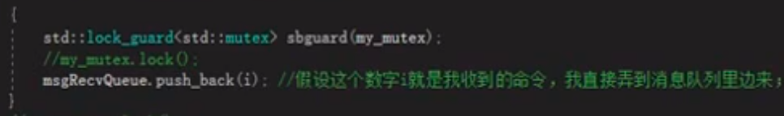

---
layout: post
title:  "C++多线程"
data: 星期六, 04. 四月 2020 05:03下午 
categories: C++
tags: 专题
---
* 该模块会针对C++中的某一块知识做专题整理，也许会有些不足或者错误的地方，未来可能会作修改。

# C++专题18----C++11多线程

## #include<thread>

#### 创建线程

main函数就是主线程

thead mythread(A,B,C); //其中A有下面三种选择，B和C则是创建A时需要传入的参数。

**使用函数创建**

**使用类创建：** 需要重载operator（）

**使用lambda函数：**

**使用类成员函数**

#### join
阻塞当先线程（主线程）让该子线程先执行，然后和主线程汇合

#### detech
传统主线程要等子线程执行完了再关闭，但是C++11出了detech函数，

一旦调用的detech，与这个主线程关联的detech对象就会失去与主线程的关联，子线程就会驻留在后台运行，由系统管理负责相关资源。

一旦detech就无法join

> #### detech的陷阱一
比如我们传入的是一个函数，而函数的形参是一个引用类型，那么正常来说我们主线程执行完这个参数就被释放的，但是实际情况是即使这个形参是一个引用变量，我们也是另外开辟一个空间，然后将值复制过去然后传进去。所以不会出问题，如果是类对象最好是引用，内置类型就不用写引用了，**但是如果是指针就不行了，会出问题。**
> #### detech的陷阱二
>
传递类对象时会出现的问题
>
比如我们传入的线程函数的一个形参是string类，你想传入一个字符串"ABC"做一个隐式转换，但是肯可能会出现主线程执行完了，"ABC"都被释放了都还没传入子线程。解决方法是传入一个右值string("ABC").其他的类也是一样的道理。**主要原因就是如果隐式转换是在子线程中完成，如果显式转换则实在主线程中完成**

* 所以不建议使用detech

#### joinable
判断是否可以使用join或者detech

#### 线程id
在当前线程中使用 std::this_thread::get_id() 方法就行

#### std::ref函数
原本我们一个实参传入子线程，即使对应子线程的形参是引用，这个实参也不会变化，但是如果加上这个函数就能达到我们想达到的效果了，将A改为std::ref(A)

其实&A 也有一样的效果

## 同步

#### 互斥量（mutex）
 #include< mutex >

std::mutex my_mutex;

一个类对象

**my_mutex.lock()**: 加锁，只有一个线程可以锁成功，不成功就阻塞，一直尝试lock()

**my_mutex.unlock()**解锁

不能lock()一次 unlock()两次

> #### 互斥量里的"智能指针"--lock_guard
>
std::lock_guard< std::mutex >newlock(my_mutex);
>
创建这个lock_guard成功则说明已经上锁，离开作用域的时候会自动释放锁，所以lock_guard没有lock和unlock操作。
>
可以加{ }强行设定作用域
>

>
lock_guard在构造函数里执行了lock，析构函数里执行了unlock
>
也可以给已经上锁的互斥量申请lock_guard
>
std::lock_guard<std::mutex>newlock(my_mutex,std::adopt_lock)
>
adopy_lock即认为该互斥量已经lock了，不需要在构造函数中再lock

> #### lock_guard的替代品unique_lock
>
unique_lock更加灵活,效率差一些，内存占用多一些，但是大部分情况我们只需要lock_guard就行了
>
**新的参数**
>>
**std::adopt_lock:** 和lock_guard的一样
>>
**std::try_to_lock:**尝试用mutex的lock()，但是如果不能成功也会立即返回不会阻塞。
>>
newlock.owns_lock()返回是否拥有锁，可以作为try_to_lock的后续
>>
**std::defer_lock:** 用来初始化的互斥量不能加锁，同时在构造函数中也不会执行lock
>
**成员函数**
>>
**newlock.lock()：** 配合defer_lock一起用
>>
**newlock.unlock():**  如果中间已经unlock了那么析构函数就不会执行unlock
>>
**newlock.try_lock():**不阻塞，拿到锁返回true，拿不到返回false
>>
**newlock.release():**放弃该互斥量的控制权，返回对应互斥量
>
unique_lock的所有权可以转移，使用move函数移动语义转移所有权

**死锁：** 互斥量的死锁只要保持lock顺序一样就不会死锁

**std::lock()：**一次锁住多个互斥量，起码两个，一个不行。 要么一起锁，要么都不锁，如果不能都锁就阻塞。std::lock(my_mutex1,my_mutex2)

**std::call_once:**可以保证一个函数在多线程中只执行一次，通过std::once_flag判断该函数是否执行。

#### 条件变量（condition_variable）
 #include< condition_variable >

std::condition_variable my_cond;

my_cond.wait(newlock,[]{return !q.empty();});

和互斥量配合(一般选择unique_lock)，可以将一个具体的条件设为解锁依据

**my_cond.wait(newlock,[]{return !q.empty();});** 
>
如果第二个参数返回false，那么就**解开newlock**(unique_lock一开始是锁的)，然后阻塞。直到某个线程调用notify_one()为止。
 >
 如果没有第二个参数，那么就默认是false
 >
 如果第二个参数返回true，那么wait就不阻塞，直接返回
 >
 当wait被notify_one()唤醒之后，condition_variable会尝试重新获取互斥量newlock，获取不了就阻塞，但是当获取的过程第二个参数又变为false，那么就又开始休眠，要是没有第二个参数则醒过来就不会再陷入休眠。 

**my_cond.notify_one()**
>
如果没有my_cond卡在wait那里 那么这个函数是无效的

>
**my_cond.notify_all()**

#### 信号量（Semaphores）
使用mutex和condition_variable一起实现

 #include < semaphore.h >

**int sem_init(sem_t *sem,int pshared,unsigned int value);**
>
sem_init() 初始化一个定位在 sem 的匿名信号量。
>
value 参数指定信号量的初始值。
>
pshared 参数指明信号量是由进程内线程共享，还是由进程之间共享。**如果 pshared 的值为 0，那么信号量将被进程内的线程共享**，并且应该放置在这个进程的所有线程都可见的地址上(如全局变量，或者堆上动态分配的变量)。**如果 pshared 是非零值，那么信号量将在进程之间共享**，并且应该定位共享内存区域
>

* 参考链接：https://www.jianshu.com/p/4fdad407068b

#### 临界区

定义一个CCriticalSection类的全局对象，因为是全局对象，那么各个线程均可以访问。

在访问需要保护的资源或代码之前，调用CCriticalSection类的成员Lock（）获得临界区对象。

（1） 创建CRITICAL_SECTIO类   my_winsec

（2）初始化my_winsec

（3）进入临界区my_winsec，和lock感觉差不多 
>
 EnterCriticalSection（&my_winsec）

（4）离开临界区my_winsec，和unlock感觉差不多
>
LeaveCriticalSection（&my_winsec）

#### 互斥量和临界区的区别
1.mutex更费时，锁住一个未被拥有的mutex，比锁住一个未被拥有的critical section需要花费几乎100倍的时间。

2.mutex可以跨进程使用。critical section则只能在同一个进程中使用。

3.等待一个mutex时，你可以指定“结束等待”的时间长度，但对于critical section则不行。

4.造成以上差别的主要原因是：mutex是内核对象，critical section非内核对象。

5.如果在进程内部使用的话，critical section更快，而且减少资源占用量。

* 互斥量（Mutex），信号量（Semaphore），事件（Event）都可以被跨越进程使用来进行同步数据操作

