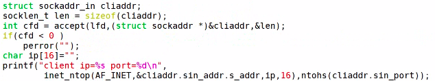

---
layout: post
title:  "socket网络编程"
data: 星期三, 01. 四月 2020 10:26上午 
categories: linux
tags: 专题
---
* 该模块会针对linux中的某一块知识做专题整理，也许会有些不足或者错误的地方，未来可能会作修改。

#linux专题3----socket网络编程

* 只是记一些有关网络编程的零碎知识

### socket网络编程的目标
解决不同主机间的进程通信

socket单独存在没有意义，一台主机创建了，另外一台主机也要创建相应的socket
，这样两个主机才能通信。1对主机1对进程对应个一对socket。

### 创建socket
int socket(int domain,int type ,int protocol);

>
**domain:**使用哪个协议族，比如对于TCP/IP协议设置为PE_INET
>
**type:**指定服务类型，主要有两个SOCK_STREAM（字节流）和SOCK_UGRAM（数据报），分别对应TCP和UDP。
>
**protocol：**除了前面两个选项再指定一个协议，但是一般填0。

返回一个套接字，相当于伪文件，返回文件描述符fd，这个伪文件分为读缓存区和写缓存区

**往写缓存区读写东西：** write()、sendto()、read()、recvfrom()
 
### scoket属性查询---getsockopt

int getsockopt(int sockfd, int level, int optname, void *optval, socklen_t *optlen);

>
返回值：成功返回0,失败返回1
>
level(协议层次)：SOL_SOCKET 套接字层次（一般选这个）、IPPROTO_IP ip层次、IPPROTO_TCP TCP层次
>
 option_name(选项的名称（套接字层次)):
 >>
  SO_BROADCAST 是否允许发送广播信息
>>
SO_REUSEADDR 是否允许重复使用本地地址
>>
SO_SNDBUF 获取发送缓冲区长度
>>
           
           SO_RCVBUF 获取接收缓冲区长度    
>>
           SO_RCVTIMEO 获取接收超时时间
>>     
           SO_SNDTIMEO 获取发送超时时间
>
option_value：获取到的选项的值
>
option_len：value的长度

这个函数用于获得socket的各种特性，即socket options. 结果放在函数的后两个参数中，这两个参数是value-result。 

**socket默认缓冲区8M，发送4M，接受4M**
 
###绑定socket/命名socket（服务端）

给套接字绑定一个固定的ip和端口，**只有服务端的scoket需要绑定，客户端的就直接用系统自动分配的。**

 #include < sys/types.h >          
 
 #include < sys/socket.h >

 int bind( int sockfd , const struct sockaddr *addr, socklen_t addrlen);
>
**addr:** 地址结构体
>>
网络通信需要解决协议、IP、端口三个问题，这三个都封装到这个结构体中
>> #### IPV4的结构体
>>
           struct sockaddr_in {
               sa_family_t    sin_family; /* address family: AF_INET */
               in_port_t      sin_port;   /* port in network byte order */
               struct in_addr sin_addr;   /* internet address */
           };
>>
           /* Internet address. */
           struct in_addr {
               uint32_t       s_addr;     /* address in network byte order */
           };
>> 
sin_family代表协议，一般设置为AF_INET，IPV4的协议族
>>
sin_port代表端口
>>
sin_addr代表IP
> #### 本地套接字
>>

>>
不需要端口和IP
>> #### 通用套接字结构体

>>
sa_data里面有端口和ip
>>
由于IPV4和IPV4的地址结构体不同，我们传入bind的时候会转为通用结构体。
>**addrlen：**结构体的大小
>
**返回值：**成功返回0,失败返回-1并设置errno
>
> #### 例子：

>>
改成下面这样也行
>>

>>
或者有人干脆不写，直接清零，效果一样

## 给socket发送信息（sendto）
UDP用sendto TCP则会用write

ssize_t sendto(int sockfd, const void *buf, size_t len, int flags, const struct sockaddr *dest_addr, socklen_t addrlen);

>
sockfd:发送方套接字文件描述符
>
buf:发送内容
>
len:发送内容长度
>
flags：一般设置为0,紧急信息设置为1
>
des_addr：ipv4套接字结构体（目的地信息）
>
addrlen：结构体大小 
>
返回值：发送的字节数

## 从scoket接数据（recvfrom）
UDP用recvfrom TCP则会用read

ssize_t recvfrom(int sockfd, void *buf, size_t len, int flags, struct sockaddr *src_addr, socklen_t *addrlen);

>
socket：接收方套接字
>
buf:存储数据区的地址
>
len:存储数据区的大小
>
flags：0
>
src_addr: ipv4套接字结构体，存储发送方的地址信息
>
addr_len: scr_addr该结构体长度
>
 返回值：接收的字节数
> #### 举个例子：
>

#### select返回有数据可读,但是recv读取返回0
select到读事件，但是读到的数据量为0，说明对方已经关闭了socket的读端。本端关闭读即可。

即对方已断开连接

## TCP连接服务器（connect）

 #include < sys/types.h >          /* See NOTES */
       
  #include < sys/socket.h >

  int connect(int sockfd, const struct sockaddr *addr, socklen_t addrlen);
>
socket:客户端套接字
>
addr:服务器的地址信息
>
addrlen:addr的长度
>
返回值：成功返回0,失败返回-1

> #### UDP的connect
>
因为UDP可以是一对一，多对一，一对多，或者多对多的通信，所以每次调用sendto()/recvfrom()时都必须指定目标IP和端口号。通过调用connect()建立一个端到端的连接，就可以和TCP一样使用send()/recv()传递数据，而不需要每次都指定目标IP和端口号。但是它和TCP不同的是它没有三次握手的过程。

#### connect阻塞
当客户端插上网线，但是连接网络失败，也就是说能够获取到ip地址，但是和服务器是ping不通的。这种情况下connect就可能会发生阻塞，因为按照《UNIX 网络编程》中讲解，connect的在进行三次握手，如果失败情况，需要等待75s的超市时间的。

**解决方法：**最通常的方法最有效的是加定时器；也可以采用非阻塞模式。
>
原理很简单，就是先把套接字设置为非阻塞，因为在非阻塞情况下，connect的结果是立即返回的，然后我们再使用select或者poll等机制来检测套接字一定的时间，如果在超时时间内不可写，则认为connect失败，然后需要把套接字重新设置为阻塞

## TCP监听socket（listen）
 #include < sys/types.h >          /* See NOTES */
 
 #include < sys/socket.h > 

 int listen(int sockfd, int backlog);
>
backlog:已完成连接队列和未完成连接队列之和的最大值，一般写内核支持的最大值比如128
>
返回值：成功返回0,失败-1

## TCP提取（accept）
从未完成队列提取新的连接，并创建一个新的已连接套接字

 #include< sys/socket.h >
 
 int accept(int socket,struct socket *addr,socklen_t *addrlen);
 
 >
 socket：监听套接字
 >
 addr: 保持客户端地址信息结构体(传入时为空)
 >
 addrlen: 结构体大小的地址
 >
 返回值：成功返回已连接套接字，失败返回-1.
 >
 
 
 
 
 
 

## 端口复用
一个端口只能对应一个套接字，而当TCP关闭的时候，在2MSL的时间内我们是不能重新用这个端口的，不能用bind函数，这其实是个问题，而端口复用就可以解决这个问题。

#### 设置方法

* 注意：端口复用后原来占用这个端口的程序就失效了

* 这个图有点问题 connect应该指向accept的上方而不是下方

### TCP分析

TCP过程中是用到两个套接字，监听套接字和已连接套接字