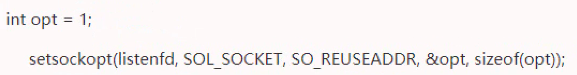
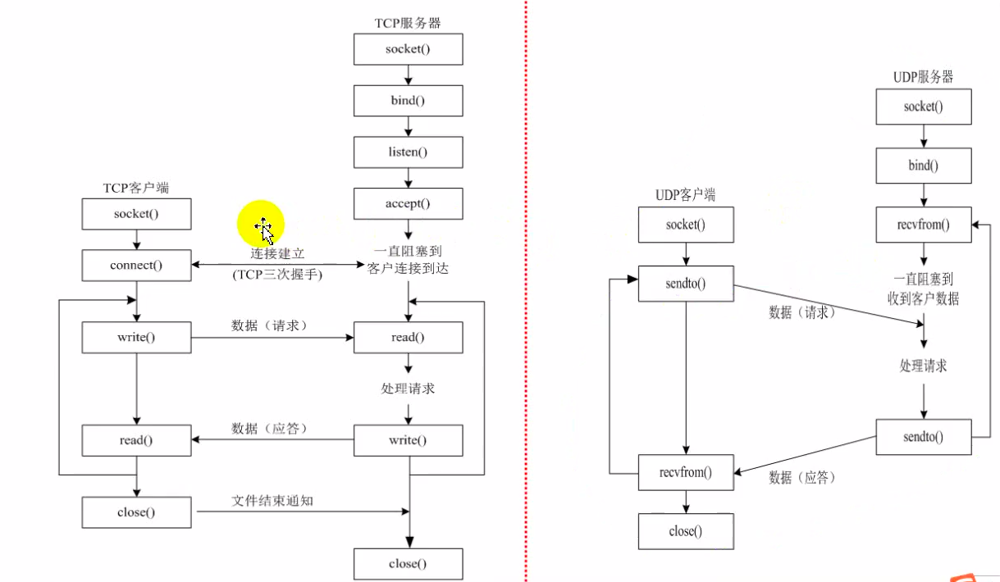
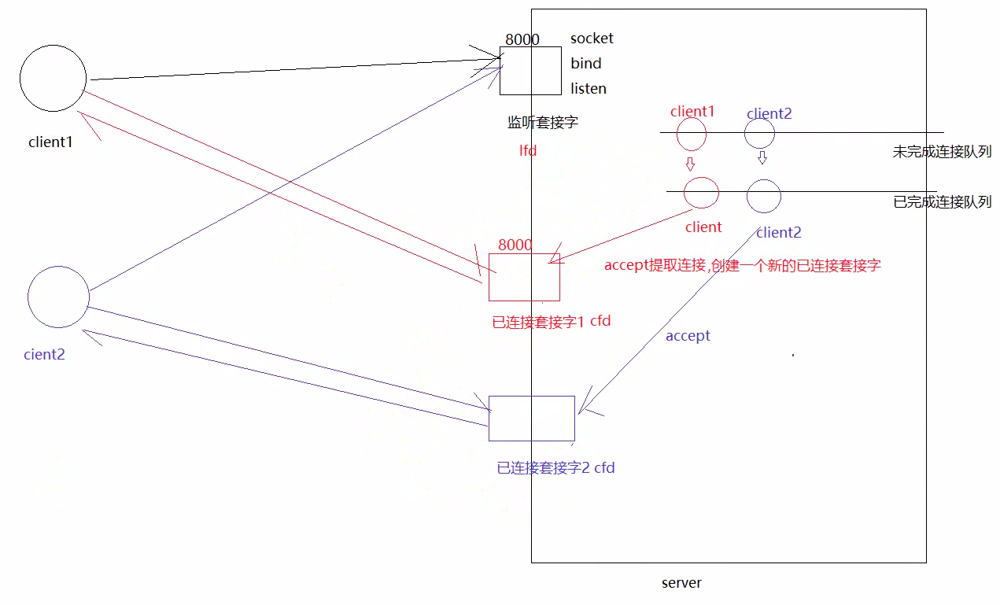

---
layout: post
title:  "socket网络编程"
data: 星期三, 01. 四月 2020 10:26上午 
categories: linux
tags: 专题
---
* 该模块会针对linux中的某一块知识做专题整理，也许会有些不足或者错误的地方，未来可能会作修改。

#linux专题3----socket网络编程

* 只是记一些有关网络编程的零碎知识

### socket网络编程的目标
解决不同主机间的进程通信

socket单独存在没有意义，一台主机创建了，另外一台主机也要创建相应的socket
，这样两个主机才能通信。1对主机1对进程对应个一对socket。

### 创建socket
返回一个套接字，相当于伪文件，返回文件描述符fd，这个伪文件分为读缓存区和写缓存区

**往写缓存区读写东西：** write()、sendto()、read()、recvfrom()

## 端口复用
一个端口只能对应一个套接字，而当TCP关闭的时候，在2MSL的时间内我们是不能重新用这个端口的，不能用bind函数，这其实是个问题，而端口复用就可以解决这个问题。

#### 设置方法

* 注意：端口复用后原来占用这个端口的程序就失效了

* 这个图有点问题 connect应该指向accept的上方而不是下方

### TCP分析

TCP过程中是用到两个套接字，监听套接字和已连接套接字