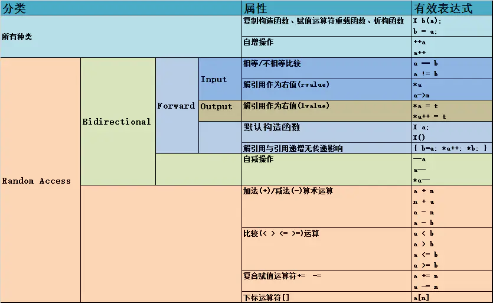

* 该模块会针对数据结构中的某一块知识做专题整理，也许会有些不足或者错误的地方，未来可能会作修改。

#  数据结构专题7----迭代器原理

* 这里的迭代器不只是STL中的，前两种暂不细讲

## 输入迭代器
istream

## 输出迭代器
ostream

## 前向迭代器

forward_list、unordered_set、unordered_multiset、unordered_map、unordered_multimap

## 双向迭代器

list、map、set 、multiset、multimap

## 随机访问迭代器

vector、array、deque、string、内置数组

参考链接：

http://c.biancheng.net/view/338.html