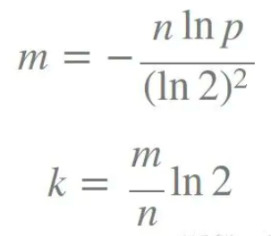

---
layout: post
title:  "布隆过滤器"
data: 星期四, 09. 四月 2020 06:17下午 
categories: 算法
tags: 专题
---
* 该模块会针对算法中的某一块知识做专题整理，也许会有些不足或者错误的地方，未来可能会作修改。

#  算法专题4----布隆过滤器

本质上布隆过滤器是一种**数据结构**，比较巧妙的概率型数据结构，特点是**高效地插入和查询**。根据查询结果可以用来告诉你**某样东西一定不存在或者可能存在**这句话是该算法的核心。

## 布隆过滤器的原理
布隆过滤器是由一个很长的bit数组和一系列哈希函数组成的

数组的每个元素都只占1bit空间，并且每个元素只能为0或1。

布隆过滤器还拥有**k个哈希函数**，当一个元素加入布隆过滤器时，会使用k个哈希函数对其进行k次计算,得到**k个哈希值**，并且根据得到的哈希值，在维数组中把对应下标的值置位1。

判断某个数是否在布隆过滤器中，就对该元素进行k次哈希计算，得到的值在位数组中判断每个元素是否都为1，如果每个元素都为1，就说明这个值在布隆过滤器中。

## 删除
传统的布隆过滤器并不支持删除操作。但是名为 Counting Bloom filter 的变种可以用来测试元素计数个数是否绝对小于某个阈值，它支持元素删除。

## 布隆过滤器的误判
当插入的元素越来越多时，当一个不在布隆过滤器中的元素，经过同样规则的哈希计算之后，得到的值在位数组中查询，有可能这些位置因为其他的元素先被置1了。这是误判。

但是如果布隆过滤器判断某个元素不在布隆过滤器中，那么这个值就一定不在。

## k和m的选择
k 为哈希函数个数，m 为布隆过滤器长度，n 为插入的元素个数，p 为误报率。

m 为布隆过滤器长度

## 使用场景
常见的适用常见有，利用布隆过滤器减少磁盘 IO 或者网络请求，因为一旦一个值必定不存在的话，我们可以不用进行后续昂贵的查询请求。

布隆过滤器广泛应用于网页黑名单系统、垃圾邮件过滤系统、爬虫网址判重系统等判断时，将输入对象经过这k个哈希函数计算得到k个值，然后判断对应bitarray的k个位置是否都为1（是否标黑），如果有一个不为黑，那么这个输入对象则不在这个集合中，也就不是黑名单了！如果都是黑，那说明在集合中，但有可能会误

