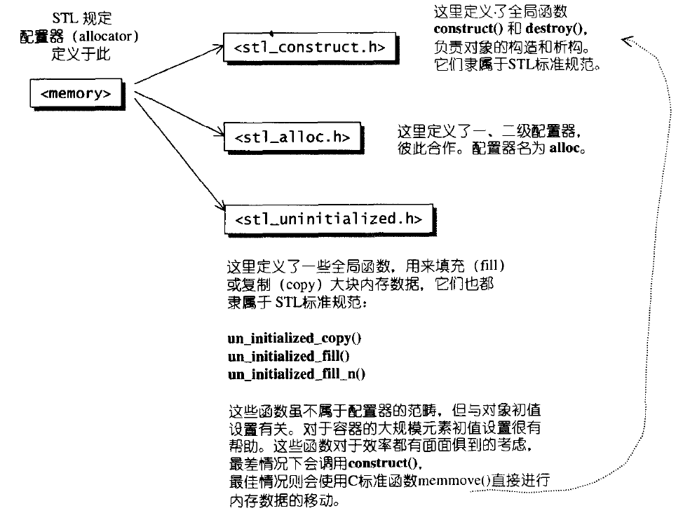

* 该模块会针对我读一本书进行整理，会分几篇博客完成，也许会有些不足或者错误的地方，未来可能会作修改。

* 有一些是看了其他博客觉得比较好摘来的，有一些是书上的，有一些是自己总结的。

# STL源码剖析

## STL六大组件

#### 容器（container）
用于存放数据

#### 算法（algorithm）
用于处理容器

#### 迭代器（iterator）
存取容器中数据的“指针”

#### 仿函数（functors）
用于构建自己的算法

#### 适配器（adapters）
可以修改仿函数、容器、迭代器的实现的一些细节

#### 分配器（allocators）
用于给容器分配空间

>
容器通过配置器获取存储空间
>
算法通过迭代器处理容器 
>
仿函数可以协助算法完成不同的策略变化
>
配置器可以修饰或套接仿函数

## 分配器（allocators）

#### SGI标准的空间配置器 std::allocator

SGI内部定义的一个符合部分标准的、名为allocator的配置器，但是SGI默认不会用它，因为**效率不行**，只是把operator new和operator delete做了简单的包装。

#### SGI特殊的空间配置器， std::alloc
我们知道在C++中申请内存的过程是先分配内存，在执行构造函数，析构的过程则是先执行析构函数再释放内存。

std::alloc将这些过程细分
>
内存分配由alloc::allocate()负责
>
内存释放由alloc::deallocate()负责
>
对象构造由::construct()负责
>
对象析构由::destory()负责

分配器定义于#include< memory >中，而#include< memory >中又含有两个文件，负责内存空间分配的释放的#include< stl_alloc.h >以及负责对象内容构造和析构的#include< stl_construct.h >

#### 一级配置器与二级配置器
一级配置器直接调用malloc和free来配置释放内存，简单明了。

二级配置器根据情况来判定，如果配置区块大于128bytes，说明“足够大”，调用第一级配置器，而小于等于128bytes，则采用**复杂内存池（memory pool）**来管理。
>
如果区块大于128， 则直接由第一级空间配置器收回
>
如果区块小于等于128， 则有自由链表收回
>>
自由链表是一个指针数组，有点类似与hash桶，它的数组大小为16，每个数组元素代表所挂的区块大小

为了自由选择，STL又规定了 __USE_MALLOC 宏，如果它存在则直接调用第一级配置器，不然则直接调用第二级配置器。SGI未定义该宏，也就是说默认使用第二级配置器

参考链接：https://blog.csdn.net/xy913741894/article/details/66974004

#### 配置器分析（主要针对二级配置器）

**优点：**

1.频繁使用malloc，free开辟释放小块内存带来的性能效率的低下

2.内存碎片问题，导致不连续内存不可用的浪费

**问题：**

1.内碎片的问题，自由链表所挂区块都是8的整数倍，因此当我们需要非8倍数的区块，往往会导致浪费

2.我们发现似乎没有释放自由链表所挂区块的函数？确实是的，由于配置器的所有方法，成员都是静态的，那么他们就是存放在静态区。释放时机就是程序结束，这样子会导致自由链表一直占用内存，自己进程可以用，其他进程却用不了。

## 仿函数（functors）

#### 什么是仿函数
只有1字节大小，重载了operator()的类。(起始只要重载operator()就行)

#### 使用场景
仿函数的主要功能是为了搭配STL算法使用，单独使用仿函数的情况比较少。

仿函数不只是STL中使用

即我们有一个需要常常重用的函数，如果作为一个类的成员函数，不太合适。如果作为一个公共的函数，那么函数用到的一些变量，就可能成为公共的全局变量，同时也不好维护。这时候就可以考虑仿函数。
> 
这里有一个关键点，为什么设置为公共的函数，函数用到的变量就成为了全局变量，因为函数的局部变量无法在函数间传递。

**在类实例化时，就将要用的，非参数的元素传入类中。这样就免去了对一些公共变量的全局化的维护了。又可以使那些代码独立出来，以便下次复用。**

而且这些仿函数，还可以用关联，聚合，依赖的类之间的关系，与用到他们的类组合在一起，这样有利于资源的管理（这点可能是它相对于函数最显著的优点了）。

#### 标准库中的仿函数
在< functional >头文件中定义了如下三类仿函数：

>
accumulate(iv.begin(),iv.end(),1,multiplies< int >())

.

>
 int arr[]={1,2,3,4,5};
 >
 sort(arr,arr+5,greater<int>());

>
bool values[] = {true,false,true,false};
 > 
 transform (values, values+4, values, logical_not<bool>());

#### 与函数指针的区别
仿函数技术可以获得更好的性能，这点直观来讲比较难以理解。你可能说，回调函数申明为inline了，怎么会性能比仿函数差？我们这里来分析下。我们假设某个函数func（例如上面的std::sort）调用中传递了一个回调函数（如上面的compare），那么可以分为两种情况：

func是内联函数，并且比较简单，func调用最终被展开了，那么其中对回调函数的调用也成为一普通函数调用（而不是通过函数指针的间接调用），并且如果这个回调函数如果简单，那么也可能同时被展开。在这种情形下，回调函数与仿函数性能相同。

func是非内联函数，或者比较复杂而无法展开（例如上面的std::sort，我们知道它是快速排序，函数因为存在递归而无法展开）。此时回调函数作为一个函数指针传入，其代码亦无法展开。而仿函数则不同。虽然func本身复杂不能展开，但是func函数中对仿函数的调用是编译器编译期间就可以确定并进行inline展开的。因此在这种情形下，仿函数比之于回调函数，有着更好的性能。并且，这种性能优势有时是一种无可比拟的优势（对于std::sort就是如此，因为元素比较的次数非常巨大，是否可以进行内联展开导致了一种雪崩效应）。

#### 仿函数的限制
话又说回来了，仿函数并不能完全取代回调函数所有的应用场合。例如，我在std::AutoFreeAlloc中使用了回调函数，而不是仿函数，这是因为AutoFreeAlloc要容纳异质的析构函数，而不是只支持某一种类的析构。这和模板（template）不能处理在同一个容器中支持异质类型，是一个道理。

## 适配器（adapters）

#### 容器适配器
通俗讲适配器就是以序列式容器为底层数据结构，进一步封装了的为适应场景应用的容器。STL中提供了三种适配器，分别为stack，queue和priority_queue。

#### 迭代器适配器

**reverse适配器：**如rbegin(),rend()等。可以将一般迭代器的行进方向逆转，使原本应该前进的 operator++ 变成了后退操作，使原本应该后退的 operator-- 变成了前进操作。这种错乱的行为不是为了掩人耳目，而是因为这种倒转性质运用在 “从尾端开始进行” 的算法上，有很大的方便性。

**insert迭代器：**就是可以将一般迭代器的赋值操作转变为插入操作。STL 提供了三个相应函数：back_inserter()、front_inserter()、inserter()。

**stream适配器：**如ostream_iterator,  istream_iterator。可以将迭代器绑定到某个 iostream 对象上。绑定到 istream 对象身上的，称为 istream_iterator，拥有输入功能；绑定到 ostream 对象身上的，称为 ostream_iterator，拥有输出功能。这种迭代器运用于屏幕输出非常方便。以它为蓝图，稍加修改，便可适用于任何输出或输入装置上。

#### 函数适配器

举两个例子：

**绑定器(binder)：**给二元函数对象绑定一个常量，转化成一元函数对象。包括bind1st和bind2nd。相当于设置一个默认参数

**取反器(negator)：**将谓词函数对象结果取反。包括not1和not2。

