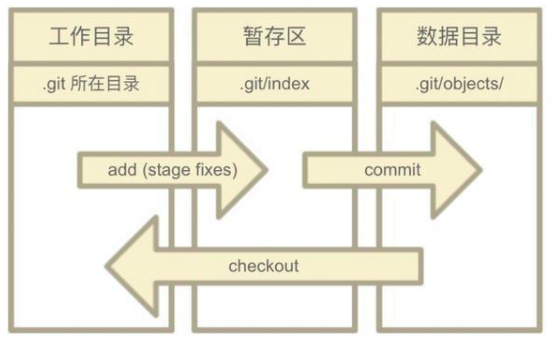
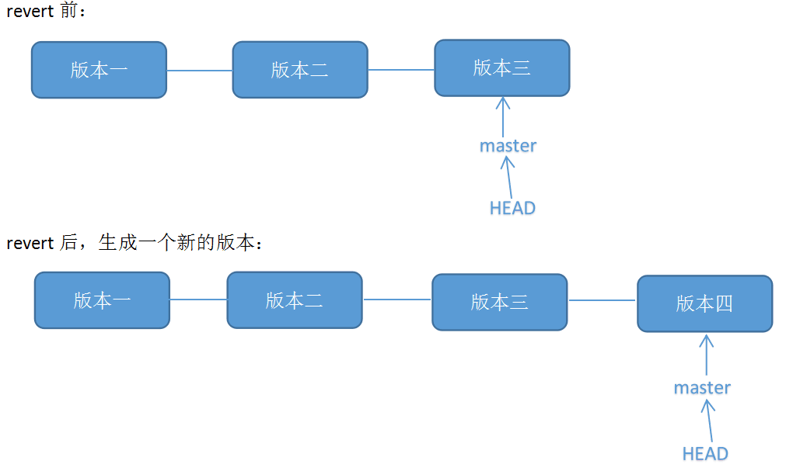
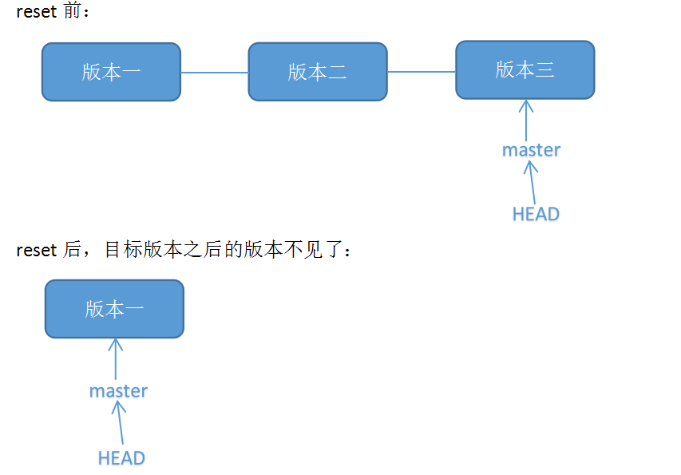

---
layout: post
title:  "git练习"
data:  星期五, 15. 五月 2020 06:50下午 
categories: 杂谈
tags: github
---
* 一直想全面地学习一下 git，但是苦于没有练习方式，逛知乎的时候发现一个不错的帖子https://zhuanlan.zhihu.com/p/134346782，同时也想记录一下git的各种用法

## git的三大区域

#### 工作区
可以理解为IDE

#### 暂存区
暂存已经修改的文件

#### git仓库（这个名字很多）
最终保存的文件

## git config
设置git 的各个属性

#### git config --list
查看已经设置的git属性。也可以通过 cat ～/.gitconfig查看

#### 设置属性
比如设置 user.name 属性， 范围为global

git config --global user.name 'Elliot'

#### 删除属性
git config unset --global user.name

## git init
先创建一个文件夹  然后  初始化一个项目

## git status
查看目前本地git的一个状态处于哪个分支 ，以及本地的git距离上次更新有什么区别，但是并不保存这些更新。

## git diff
输出我们在本地git上具体修改了什么（git add -A 执行保存后就没区别了）

如果想查某一文件可以后面加文件名

## git add
提交修改，我一般直接使用 git add -A ，即会处理所有操作，创建删除和修改。执行完这个操作，本地的git会保存更新。 **如果本地git有修改就必须先提交修改才能commit，提交修改的命令不止add**

## 恢复操作

#### git checkout

git checkout HEAD

对于本地git的修改 我们并不想修改（删除、创建），想还原，就是可以用这个命令

#### git revert
结合git log --oneline 一起用，查看版本号，取消前面某一次提交。

**如果你最近的修改和要撤消的修改有重叠(overlap),那么就会被要求手工解决冲突(conflicts)**,　就像解决合并(merge)时出现的冲突一样.git revert 其实不会直接创建一个提交(commit), 把撤消后的文件内容放到索引(index)里,你需要再执行git commit命令，它们才会成为真正的提交(commit).

>
想要撤销版本二，但又不想影响撤销版本三的提交，就可以用 git revert 命令来反做版本二，生成新的版本四，这个版本四里会保留版本三的东西，但撤销了版本二的东西。

#### git reset
结合git log --oneline 一起用，查看版本号，恢复到某一次提交之前，后面部分会被取消

git reset --mixed （默认选项）

git reset --soft

## git commit
将本地git 的更新提交到github上。

####  git commit -m “message”
提交修改附加信息。

#### git commit --amend

## git log
查看以往的提交修改

一次 git commit一次记录

git log --oneline

可以查出哪个人做了哪些提交，可以查出某个文件做了哪些修改

## git branch
想要为项目新增特性 或者修改BUG的时候

完成之后可以将分支合并在一块

git status可以查看处于哪个分支

git branch可以查看有多少分支  *表示当前位置 ,也可以选择查看远程服务器端有多少分支

#### 创建分支
git branch xxx  //创建名为xxx的分支

#### 切换分支
git checkout   xxx

如果切换成原来的分支 那么在xxx分支上做的修改都会消失（本地操作）

#### 查看分支区别
git branch diff

#### 合并分支
git merge xxx //xxx分支会合并到主分支   在master分支合并 

#### 解决冲突
如果有冲突会报错

如果想取消合并 则输入abort

重新打开代码则会标记在哪出了问题

#### 删除分支
git branch -d xxx

## git stash
工作进度的保存

即你修改了一样东西 但是暂时不想管他 你可以使用这个命令，并且文件也会恢复成原来的样子

* 可以选择忽略一些文件，即让git放弃跟踪  git config 中可以设置

## git remote 
将本地的代码 同步到github上新的repositories

## git push
将本地版本库推送到远程服务器上

可以推送分支

git push -u origin  bb1 //将名为bb1的分支上传到github上

## git fetch与git pull
将远程服务器的版本库 同步到本地

还需要经过merge操作
>
如有有人修改了你的项目 那么pull的时候会有冲突
>
当你修改完（commit之后）你的冲突之后就不会显示有冲突，即使冲突依然存在，就可以使用push

## git clone
将github上的项目的版本库 复制到本地

## pull request
将自己的修改提交到别人的项目中 （需要作者同意）

