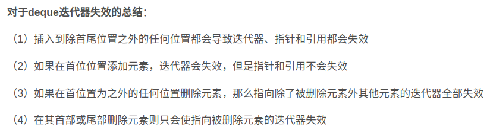
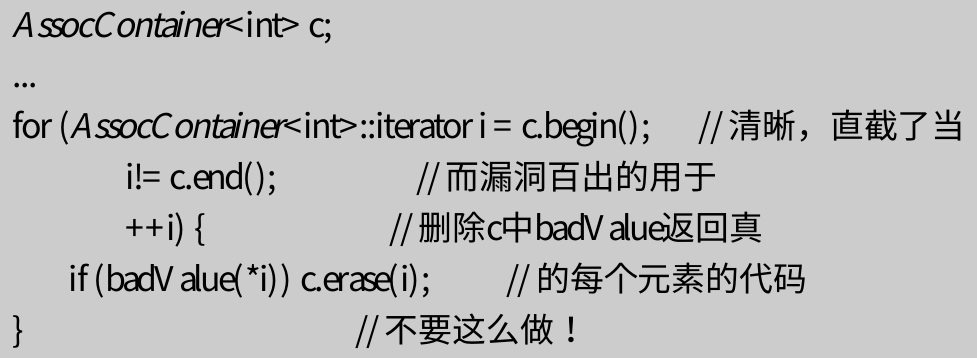
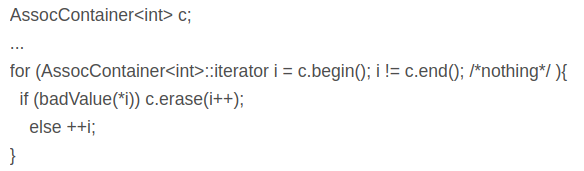

---
layout: post
title:  "EffectiveSTL"
data:  星期三, 20. 五月 2020 09:44上午 
categories: C++
tags: 读书笔记
---
# Effective STL记录

### 条款1:仔细选择你的容器

1.deque是唯一一个“在迭代器失效时不会使它的指针和引用失效”的标准STL容器。

2.list是唯一提供多元素插入事务性语义的标准容器。（比如，以范围的方式--参见条款5）

### 条款2:小心对“容器无关代码”的幻想
这里的罪魁祸首是不同的序列容器所对应的不同的迭代器、指针和引用的失效规则。要写能正确地和vector,deque和list配合的代码,你必须假设任何使那些容器的迭代器,指针或引用失效的操作符真的在你用的容器上起作用了。

因此,你必须假设每次调用insert都使所有东西失效了,因为deque::insert会使所有迭代器失效,而且因为缺少capacity,vector::insert也必须假设使所有指针和引用失效。

### 条款3:使容器里对象的拷贝操作轻量而正确
拷进去,拷出来。这就是STL的方式。

当然由于继承的存在,**拷贝会导致分割**。那就是说,如果你以基类对象建立一个容器,而你试图插入派生类对象,那么当对象(通过基类的拷贝构造函数)拷入容器的时候对象的派生部分会被删除。如果你希望结果对象表现为派生类对象,比如,调用派生类的虚函数等,总是错的。

**一个使拷贝更高效、正确而且对分割问题免疫的简单的方式是建立指针的容器而不是对象的容器。而且当指针拷贝时没有分割。**

### 条款4:用empty来代替检查size()是否为0
对于所有的标准容器,empty是一个常数时间的操作,但对于一些list实现,size花费线性时间。

但是什么造成list这么麻烦?为什么不能也提供一个常数时间的size?答案是对于list特有的splice有很多要处理的东西。splice是list的拼接，是在常数级别完成的，可以常数时间合并其他list的某一个区间，经过这个操作，size（）操作就未知了，必须遍历，splice和size必须有一个作出让步，不是常数操作。

>
list::splice实现list拼接的功能。将源list的内容部分或全部元素删除，拼插入到目的list。

### 条款5:尽量使用区间成员函数代替它们的单元素兄弟

当你想要给一个容器完全的新数据集时,assign就可以利用,但operator=做不了。即你只想修改容器的部分区间。

几乎所有目标区间被插入迭代器指定的copy的使用都可以用调用的区间成员函数的来代替。

**原因：**

（1）一般来说使用区间成员函数可以输入更少的代码。

（2）区间成员函数会导致代码更清晰更直接了当

当处理标准序列容器（例如vector）时,应用单元素成员函数比完成同样目的的区间成员函数需要更多地内存分配,更频繁地拷贝对象,而且/或者造成多余操作。
>
第一种多余操作：没有必要的函数调用（isnert）
>
第二种多余操作：无效率地把v中的现有元素移动到它们最终插入后的位置的开销。每次调用insert来增加一个新元素到v,插入点以上的每个元素都必须向上移动一次来为新元素腾出空间。
>
第三种多余操作：重复使用单元素插入而不是一个区间插入就必须处理内存分配
>
list同理也最好使用insert的区间形式

* 序列容器的和关联容器的区间删除有些不同，因为erase的序列和关联容器版本有不同的返回类型。当然插入也不同。

### 条款6:警惕C++最令人恼怒的解析
>
从int文件中读取的数据直接构造一个list 缺构造了一格函数
>
ifstream dataFile("ints.dat");
>
list< int > data(istream_iterator< int >(dataFile), istream_iterator< int >()); 

>
最好使用以下的方法
>
ifstream dataFile("ints.dat");
>
istream_iterator<int> dataBegin(dataFile);
>
istream_iterator<int> dataEnd;
>
list<int> data(dataBegin, dataEnd);

### 条款7:当使用new得指针的容器时,记得在销毁容器前delete那些指针
STL的容器在自己被销毁时，会自动销毁其容纳的每一个对象。但是当其容纳的对象是指针时，容器并不能正确销毁指针所指向的对象，因为指针的析构函数是无操作。

如果循环delete会有两个问题
>
1.相比for_each，代码量多得多 (如果需要用for_each来完成这一操作，我们需要将delete转入一个函数对象中。)
>
2.非异常安全，即当异常抛出在delete掉所有容器内指针指向的内存之前时，会造成内存泄露。(要解决异常安全，一个最好的方法是使用智能指针)

* 非模板类中的模板成员函数会自己判断传入参数类型 

### 条款8:永不建立auto_ptr的容器
主要原因是，当拷贝一个auto_ptr时，auto_ptr所指向对象的所有权会被转移到拷贝的auto_ptr，二被拷贝的auto_ptr将被设为NULL。这将导致容器操作过程中，其所包含的元素会被意外地改变，导致未定义的结果。幸运的是，当你尝试建立一个auto_ptr的容器时，一般都会在编译阶段报错。

### 条款9:在删除选项中仔细选择
去除一个容器中有特定值的所有对象：
>
如果容器是vector、string或deque，使用erase-remove惯用法。
>
如果容器是list，使用list::remove。
>
如果容器是标准关联容器，使用它的erase成员函数。

去除一个容器中满足一个特定判定式的所有对象：
>
如果容器是vector、string或deque，使用erase-remove_if惯用法。
>
如果容器是list，使用list::remove_if。
>
如果容器是标准关联容器，使用remove_copy_if和swap，或写一个循环来遍历容器元素，当你把迭代器传给erase时记得后置递增它。

* 循环删除的时候一定要注意迭代器失效的问题,不论哪种容器

>
错误样例
>

>
当c.erase(i)返回时,i已经失效。
> 
正确样例
>

### 条款10:注意分配器的协定和约束

### 条款11：理解自定义分配子的合理用法
在自定义allocator时，需要遵守同一类型的allocator必须是等价的。

例如,假定你有仿效malloc和free的特别程序,用于管理共享内存的堆。

### 条款12：切勿对STL容器的线程安全性有不切实际的依赖
当涉及STL容器和线程安全时，你可以指望一个STL库允许多个线程同时读一个容器，以及多个线程对不同的容器做写操作。你不能指望STL库会把你从同步控制中解脱出来，而且你不能依赖任何线程支持。

### 条款13：vector和string优先于动态分配的数组
如果使用new来动态分配内存，程序员需要保证这些内存在使用结束后被正确释放。当一个vector或string销毁时,它的析构函数会自动销毁容器中的元素,回收存放那些元素的内存。（当然，如果用智能指针就没有这样的问题，但是将无法使用STL提供的算法或容器内置函数。）

为减轻程序员的负担，推荐使用vector或者string。其中有一个例外是，在多线程环境下使用string，由于string大多使用引用计数来优化内存分配和效率，但是在多线程环境下，同步操作可能带来更来的效率损耗。这时候可以用vector< char >来代替string。

>
要知道你正在使用的string实现是否是引用计数的,通常最简单的方式是参考库的文档。因为通常认为引用计数是一种优化,制作商一般把它作为一个特性来吹捧。另一种方法是看库的string实现的源代码。

### 条款14：使用reserve来避免不必要的重新分配
以下四个成员函数经常被混淆，而且只有vector和string提供了所有这四个函数。

size()：返回该容器中有多少个元素

capacity()：返回该容器利用已分配的内存可以容纳多少个元素

resize(container::size_type n)：强迫改变容器改变到包含n个元素的状态。如果n小于当前size，则容器尾部元素北析构；如果n大于当前size，则通过默认工造函数将新元素添加到容器的尾部；；如果n大于当前capacity，则先重新分配内存。

reserve(container::size_type n)：强制容器吧他的容量变成至少是n，前提是n不小于当前的大小。如果n小于当前容量，vector什么都不做；**而string可能把自己的容量见效为size()和n中的最大值。**

### 条款15：注意string实现的多样性
string的值可能会被引用计数，也可能不会。很多情况下会默认使用引用计数，但一般都会提供关闭默认选择的方法。（主要是为了显示写时复制计数）

string对象大小的范围是一个char*指针大小的1倍到7倍。

创建一个新的字符串可能需要0次、1次或者2次动态分配内存。

string对象可能共享，也可能不共享其大小和容量信息。

string可能支持，也可能不支持针对单个对象的分配子。

不同的实现对字符内存的最小分配单位有不同的策略。

