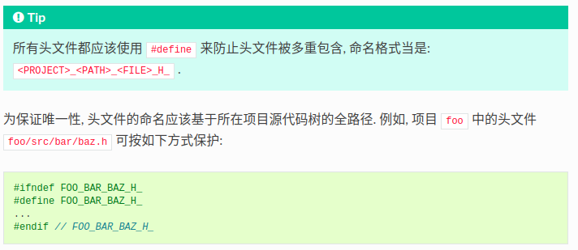
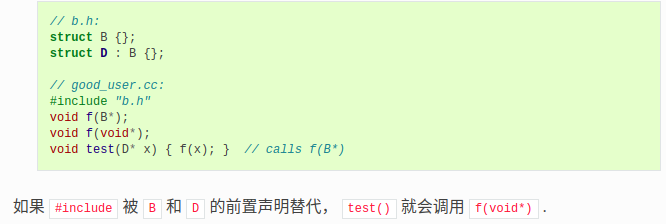
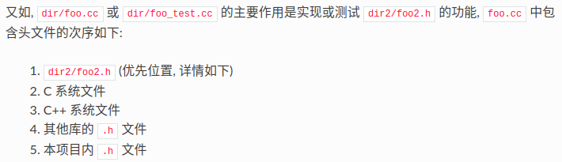
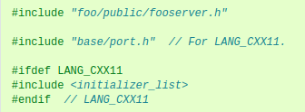
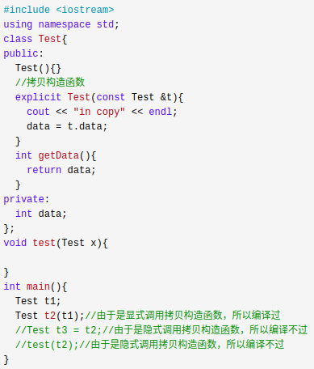

---
layout: post
title:  "EffectiveSTL"
data: 星期三, 30. 九月 2020 09:23上午 
categories: C++
tags: 读书笔记
---
# Google C++ 编程规范
* 每个人写代码都有自己的风格，但是开发往往不是一个人的事，所以统一风格很重要，我所在的组一般采用google C++规范。特此开一篇博文记录一下。

## 头文件
####  头文件要自给自足
所有头文件要能够自给自足。换言之，用户和重构工具不需要为特别场合而包含额外的头文件。

#### #define保护

#### 前置声明
> 所谓「前置声明」（forward declaration）是类、函数和模板的纯粹声明，没伴随着其定义.

尽可能避免使用前置声明。使用#include包含所需要的头文件即可。

前置声明能减少编译时间，减少不必要的#include,避免#include使代码因为头文件无关的改动而被重新编译多次

**但是也有缺点**

1.前置声明隐藏了依赖关系，头文件改动时，用户的代码会跳过必要的重新编译过程

2.前置声明了不少来自头文件的symbol时，就会比单单一行的include冗长。

3.有的时候采用前置声明代替include甚至都会暗暗改变代码的含义

4.前置声明来自命名空间 std:: 的 symbol 时，其行为未定义。

5.前置声明可能会被库的后续更改所破坏。前置声明函数或模板有时会妨碍头文件开发者变动其 API. 例如扩大形参类型，加个自带默认参数的模板形参等等。

>前置声明的类是不完全类型（incomplete type），我们只能定义指向该类型的指针或引用，或者声明（但不能定义）以不完全类型作为参数或者返回类型的函数。毕竟编译器不知道不完全类型的定义，我们不能创建其类的任何对象，也不能声明成类内部的数据成员。
>所以当用到其他文件的类时但是不需要调用其实现方法，尽量只用指针，这样就可以直接使用前置声明了

#### #include的路径及顺序
1.项目内头文件应按照项目源代码目录树结构排列, 避免使用 UNIX 特殊的快捷目录 . (当前目录) 或 .. (上级目录). 

2.注意库的声明顺序

这种优先的顺序排序保证当 dir2/foo2.h 遗漏某些必要的库时， dir/foo.cc 或 dir/foo_test.cc 的构建会立刻中止。因此这一条规则保证维护这些文件的人们首先看到构建中止的消息而不是维护其他包的人们。

3.按字母顺序分别对每种类型的头文件进行二次排序是不错的主意。注意较老的代码可不符合这条规则，要在方便的时候改正它们。

4.您所依赖的符号被哪些头文件所定义，您就应该包含哪些头文件，前置声明情况除外。比如您要用到 bar.h 中的某个符号, 哪怕您所包含的 foo.h 已经包含了 bar.h, 也照样得包含 bar.h, 除非 foo.h 有明确说明它会自动向您提供 bar.h 中的 symbol. 

5.凡是 cc 文件所对应的「相关头文件」已经包含的，就不用再重复包含进其 cc 文件里面了，就像 foo.cc 只包含 foo.h 就够了，不用再管后者所包含的其它内容。

6.有时，平台特定（system-specific）代码需要条件编译（conditional includes），这些代码可以放到其它 includes 之后。当然，您的平台特定代码也要够简练且独立，比如：

## 作用域
鼓励在 .cc 文件内使用匿名命名空间或 static 声明. 使用具名的命名空间时, 其名称可基于项目名或相对路径. **禁止使用 using 指示（using-directive）。禁止使用内联命名空间（inline namespace）。**

> 

命名空间将全局作用域细分为独立的, 具名的作用域, 可有效防止全局作用域的命名冲突.

**不要在命名空间 std 内声明任何东西**, 包括标准库的类前置声明. 在 std 命名空间声明实体是未定义的行为, 会导致如不可移植. 声明标准库下的实体, 需要包含对应的头文件.

**不应该使用 using 指示 引入整个命名空间的标识符号。会污染命名空间**

**不要在头文件中使用命名空间别名，除非显式标记内部命名空间使用。**因为任何在头文件中引入的命名空间都会成为公开API的一部分。

> 命名空间内不用包含 
>
> 1. include头文件 2. gflags 的声明/定义 3.类的前置声明

#### 局部变量
1.声明变量离变量第一次使用越近越好

2.应使用初始化的方式替代声明再赋值

* 有一个例外, 如果变量是一个对象, 每次进入作用域都要调用其构造函数, 每次退出作用域都要调用其析构函数. 这会导致效率降低. 具体例子就是不应该在for循环内部定义变量。

#### 静态和全局变量
POD变量：内置类型的变量

静态生存周期的对象: 全局变量，静态变量，静态类成员变量和函数静态变量

**禁止定义静态储存周期非POD变量，禁止使用含有副作用的函数初始化POD全局变量，因为多编译单元中的静态变量执行时的构造和析构顺序是未明确的，这将导致代码的不可移植。**

> 例子：https://blog.csdn.net/lemonrabbit1987/article/details/49071893

不过 constexpr 变量除外，毕竟它们又不涉及动态初始化或析构。

 >
同一个编译单元内是明确的，静态初始化优先于动态初始化，初始化顺序按照声明顺序进行，销毁则逆序。不同的编译单元之间初始化和销毁顺序属于未明确行为 (unspecified behaviour)。

**所以除了禁用类类型的全局变量，我们也不允许用函数返回值来初始化 POD 变量，除非该函数（比如 getenv() 或 getpid() ）不涉及任何全局变量。函数作用域里的静态变量除外，毕竟它的初始化顺序是有明确定义的，而且只会在指令执行到它的声明那里才会发生。**

**综上所述，我们只允许 POD 类型的静态变量，即完全禁用 vector (使用 C 数组替代) 和 string (使用 const char [])。**

如果您确实需要一个 class 类型的静态或全局变量，可以考虑在 main() 函数或 pthread_once() 内初始化一个指针且永不回收。**注意只能用 raw 指针，别用智能指针**，毕竟后者的析构函数涉及到上文指出的不定顺序问题。

## 类

#### 构造函数的缺点
**因为构造函数没有返回值，不能返回错误类型**

构造函数中只进行那些没什么意义的 (trivial, 注: 简单初始化对于程序执行没有实际的逻辑意义, 因为成员变量 "有意义" 的值大多不在构造函数中确定) 初始化, 可能的话, 使用 Init() 方法集中初始化有意义的 (non-trivial) 数据. 或者使用工厂模式。

如果代码允许, 直接终止程序是一个合适的处理错误的方式. 否则, 考虑用 Init() 方法或工厂函数.

#### 隐式类型转换
不要定义隐式类型转换. 对于转换运算符和单参数构造函数, 请使用 explicit 关键字.

当有多个参数的构造函数就不用加explict

拷贝和移动构造函数不应当被标记为 explicit, 因为它们并不执行类型转换. 目前不建议加 
> 

#### 拷贝与移动
如果你的类型需要, 就让它们支持拷贝 / 移动. 否则, 就把隐式产生的拷贝和移动函数禁用.

如果对于你的用户来说这个拷贝操作不是一眼就能看出来的, 那就不要把类型设置为可拷贝. 如果让类型可拷贝, 一定要同时给出拷贝构造函数和赋值操作的定义, 反之亦然. 如果让类型可拷贝, 同时移动操作的效率高于拷贝操作, 那么就把移动的两个操作 (移动构造函数和赋值操作) 也给出定义. 如果类型不可拷贝, 但是移动操作的正确性对用户显然可见, 那么把这个类型设置为只可移动并定义移动的两个操作.

#### 结构体与类
仅当只有数据成员时使用 struct, 其它一概使用 class.

为了和 STL 保持一致, 对于仿函数等特性可以不用 class 而是使用 struct.

#### 继承
对于重载的虚函数或虚析构函数, 使用 override, 或 (较不常用的) final 关键字显式地进行标记.

这些标记起到了文档的作用, 因为如果省略这些关键字, 代码阅读者不得不检查所有父类, 以判断该函数是否是虚函数.

#### 多重继承
真正需要用到多重实现继承的情况少之又少. 只在以下情况我们才允许多重继承: 最多只有一个基类是非抽象类; 其它基类都是以 Interface 为后缀的 纯接口类.

#### 接口
当一个类满足以下要求时, 称之为纯接口:

* 只有纯虚函数 (“=0”) 和静态函数 (**除了下文提到的析构函数**).
* 没有非静态数据成员.
* 没有定义任何构造函数. 如果有, 也不能带有参数, 并且必须为 protected.
* 如果它是一个子类, 也只能从满足上述条件并以 Interface 为后缀的类继承.

#### 重载运算符
只有在意义明显, 不会出现奇怪的行为并且与对应的内建运算符的行为一致时才定义重载运算符. 

很少用到

 如果你定义了一个运算符, 请将其相关且有意义的运算符都进行定义, 并且保证这些定义的语义是一致的. 例如, 如果你重载了 <, 那么请将所有的比较运算符都进行重载, 并且保证对于同一组参数, < 和 > 不会同时返回 true.

建议不要将不进行修改的二元运算符定义为成员函数. 如果一个二元运算符被定义为类成员, 这时隐式转换会作用域右侧的参数却不会作用于左侧. 这时会出现 a < b 能够通过编译而 b < a 不能的情况, 这是很让人迷惑的.

不要为了避免重载操作符而走极端. 比如说, 应当定义 ==, =, 和 << 而不是 Equals(), CopyFrom() 和 PrintTo(). 反过来说, 不要只是为了满足函数库需要而去定义运算符重载. 比如说, 如果你的类型没有自然顺序, 而你要将它们存入 std::set 中, 最好还是定义一个自定义的比较运算符而不是重载 <.

#### 存取控制
将 所有 数据成员声明为 private, 除非是 static const 类型成员 (遵循常量命名规则). 处于技术上的原因, 在使用 Google Test 时我们允许测试固件类中的数据成员为 protected.

#### 声明顺序
在各个部分中, 建议将类似的声明放在一起, 并且建议以如下的顺序: 类型 (包括 typedef, using 和嵌套的结构体与类), 常量, 工厂函数, 构造函数, 赋值运算符, 析构函数, 其它函数, 数据成员.

## 函数

#### 传入参数
函数的参数顺序为: 输入参数在先, 后跟输出参数.

 特别要注意, 在加入新参数时不要因为它们是新参数就置于参数列表最后, 而是仍然要按照前述的规则, 即将新的输入参数也置于输出参数之前.
 
 所有按引用传递的参数必须加上 const.

* 有时候, 在输入形参中用 const T* 指针比 const T& 更明智. 比如:
> 
可能会传递空指针.
> 
函数要把指针或对地址的引用赋值给输入形参.
 
#### 函数长度 
 如果函数超过 40 行, 可以思索一下能不能在不影响程序结构的前提下对其进行分割.

#### 函数重载
如果打算重载一个函数, 可以试试改在函数名里加上参数信息. 例如, 用 AppendString() 和 AppendInt() 等, 而不是一口气重载多个 Append(). 如果重载函数的目的是为了支持不同数量的同一类型参数, 则优先考虑使用 std::vector 以便使用者可以用 列表初始化 指定参数.

#### 缺省参数
缺省参数实际上是函数重载语义的另一种实现方式, 因此所有**不应当使用函数重载的理由**也都适用于缺省参数.

缺省参数是在每个调用点都要进行重新求值的, 这会造成生成的代码迅速膨胀.？？？ 

虚函数调用的缺省参数取决于目标对象的**静态类型**, 此时无法保证给定函数的所有重载声明的都是同样的缺省参数. **对于虚函数, 不允许使用缺省参数, 因为在虚函数中缺省参数不一定能正常工作. 如果在每个调用点缺省参数的值都有可能不同, 在这种情况下缺省函数也不允许使用.**

如果缺省参数对可读性的提升远远超过了以上提及的缺点的话, 可以使用缺省参数. **如果仍有疑惑, 就使用函数重载.**

**缺省参数**应该放在头文件中

### 额外笔记
1.在 #include 中插入空行以分割相关头文件, C 库, C++ 库, 其他库的 .h 和本项目内的 .h 是个好习惯。

2.类内部的函数一般会自动内联。所以某函数一旦不需要内联，其定义就不要再放在头文件里

3.存取函数一般内联在头文件中;

4.组合 > 实现继承 > 接口继承 > 私有继承, 子类重载的虚函数也要声明 virtual 关键字, 虽然编译器允许不这样做;

### 问题：
/类/隐式类型转换：拷贝和移动构造函数应该被标记为explicit吗

